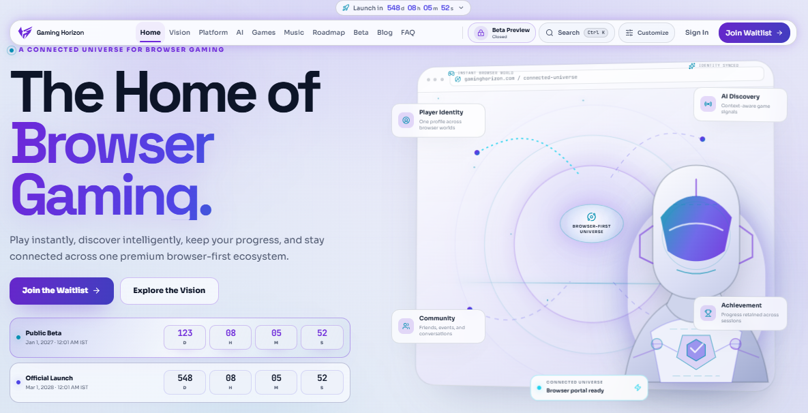

<!--
===============================================================================
                              THE GAMING HORIZON
                              BEYOND THE HORIZON
===============================================================================

                               ROOT README

                                README.md

                      REPOSITORY SYSTEM v1.0.0

===============================================================================

PURPOSE
-------
Primary repository entry point for The Gaming Horizon.

This README provides a structured overview of:

- project identity;
- platform direction;
- official launch;
- project status;
- ecosystem systems;
- confirmed technology;
- application architecture;
- repository structure;
- documentation;
- development;
- Beta;
- Horizon Labs;
- Beyond;
- assets and branding;
- security;
- privacy;
- contribution;
- governance;
- official network;
- licensing;
- project-truth boundaries.

PROJECT
-------
THE GAMING HORIZON

COMMON BRAND
------------
GAMING HORIZON

TAGLINE
-------
BEYOND THE HORIZON

PLATFORM
--------
Browser-first gaming ecosystem.

OFFICIAL LAUNCH
---------------
1 January 2027

VERSION
-------
1.0.0

STATUS
------
In Development

CONFIRMED TECHNOLOGY
--------------------
Next.js
TypeScript
npm
Supabase migrations
GitHub Actions
Netlify configuration

IMPORTANT
---------
The Gaming Horizon repository contains a combination of:

- current implementation;
- active development;
- documentation;
- pre-release systems;
- experiments;
- conceptual architecture;
- visual showcases;
- future exploration.

A documented concept, showcase, prototype, Labs experiment, or Beyond idea
must not automatically be interpreted as an available product feature.

Do not invent:

- users;
- game counts;
- creator counts;
- developer counts;
- community counts;
- revenue;
- funding;
- partnerships;
- sponsors;
- awards;
- press coverage;
- infrastructure scale;
- uptime;
- latency;
- adoption;
- traffic;
- performance statistics;
- AI accuracy;
- completion percentages.

===============================================================================
-->

<a id="top"></a>

<div align="center">

<br>


<br><br>

# THE GAMING HORIZON

### **B E Y O N D &nbsp; T H E &nbsp; H O R I Z O N**

<br>

**A browser-first gaming ecosystem built around discovery, community,  
creativity, competition, development, intelligence, and possibility.**

<br><br>

<a href="#status">
  
</a>
<a href="#version">
  
</a>
<a href="#platform">
  
</a>
<a href="#official-launch">
  
</a>
<a href="#license">
  
</a>

<br><br>

<a href="#technology">
  
</a>
<a href="#technology">
  
</a>
<a href="#technology">
  
</a>
<a href="#technology">
  
</a>
<a href="#github-system">
  
</a>

<br><br>

<a href="https://thegaminghorizon.netlify.app/">
  
</a>
<a href="docs/README.md">
  
</a>
<a href="https://github.com/thegaminghorizon/The-Gaming-Horizon">
  
</a>

<br><br>

<code>PLAY</code>
&nbsp; • &nbsp;
<code>DISCOVER</code>
&nbsp; • &nbsp;
<code>CONNECT</code>
&nbsp; • &nbsp;
<code>CREATE</code>
&nbsp; • &nbsp;
<code>COMPETE</code>
&nbsp; • &nbsp;
<code>BUILD</code>
&nbsp; • &nbsp;
<code>EXPLORE</code>

<br><br>

</div>

---

<a id="overview"></a>

## ✦ Overview

**The Gaming Horizon** is a browser-first gaming ecosystem being developed
around a simple idea:

> **There is always something beyond what the player can currently see.**

Gaming Horizon brings together connected areas of the gaming experience:

```text
DISCOVERY

COMMUNITY

CREATORS

COMPETITION

DEVELOPERS

ARTIFICIAL INTELLIGENCE

EXPERIMENTATION

FUTURE EXPERIENCES
```

The objective is not to create the largest possible collection of unrelated
features.

The objective is to build a coherent platform where one meaningful experience
can naturally lead to another.

---

## ✦ Core Idea

A player may arrive looking for:

```text
A GAME
```

and continue toward:

```text
A COMMUNITY

A CREATOR

A COMPETITION

A GUIDE

A TOOL

A PROJECT

A NEW POSSIBILITY
```

That movement is the Horizon.

---

## ✦ Project Principle

> **Build what matters. Remove what does not. Improve what remains.**

Gaming Horizon development should prioritize meaningful value over feature
count, technical spectacle, or artificial complexity.

---

## ✦ The Horizon

```text
WHAT YOU KNOW
      │
      ▼
WHAT YOU CAN SEE
      │
      ▼
CURRENT HORIZON
      │
      ▼
WHAT YOU HAVE NOT
DISCOVERED YET
```

The project is designed around continuously expanding that boundary.

---

## ✦ Core Brand Line

> **There is always another world beyond the horizon.**

---

<a id="status"></a>

## ✦ Status

Current project status:

```text
IN DEVELOPMENT
```

Gaming Horizon is being actively structured, documented, implemented,
validated, and refined ahead of its official launch.

---

## ✦ Current-State Principle

Project status should be represented through clear language such as:

```text
AVAILABLE

ACTIVE

IN DEVELOPMENT

BETA

PRE-RELEASE

EXPERIMENTAL

LIMITED

COMING SOON

AVAILABLE AT LAUNCH

EXPLORING

CONCEPTUAL
```

A status should only be used when it accurately represents the actual system.

---

<a id="version"></a>

## ✦ Version

Current project documentation/system version:

```text
1.0.0
```

This does **not** automatically mean that a public GitHub software release
named:

```text
v1.0.0
```

has been published.

Actual releases should be tracked through:

```text
CHANGELOG.md
```

and GitHub Releases.

---

<a id="official-launch"></a>

## ✦ Official Launch

The official Gaming Horizon launch date is:

```text
1 JANUARY 2027
```

Written form:

```text
1 January 2027
```

---

## ✦ Launch Is a Beginning

```text
DEVELOPMENT
     │
     ▼
VALIDATION
     │
     ▼
BETA
     │
     ▼
1 JANUARY 2027
     │
     ▼
OFFICIAL LAUNCH
     │
     ▼
FEEDBACK
     │
     ▼
IMPROVEMENT
     │
     ▼
NEW HORIZON
```

Launch does not mean the platform stops evolving.

---

<a id="platform"></a>

## ✦ Platform

Gaming Horizon is a:

> **Browser-first gaming ecosystem.**

The browser is the primary gateway into the platform.

---

## ✦ Browser-First Model

```text
USER
 │
 ▼
LINK
 │
 ▼
BROWSER
 │
 ▼
GAMING HORIZON
 │
 ▼
CONNECTED EXPERIENCE
```

Browser-first development emphasizes:

```text
LOW ENTRY FRICTION

ACCESSIBILITY

RESPONSIVE DESIGN

WEB PERFORMANCE

SHAREABLE DESTINATIONS

DISCOVERABILITY

PROGRESSIVE ENHANCEMENT

CROSS-DEVICE ACCESS
```

---

## ✦ What Gaming Horizon Is Not

Current project direction does **not** define Gaming Horizon as:

```text
CLOUD GAMING

GAME STREAMING

REMOTE GAME EXECUTION

DESKTOP GAME LAUNCHER

GAME DOWNLOAD CLIENT

QUEUE-BASED STREAMING SERVICE

TRADITIONAL GAME MARKETPLACE
```

Those models should not be used to describe the platform unless formal project
direction changes.

---

<a id="preview"></a>

## ✦ Preview

The repository includes real interface captures under:

```text
assets/screenshots/
```

A homepage capture can be viewed here:

<p align="center">
  
</p>

> **Screenshot:** real interface capture.  
> **Showcase:** conceptual visual storytelling.

These categories remain intentionally separate.

---

<a id="vision"></a>

## ✦ Vision

Gaming Horizon aims to build a gaming ecosystem where:

```text
DISCOVERY
     │
     ▼
CONTEXT
     │
     ▼
CONNECTION
     │
     ▼
PARTICIPATION
     │
     ▼
CREATION
     │
     ▼
NEW POSSIBILITY
```

The long-term vision is documented in:

[`docs/VISION.md`](docs/VISION.md)

---

## ✦ Vision Statement

> **Build a premium browser-first gaming ecosystem where discovery leads to possibility, community creates connection, creativity expands the experience, competition creates progression, developers build what comes next, and new ideas continue beyond the current Horizon.**

---

<a id="ecosystem"></a>

## ✦ Ecosystem

Gaming Horizon is organized around connected ecosystem areas.

```text
                          GAMING HORIZON
                                │
                                ▼
                             PLATFORM
                                │
          ┌─────────────────────┼─────────────────────┐
          ▼                     ▼                     ▼
      DISCOVERY             COMMUNITY              CREATORS
          │                     │                     │
          ├─────────────────────┼─────────────────────┤
          ▼                     ▼                     ▼
       COMPETE              DEVELOPERS                AI
          │                     │                     │
          └─────────────────────┼─────────────────────┘
                                ▼
                         HORIZON LABS
                                │
                                ▼
                             BEYOND
```

Detailed ecosystem documentation:

[`docs/ECOSYSTEM.md`](docs/ECOSYSTEM.md)

---

## ✦ Game Discovery

Discovery should help users move beyond exact search toward meaningful
exploration.

Potential discovery relationships include:

```text
GAMES

GENRES

INTERESTS

COMMUNITIES

CREATORS

COMPETITIONS

RELATED EXPERIENCES
```

Read:

[`docs/DISCOVERY.md`](docs/DISCOVERY.md)

---

## ✦ Community

Community connects the people around the platform.

Its role includes areas such as:

```text
PARTICIPATION

DISCUSSION

SUPPORT

FEEDBACK

MODERATION

REPORTING

COLLABORATION

TRUST
```

Read:

[`docs/COMMUNITY.md`](docs/COMMUNITY.md)

---

## ✦ Creators

Creators can expand the ecosystem through:

```text
CONTENT

GUIDES

ANALYSIS

STORYTELLING

ART

TOOLS

COMMUNITY VALUE

NEW EXPERIENCES
```

Human creative direction remains central.

Read:

[`docs/CREATORS.md`](docs/CREATORS.md)

---

## ✦ Competition

Competitive experiences should prioritize:

```text
SKILL

FAIRNESS

CLARITY

INTEGRITY

PROGRESSION

COMMUNITY
```

Read:

[`docs/COMPETE.md`](docs/COMPETE.md)

---

## ✦ Developers

Developer experience should make Gaming Horizon easier to:

```text
UNDERSTAND

BUILD

CONTRIBUTE TO

VALIDATE

MAINTAIN

EVOLVE
```

Read:

[`docs/DEVELOPERS.md`](docs/DEVELOPERS.md)

---

## ✦ Artificial Intelligence

AI may support Gaming Horizon where it creates meaningful value.

Potential areas include:

```text
DISCOVERY ASSISTANCE

CREATOR ASSISTANCE

DEVELOPER ASSISTANCE

DOCUMENTATION

CONTEXT

SUPPORT

ACCESSIBILITY
```

AI remains assistive.

It is not the authority for project truth.

Read:

[`docs/AI.md`](docs/AI.md)

---

<a id="technology"></a>

## ✦ Confirmed Technology

The current confirmed technical foundation includes:

| Technology | Role |
| --- | --- |
| **Next.js** | Application framework |
| **TypeScript** | Application language |
| **npm** | Package management |
| **Supabase migrations** | Database/schema migration workflow |
| **GitHub Actions** | Repository automation and validation |
| **Netlify configuration** | Deployment configuration |

No additional technology should be presented as part of the confirmed stack
without repository evidence.

---

## ✦ Technology Model

```text
                         APPLICATION
                              │
            ┌─────────────────┼─────────────────┐
            ▼                 ▼                 ▼
         NEXT.JS          TYPESCRIPT           NPM
            │                 │                 │
            └─────────────────┼─────────────────┘
                              ▼
                         SOURCE CODE
                              │
       ┌──────────────────────┼──────────────────────┐
       ▼                      ▼                      ▼
      app/                components/              lib/
                              │
                              ▼
                           public/
                              │
                              ▼
                    supabase/migrations/


GITHUB ACTIONS ───────► VALIDATION

NETLIFY CONFIG ───────► DEPLOYMENT CONFIGURATION
```

---

<a id="architecture"></a>

## ✦ Architecture

Gaming Horizon architecture is designed around clear responsibilities,
browser-first delivery, trust boundaries, maintainability, accessibility, and
controlled evolution.

Core principle:

> **Architecture supports the experience, not the other way around.**

Read:

[`docs/ARCHITECTURE.md`](docs/ARCHITECTURE.md)

---

## ✦ Platform Architecture

```text
                         BROWSER
                            │
                            ▼
                        NEXT.JS APP
                            │
       ┌────────────────────┼────────────────────┐
       ▼                    ▼                    ▼
      app/              components/            lib/
       │                    │                    │
       └────────────────────┼────────────────────┘
                            ▼
                     APPLICATION LOGIC
                            │
                   ┌────────┴────────┐
                   ▼                 ▼
                DATA             SERVICES /
                                  INTEGRATIONS
                   │
                   ▼
            SUPABASE MIGRATIONS
```

This is a conceptual structural map rather than a claim of every runtime
service.

---

<a id="repository-structure"></a>

## ✦ Repository Structure

The project uses a structured repository separating application source,
documentation, assets, GitHub automation, policies, and configuration.

```text
The-Gaming-Horizon/
│
├── .github/
│
├── THE-GAMING-HORIZON/
│   ├── app/
│   ├── components/
│   ├── lib/
│   ├── public/
│   ├── supabase/
│   │   └── migrations/
│   └── README.md
│
├── assets/
│   ├── branding/
│   ├── screenshots/
│   └── showcase/
│
├── docs/
│
├── .gitignore
├── BRAND.md
├── CHANGELOG.md
├── CODE_OF_CONDUCT.md
├── CONTRIBUTING.md
├── COPYRIGHT.md
├── LICENSE
├── PRIVACY.md
├── README.md
├── SECURITY.md
├── TERMS.md
├── THIRD-PARTY-NOTICES.md
│
├── components.json
├── eslint.config.mjs
├── netlify.toml
├── next.config.mjs
├── package-lock.json
├── package.json
├── postcss.config.mjs
├── proxy.ts
└── tsconfig.json
```

The repository itself remains authoritative if its structure changes.

---

<a id="application"></a>

## ✦ Application

The main application source is located under:

```text
THE-GAMING-HORIZON/
```

Current confirmed application structure includes:

```text
THE-GAMING-HORIZON/
│
├── app/
├── components/
├── lib/
├── public/
├── supabase/
│   └── migrations/
└── README.md
```

Application-specific documentation:

[`THE-GAMING-HORIZON/README.md`](THE-GAMING-HORIZON/README.md)

---

## ✦ Application Responsibilities

### `app/`

```text
ROUTES

LAYOUTS

PAGES

ROUTE COMPOSITION

LOADING STATES

ERROR STATES
```

### `components/`

```text
REUSABLE UI

NAVIGATION

CARDS

FORMS

PANELS

SHARED INTERACTION
```

### `lib/`

```text
UTILITIES

SHARED LOGIC

VALIDATION

TYPES

DATA HELPERS

SERVICE BOUNDARIES
```

### `public/`

```text
RUNTIME PUBLIC APPLICATION ASSETS
```

### `supabase/migrations/`

```text
VERSIONED DATABASE EVOLUTION
```

---

<a id="documentation"></a>

## ✦ Documentation

Gaming Horizon uses a dedicated documentation architecture rather than placing
every system inside the root README.

Start here:

[`docs/README.md`](docs/README.md)

---

## ✦ Documentation Map

```text
                         PROJECT INFORMATION
                                  │
                                  ▼
                               VISION
                                  │
                                  ▼
                              DIRECTION
                                  │
               ┌──────────────────┼──────────────────┐
               ▼                  ▼                  ▼
           ECOSYSTEM           PLATFORM         ARCHITECTURE
               │                  │                  │
               ├──────────────────┼──────────────────┤
               ▼                  ▼                  ▼
          DISCOVERY          COMMUNITY           CREATORS
               │                  │                  │
               ├──────────────────┼──────────────────┤
               ▼                  ▼                  ▼
            COMPETE           DEVELOPERS             AI
               │                  │                  │
               └──────────────────┼──────────────────┘
                                  ▼
                           DEVELOPMENT
                                  │
                        ┌─────────┴─────────┐
                        ▼                   ▼
                      BETA                LABS
                                            │
                                            ▼
                                         BEYOND
```

---

## ✦ Documentation Index

| System | Documentation |
| --- | --- |
| **Documentation Gateway** | [`docs/README.md`](docs/README.md) |
| **Project Information** | [`docs/PROJECT-INFORMATION.md`](docs/PROJECT-INFORMATION.md) |
| **Vision** | [`docs/VISION.md`](docs/VISION.md) |
| **Direction** | [`docs/DIRECTION.md`](docs/DIRECTION.md) |
| **Ecosystem** | [`docs/ECOSYSTEM.md`](docs/ECOSYSTEM.md) |
| **Platform** | [`docs/PLATFORM.md`](docs/PLATFORM.md) |
| **Architecture** | [`docs/ARCHITECTURE.md`](docs/ARCHITECTURE.md) |
| **Discovery** | [`docs/DISCOVERY.md`](docs/DISCOVERY.md) |
| **Community** | [`docs/COMMUNITY.md`](docs/COMMUNITY.md) |
| **Creators** | [`docs/CREATORS.md`](docs/CREATORS.md) |
| **Developers** | [`docs/DEVELOPERS.md`](docs/DEVELOPERS.md) |
| **Compete** | [`docs/COMPETE.md`](docs/COMPETE.md) |
| **AI** | [`docs/AI.md`](docs/AI.md) |
| **Development** | [`docs/DEVELOPMENT.md`](docs/DEVELOPMENT.md) |
| **Beta** | [`docs/BETA.md`](docs/BETA.md) |
| **Horizon Labs** | [`docs/LABS.md`](docs/LABS.md) |
| **Network** | [`docs/NETWORK.md`](docs/NETWORK.md) |
| **Beyond** | [`docs/BEYOND.md`](docs/BEYOND.md) |

---

## ✦ Navigation

<div align="center">

<a href="docs/VISION.md">
  
</a>
<a href="docs/DIRECTION.md">
  
</a>
<a href="docs/ECOSYSTEM.md">
  
</a>
<a href="docs/PLATFORM.md">
  
</a>
<a href="docs/ARCHITECTURE.md">
  
</a>

<br><br>

<a href="docs/DISCOVERY.md">
  
</a>
<a href="docs/COMMUNITY.md">
  
</a>
<a href="docs/CREATORS.md">
  
</a>
<a href="docs/COMPETE.md">
  
</a>
<a href="docs/DEVELOPERS.md">
  
</a>
<a href="docs/AI.md">
  
</a>

</div>

---

<a id="development"></a>

## ✦ Development

Gaming Horizon development is guided by:

> **Build what matters. Remove what does not. Improve what remains.**

Development documentation:

[`docs/DEVELOPMENT.md`](docs/DEVELOPMENT.md)

Developer documentation:

[`docs/DEVELOPERS.md`](docs/DEVELOPERS.md)

Contribution guidance:

[`CONTRIBUTING.md`](CONTRIBUTING.md)

---

## ✦ Development Lifecycle

```text
NEED
 │
 ▼
UNDERSTAND
 │
 ▼
DESIGN
 │
 ▼
ARCHITECT
 │
 ▼
BUILD
 │
 ▼
VALIDATE
 │
 ▼
REVIEW
 │
 ▼
RELEASE
 │
 ▼
LEARN
 │
 ▼
IMPROVE
```

---

## ✦ Development Priorities

Gaming Horizon development should consistently consider:

```text
PURPOSE

SECURITY

PRIVACY

ACCESSIBILITY

PERFORMANCE

RELIABILITY

RESPONSIVE DESIGN

MAINTAINABILITY

DOCUMENTATION
```

---

<a id="beta"></a>

## ✦ Beta

Beta exists to answer:

> **Does the experience work well enough in real use to move closer to release?**

Beta validation may include:

```text
USABILITY

ACCESSIBILITY

RESPONSIVENESS

PERFORMANCE

SECURITY

PRIVACY

RELIABILITY

FEEDBACK
```

Read:

[`docs/BETA.md`](docs/BETA.md)

---

<a id="labs"></a>

## ✦ Horizon Labs

Horizon Labs provides space to experiment before commitment.

```text
CONCEPT
   │
   ▼
PROTOTYPE
   │
   ▼
EXPERIMENTAL
   │
   ▼
LIMITED
   │
   ▼
PRE-RELEASE
```

An experiment may:

```text
GRADUATE

CHANGE

RETURN TO RESEARCH

BE ARCHIVED
```

Read:

[`docs/LABS.md`](docs/LABS.md)

---

<a id="beyond"></a>

## ✦ Beyond

Beyond preserves room for ideas that do not yet belong inside established
Gaming Horizon systems.

```text
CURRENT PLATFORM
      │
      ▼
CURRENT HORIZON
      │
      ▼
QUESTIONS
      │
      ▼
POSSIBILITIES
      │
      ▼
BEYOND
```

Beyond is exploratory.

It is **not** a release commitment.

Read:

[`docs/BEYOND.md`](docs/BEYOND.md)

---

<a id="quality-foundations"></a>

## ✦ Quality Foundations

Gaming Horizon should not separate technical quality from product quality.

```text
                    QUALITY
                       │
      ┌────────────────┼────────────────┐
      ▼                ▼                ▼
  SECURITY          PRIVACY        ACCESSIBILITY
      │                │                │
      ├────────────────┼────────────────┤
      ▼                ▼                ▼
 PERFORMANCE      RELIABILITY      MAINTAINABILITY
      │                │                │
      └────────────────┼────────────────┘
                       ▼
                 USER EXPERIENCE
```

---

## ✦ Accessibility

Accessibility is foundational.

Consider:

```text
SEMANTIC HTML

KEYBOARD NAVIGATION

VISIBLE FOCUS

SCREEN READERS

FORM LABELS

CONTRAST

REDUCED MOTION

RESPONSIVE DESIGN

TOUCH TARGETS

ERROR FEEDBACK
```

---

## ✦ Performance

Premium presentation should not mean unnecessary weight.

```text
PREMIUM
   ≠
HEAVY
```

Performance considerations include:

```text
CLIENT JAVASCRIPT

MEDIA

NETWORK REQUESTS

ANIMATION

THIRD-PARTY SYSTEMS

DATA FETCHING

AI REQUESTS
```

---

## ✦ Reliability

Systems should expect failure.

```text
NETWORK FAILURE

MISSING DATA

SERVICE FAILURE

AI FAILURE

INVALID INPUT

CONFIGURATION FAILURE
```

Optional systems should degrade gracefully where practical.

---

<a id="security"></a>

## ✦ Security

Security guidance:

[`SECURITY.md`](SECURITY.md)

Core trust principle:

```text
BROWSER
   │
   ▼
UNTRUSTED INPUT
   │
   ▼
VALIDATE
   │
=============== TRUST BOUNDARY ===============
   │
   ▼
TRUSTED LOGIC
   │
   ▼
AUTHORIZATION
   │
   ▼
PROTECTED RESOURCE
```

Never commit:

```text
PASSWORDS

API KEYS

ACCESS TOKENS

PRIVATE KEYS

SERVICE ROLE KEYS

DATABASE CREDENTIALS

DEPLOYMENT TOKENS

BOT TOKENS

WEBHOOK SECRETS
```

---

<a id="privacy"></a>

## ✦ Privacy

Privacy guidance:

[`PRIVACY.md`](PRIVACY.md)

Gaming Horizon should follow:

```text
REAL PURPOSE
      │
      ▼
MINIMUM NECESSARY DATA
      │
      ▼
PROTECT
      │
      ▼
CONTROL ACCESS
      │
      ▼
RETAIN ONLY AS NEEDED
```

---

<a id="brand"></a>

## ✦ Brand

The official Gaming Horizon brand system is documented in:

[`BRAND.md`](BRAND.md)

Brand personality:

```text
PREMIUM

FUTURISTIC

CINEMATIC

GAMING-FOCUSED

INNOVATIVE

CONFIDENT

ELEGANT

ACCESSIBLE

INTERNATIONAL

TRUSTWORTHY
```

---

## ✦ Visual Direction

Primary visual direction includes:

```text
DEEP CHARCOAL

MIDNIGHT BLACK

NAVY

PURPLE

ELECTRIC BLUE

CYAN

VIOLET

SUBTLE MAGENTA

GLASSMORPHISM

CINEMATIC GRADIENTS

ATMOSPHERIC DEPTH

CONTROLLED MOTION
```

---

## ✦ Official Logo

Authoritative source:

```text
assets/branding/logos/gaming-horizon-logo-source.png
```

Do not:

```text
REDRAW

STRETCH

SQUASH

DISTORT

ARBITRARILY RECOLOR

REPLACE WITH AN AI RECREATION
```

the official logo.

---

<a id="assets"></a>

## ✦ Assets

Repository assets are organized into dedicated systems.

```text
assets/
│
├── branding/
│   ├── logos/
│   ├── banners/
│   └── icons/
│
├── screenshots/
│   ├── website/
│   └── features/
│
└── showcase/
```

Asset documentation:

[`assets/README.md`](assets/README.md)

---

## ✦ Branding Assets

[`assets/branding/README.md`](assets/branding/README.md)

Includes:

```text
LOGOS

BANNERS

ICONS
```

---

## ✦ Screenshots

[`assets/screenshots/README.md`](assets/screenshots/README.md)

Definition:

```text
SCREENSHOT
      =
REAL INTERFACE CAPTURE
```

---

## ✦ Showcase

[`assets/showcase/README.md`](assets/showcase/README.md)

Definition:

```text
SHOWCASE
      =
CONCEPTUAL VISUAL STORYTELLING
```

---

## ✦ Screenshot vs Showcase

```text
SCREENSHOT
    ≠
SHOWCASE
```

```text
SHOWCASE
    ≠
FEATURE PROOF
```

This distinction is part of Gaming Horizon's project-truth standard.

---

<a id="github-system"></a>

## ✦ GitHub System

Repository operations are organized under:

```text
.github/
```

Documentation:

[`.github/README.md`](.github/README.md)

---

## ✦ GitHub Infrastructure

The GitHub system includes areas such as:

```text
ISSUE TEMPLATES

PULL REQUEST TEMPLATE

CODEOWNERS

GITHUB ACTIONS

DEPENDABOT

STALE MANAGEMENT

FUNDING CONFIGURATION
```

---

## ✦ Workflows

Workflow documentation:

[`.github/workflows/README.md`](.github/workflows/README.md)

Repository Actions:

`https://github.com/thegaminghorizon/The-Gaming-Horizon/actions`

---

## ✦ Issues

Issue tracker:

`https://github.com/thegaminghorizon/The-Gaming-Horizon/issues`

Structured issue categories may include:

```text
BUG REPORT

FEATURE REQUEST

FEEDBACK

QUESTION

CUSTOM ISSUE
```

---

## ✦ Pull Requests

Pull requests:

`https://github.com/thegaminghorizon/The-Gaming-Horizon/pulls`

Meaningful changes should generally move through:

```text
ISSUE / NEED
      │
      ▼
BRANCH
      │
      ▼
IMPLEMENTATION
      │
      ▼
LOCAL VALIDATION
      │
      ▼
PULL REQUEST
      │
      ▼
CI
      │
      ▼
REVIEW
      │
      ▼
MERGE
```

---

<a id="contributing"></a>

## ✦ Contributing

Contributions are welcome when they meaningfully improve the project.

Read the full contribution guide:

[`CONTRIBUTING.md`](CONTRIBUTING.md)

---

## ✦ Ways to Contribute

Useful contributions may include:

```text
BUG FIXES

FEATURE IMPROVEMENTS

ACCESSIBILITY

PERFORMANCE

SECURITY

DOCUMENTATION

TESTING

ARCHITECTURE

DESIGN SYSTEMS

DEVELOPER EXPERIENCE

COMMUNITY SYSTEMS
```

---

## ✦ Contributor Standard

A contribution should aim to be:

```text
PURPOSEFUL

FOCUSED

ACCESSIBLE

SECURE

PRIVATE

PERFORMANT

RELIABLE

MAINTAINABLE

TESTED

DOCUMENTED

TRUTHFUL
```

---

## ✦ Code of Conduct

All participation should follow:

[`CODE_OF_CONDUCT.md`](CODE_OF_CONDUCT.md)

Core principle:

> **Challenge ideas without attacking people.**

---

<a id="project-truth"></a>

## ✦ Project Truth

Gaming Horizon documentation and presentation must distinguish between what
exists and what is only being explored.

---

## ✦ Truth Boundaries

```text
VISION
    ≠
ROADMAP


ROADMAP
    ≠
IMPLEMENTATION


CONCEPT
    ≠
FEATURE


PROTOTYPE
    ≠
PRODUCT


LAB EXPERIMENT
    ≠
RELEASE COMMITMENT


SHOWCASE
    ≠
SCREENSHOT


AI OUTPUT
    ≠
PROJECT FACT
```

---

## ✦ No Invented Metrics

Do not claim unsupported:

```text
USER COUNTS

GAME COUNTS

CREATOR COUNTS

COMMUNITY SIZE

REPOSITORY TRAFFIC

UPTIME

LATENCY

AI ACCURACY

SEARCH ACCURACY

REVENUE

FUNDING

MARKET SHARE

GROWTH RATE
```

---

## ✦ No Invented Partnerships

Use of external platforms or technologies does not imply:

```text
PARTNERSHIP

SPONSORSHIP

ENDORSEMENT

CERTIFICATION
```

unless such a relationship is actually confirmed.

---

## ✦ Project-State Architecture

```text
CURRENT
  │
  ├── AVAILABLE
  └── ACTIVE


DEVELOPMENT
  │
  ├── IN DEVELOPMENT
  ├── BETA
  └── PRE-RELEASE


EXPERIMENTATION
  │
  ├── CONCEPT
  ├── PROTOTYPE
  ├── EXPERIMENTAL
  └── LIMITED


FUTURE
  │
  ├── EXPLORING
  └── BEYOND
```

---

<a id="changelog"></a>

## ✦ Changelog

Repository change history:

[`CHANGELOG.md`](CHANGELOG.md)

The changelog separates:

```text
UNRELEASED DEVELOPMENT
```

from:

```text
CONFIRMED VERSIONED RELEASES
```

---

## ✦ Changelog vs Git History

```text
GIT HISTORY
    =
DETAILED COMMIT HISTORY
```

```text
CHANGELOG
    =
CURATED MEANINGFUL PROJECT HISTORY
```

---

<a id="governance"></a>

## ✦ Governance

Gaming Horizon repository governance currently includes:

| Area | Document |
| --- | --- |
| Contribution | [`CONTRIBUTING.md`](CONTRIBUTING.md) |
| Conduct | [`CODE_OF_CONDUCT.md`](CODE_OF_CONDUCT.md) |
| Security | [`SECURITY.md`](SECURITY.md) |
| Privacy | [`PRIVACY.md`](PRIVACY.md) |
| Terms | [`TERMS.md`](TERMS.md) |
| Copyright | [`COPYRIGHT.md`](COPYRIGHT.md) |
| Third-Party Notices | [`THIRD-PARTY-NOTICES.md`](THIRD-PARTY-NOTICES.md) |
| Brand | [`BRAND.md`](BRAND.md) |
| License | [`LICENSE`](LICENSE) |

---

<a id="copyright"></a>

## ✦ Copyright

Copyright and reuse guidance:

[`COPYRIGHT.md`](COPYRIGHT.md)

The repository distinguishes between:

```text
SOFTWARE

DOCUMENTATION

BRANDING

SCREENSHOTS

SHOWCASE MATERIAL

THIRD-PARTY MATERIAL
```

---

<a id="license"></a>

## ✦ License

Software covered by the repository license is made available under the:

```text
Apache License
Version 2.0
```

Read the authoritative legal text:

[`LICENSE`](LICENSE)

---

## ✦ Brand Licensing Boundary

```text
APACHE 2.0 SOFTWARE LICENSE
        ≠
AUTOMATIC UNRESTRICTED
BRAND PERMISSION
```

Gaming Horizon branding, logos, visual identity, and other creative assets may
require separate consideration.

See:

[`BRAND.md`](BRAND.md)

and:

[`COPYRIGHT.md`](COPYRIGHT.md)

---

## ✦ Third-Party Notices

Third-party notices and attribution:

[`THIRD-PARTY-NOTICES.md`](THIRD-PARTY-NOTICES.md)

Third-party technologies, services, names, logos, and assets remain subject to
their respective rights and licenses.

---

<a id="network"></a>

## ✦ Official Network

Official Gaming Horizon network documentation:

[`docs/NETWORK.md`](docs/NETWORK.md)

---

## ✦ Website

```text
https://thegaminghorizon.netlify.app/
```

Primary browser-first Gaming Horizon destination.

---

## ✦ Support Us

```text
https://thegaminghorizon.netlify.app/support-us
```

---

## ✦ GitHub

Organization:

```text
https://github.com/thegaminghorizon
```

Repository:

```text
https://github.com/thegaminghorizon/The-Gaming-Horizon
```

---

## ✦ Discord

```text
https://discord.gg/M5PeNThBwF
```

---

## ✦ X

```text
https://x.com/gamingshorizon
```

---

## ✦ Instagram

```text
https://www.instagram.com/thegaminghorizon/
```

---

## ✦ Network Model

```text
                          GAMING HORIZON
                                │
          ┌─────────────────────┼─────────────────────┐
          ▼                     ▼                     ▼
       WEBSITE                GITHUB                DISCORD
          │                     │                     │
          ▼                     ▼                     ▼
      PLATFORM             DEVELOPMENT            COMMUNITY
          │                     │                     │
          └─────────────┬───────┴───────┬─────────────┘
                        ▼               ▼
                        X           INSTAGRAM
                        │               │
                        └───────┬───────┘
                                ▼
                        PUBLIC PRESENCE
```

---

## ✦ External Platform Boundary

```text
OFFICIAL ACCOUNT
      ≠
PARTNERSHIP
```

```text
HOSTED ON SERVICE
      ≠
SPONSORSHIP
```

---

<a id="recommended-reading"></a>

## ✦ Recommended Reading

For a complete understanding of Gaming Horizon:

```text
01
README.md
   │
   ▼
02
docs/PROJECT-INFORMATION.md
   │
   ▼
03
docs/VISION.md
   │
   ▼
04
docs/DIRECTION.md
   │
   ▼
05
docs/ECOSYSTEM.md
   │
   ▼
06
docs/PLATFORM.md
   │
   ▼
07
docs/ARCHITECTURE.md
   │
   ▼
08
docs/DEVELOPMENT.md
   │
   ▼
09
SYSTEM DOCUMENTATION
   │
   ├── DISCOVERY
   ├── COMMUNITY
   ├── CREATORS
   ├── COMPETE
   ├── DEVELOPERS
   └── AI
   │
   ▼
10
docs/BETA.md
   │
   ▼
11
docs/LABS.md
   │
   ▼
12
docs/BEYOND.md
```

---

## ✦ Quick Navigation

### Project

- [`Project Information`](docs/PROJECT-INFORMATION.md)
- [`Vision`](docs/VISION.md)
- [`Direction`](docs/DIRECTION.md)
- [`Ecosystem`](docs/ECOSYSTEM.md)
- [`Platform`](docs/PLATFORM.md)
- [`Architecture`](docs/ARCHITECTURE.md)

### Experience

- [`Discovery`](docs/DISCOVERY.md)
- [`Community`](docs/COMMUNITY.md)
- [`Creators`](docs/CREATORS.md)
- [`Compete`](docs/COMPETE.md)
- [`AI`](docs/AI.md)

### Engineering

- [`Developers`](docs/DEVELOPERS.md)
- [`Development`](docs/DEVELOPMENT.md)
- [`Beta`](docs/BETA.md)
- [`Horizon Labs`](docs/LABS.md)

### Future

- [`Network`](docs/NETWORK.md)
- [`Beyond`](docs/BEYOND.md)

### Repository

- [`Brand`](BRAND.md)
- [`Changelog`](CHANGELOG.md)
- [`Contributing`](CONTRIBUTING.md)
- [`Code of Conduct`](CODE_OF_CONDUCT.md)
- [`Security`](SECURITY.md)
- [`Privacy`](PRIVACY.md)
- [`Copyright`](COPYRIGHT.md)
- [`Third-Party Notices`](THIRD-PARTY-NOTICES.md)
- [`License`](LICENSE)

### Assets

- [`Asset Library`](assets/README.md)
- [`Branding`](assets/branding/README.md)
- [`Logos`](assets/branding/logos/README.md)
- [`Banners`](assets/branding/banners/README.md)
- [`Icons`](assets/branding/icons/README.md)
- [`Screenshots`](assets/screenshots/README.md)
- [`Showcase`](assets/showcase/README.md)

### Development Operations

- [`GitHub System`](.github/README.md)
- [`Workflow System`](.github/workflows/README.md)
- [`Application Documentation`](THE-GAMING-HORIZON/README.md)

---

<a id="repository-standard"></a>

## ✦ Repository Standard

Gaming Horizon should remain:

```text
CLEAR

STRUCTURED

DOCUMENTED

BROWSER-FIRST

SECURE

PRIVATE

ACCESSIBLE

PERFORMANT

MAINTAINABLE

TRUTHFUL

EVOLVABLE
```

---

## ✦ What the Project Should Avoid

Gaming Horizon should avoid becoming:

```text
FEATURE-BLOATED

OVER-ENGINEERED

GENERIC

CLOUD-GAMING-BY-ASSUMPTION

AI-FOR-EVERYTHING

INACCESSIBLE

SURVEILLANCE-DRIVEN

PERFORMANCE-HEAVY

MARKETING-FIRST

METRIC-OBSESSED

DISCONNECTED
```

---

## ✦ What the Project Should Become

Gaming Horizon should aim to become:

```text
GAMING-FOCUSED

DISCOVERY-DRIVEN

COMMUNITY-CONNECTED

CREATOR-FRIENDLY

COMPETITION-AWARE

DEVELOPER-READY

AI-ASSISTED

BROWSER-FIRST

ACCESSIBLE

SECURE

PRIVATE

PERFORMANT

RELIABLE

PREMIUM

ADAPTABLE

EVOLVABLE
```

---

## ✦ Repository Golden Rules

### `01`

**Gaming remains the center of the platform.**

### `02`

**Gaming Horizon remains browser-first.**

### `03`

**Discovery should expand possibility.**

### `04`

**Community should create meaningful connection.**

### `05`

**Creators should expand the ecosystem through human creativity.**

### `06`

**Competition should preserve fairness, clarity, and integrity.**

### `07`

**Developers should be able to understand and evolve the platform responsibly.**

### `08`

**AI should assist human intent rather than replace it.**

### `09`

**Security, privacy, accessibility, performance, and reliability are shared responsibilities.**

### `10`

**Concepts, experiments, showcases, and future ideas must not be represented as implemented features.**

### `11`

**Build what matters. Remove what does not. Improve what remains.**

### `12`

**There is always another world beyond the horizon.**

---

## ✦ Complete System Architecture

```text
                            THE GAMING HORIZON
                                   │
                                   ▼
                               BROWSER
                                   │
                                   ▼
                                PLATFORM
                                   │
          ┌────────────────────────┼────────────────────────┐
          ▼                        ▼                        ▼
      DISCOVERY                COMMUNITY                 CREATORS
          │                        │                        │
          ├────────────────────────┼────────────────────────┤
          ▼                        ▼                        ▼
       COMPETE                 DEVELOPERS                   AI
          │                        │                        │
          └────────────────────────┼────────────────────────┘
                                   ▼
                              APPLICATION
                                   │
              ┌────────────────────┼────────────────────┐
              ▼                    ▼                    ▼
             app/              components/            lib/
                                   │
                                   ▼
                                 DATA
                                   │
                                   ▼
                         SUPABASE MIGRATIONS
                                   │
             ┌─────────────────────┼─────────────────────┐
             ▼                     ▼                     ▼
         SECURITY               PRIVACY            ACCESSIBILITY
             │                     │                     │
             ├─────────────────────┼─────────────────────┤
             ▼                     ▼                     ▼
        PERFORMANCE           RELIABILITY        MAINTAINABILITY
             │                     │                     │
             └─────────────────────┼─────────────────────┘
                                   ▼
                              DEVELOPMENT
                                   │
                        ┌──────────┴──────────┐
                        ▼                     ▼
                      BETA                   LABS
                                               │
                                               ▼
                                            BEYOND
                                               │
                                               ▼
                                      NEXT GAMING HORIZON
```

---

## ✦ Project Summary

```text
PROJECT          THE GAMING HORIZON

BRAND            GAMING HORIZON

TAGLINE          BEYOND THE HORIZON

VERSION          1.0.0

STATUS           IN DEVELOPMENT

PLATFORM         BROWSER-FIRST GAMING ECOSYSTEM

OFFICIAL LAUNCH  1 JANUARY 2027

FRAMEWORK        NEXT.JS

LANGUAGE         TYPESCRIPT

PACKAGE MANAGER  NPM

DATABASE CHANGE  SUPABASE MIGRATIONS

AUTOMATION       GITHUB ACTIONS

DEPLOY CONFIG    NETLIFY

CORE SYSTEMS     DISCOVERY
                 COMMUNITY
                 CREATORS
                 COMPETITION
                 DEVELOPERS
                 AI
                 HORIZON LABS
                 BEYOND

FOUNDATIONS      SECURITY
                 PRIVACY
                 ACCESSIBILITY
                 PERFORMANCE
                 RELIABILITY
                 MAINTAINABILITY

DOCUMENTATION    docs/

APPLICATION      THE-GAMING-HORIZON/

ASSETS           assets/

GITHUB SYSTEM    .github/

LICENSE          APACHE LICENSE 2.0

WEBSITE          https://thegaminghorizon.netlify.app/

REPOSITORY       https://github.com/thegaminghorizon/The-Gaming-Horizon
```

---

## ✦ Final Standard

```text
                           PLAY
                            │
                            ▼
                         DISCOVER
                            │
                            ▼
                          CONNECT
                            │
               ┌────────────┼────────────┐
               ▼            ▼            ▼
            CREATE       COMPETE        BUILD
               │            │            │
               └────────────┼────────────┘
                            ▼
                          LEARN
                            │
                            ▼
                         IMPROVE
                            │
                            ▼
                          EVOLVE
                            │
                            ▼
                         HORIZON
                            │
                            ▼
                          BEYOND
```

---

<div align="center">

<br>


<br><br>

<strong>THE GAMING HORIZON</strong>

<br>

<sub>Browser-First Gaming Ecosystem · Version 1.0.0</sub>

<br><br>

<a href="docs/PROJECT-INFORMATION.md">
  
</a>
<a href="docs/VISION.md">
  
</a>
<a href="docs/DEVELOPMENT.md">
  
</a>
<a href="CONTRIBUTING.md">
  
</a>
<a href="docs/BEYOND.md">
  
</a>

<br><br>

<a href="https://thegaminghorizon.netlify.app/">
  
</a>
<a href="https://discord.gg/M5PeNThBwF">
  
</a>

<br><br>

<code>
PLAY · DISCOVER · CONNECT · CREATE · COMPETE · BUILD · EXPLORE
</code>

<br><br>

<strong>
Build what matters. Remove what does not. Improve what remains.
</strong>

<br><br>

<strong>
Your next gaming adventure starts here.
</strong>

<br><br>

<strong>
There is always another world beyond the horizon.
</strong>

<br><br>

<sub>
The Gaming Horizon · Beyond the Horizon
</sub>

<br><br>

</div>
