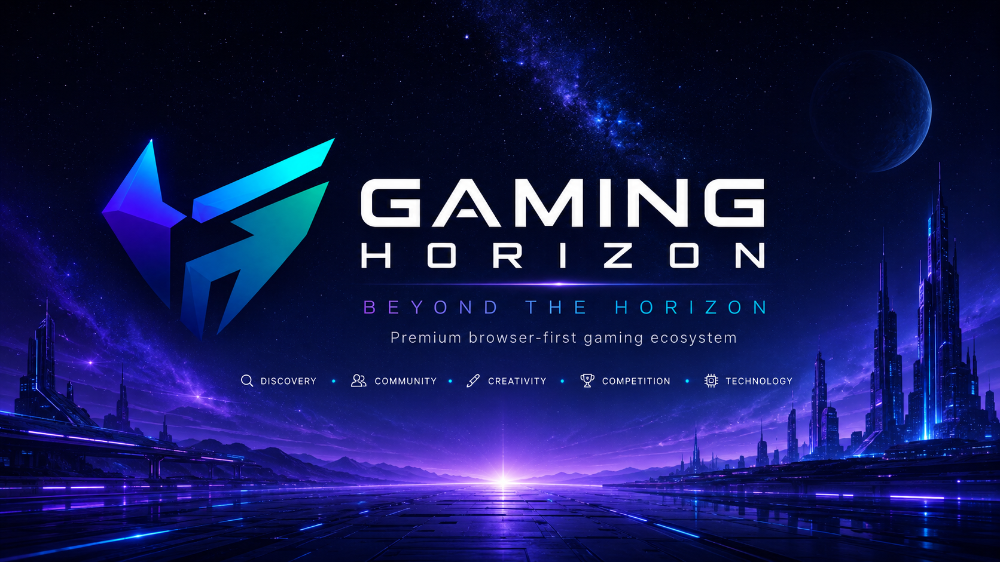
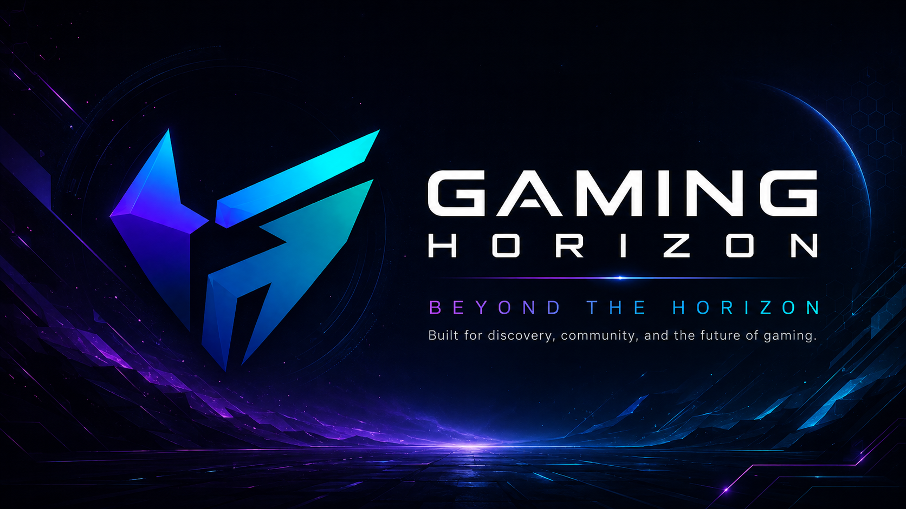
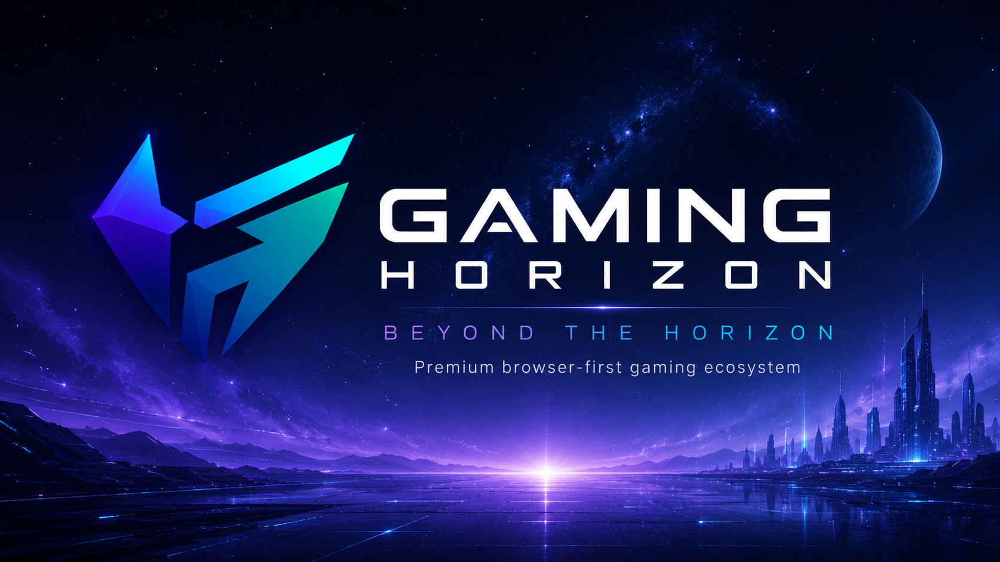
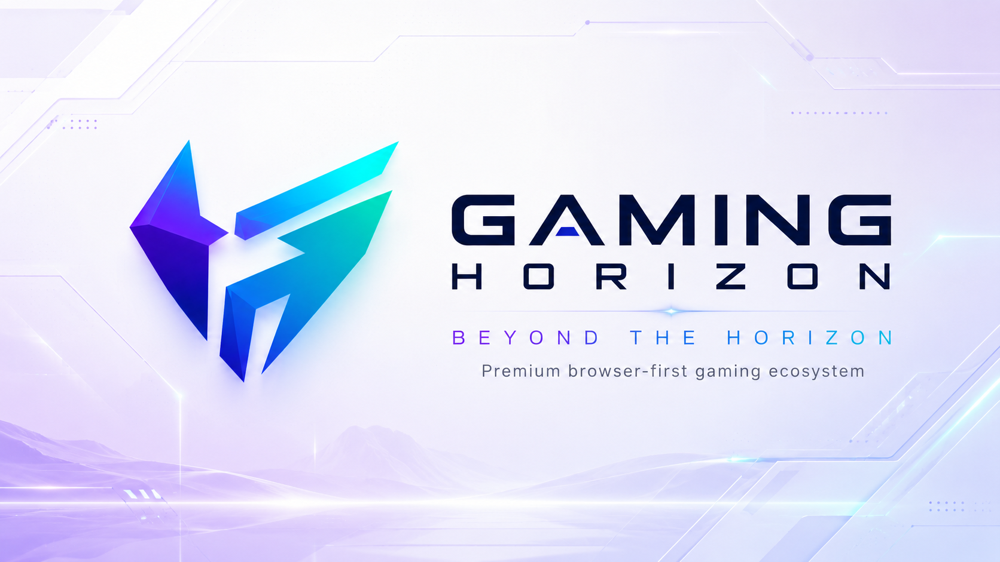

<!--
===============================================================================
                              GAMING HORIZON
                         BEYOND THE HORIZON
===============================================================================

                         OFFICIAL BANNER SYSTEM
                  assets/branding/banners/README.md

                        BANNER SYSTEM v1.0.0

===============================================================================

DOCUMENT LOCATION
-----------------
assets/branding/banners/README.md

RELATIVE PATH RULE
------------------

Banner files in this directory:
gaming-horizon-github-banner.png

Official logo source:
../logos/gaming-horizon-logo-source.png

Branding documentation:
../README.md

Asset documentation:
../../README.md

Repository root:
../../../

===============================================================================
-->

<div align="center">

<br>


<br><br>

<h1>Gaming Horizon Banner System</h1>

<p>
  <strong>
    Official wide-format presentation assets for repository,
    documentation, branded environments, and visual communication.
  </strong>
</p>

<p>
  A controlled presentation system designed to extend the Gaming Horizon
  identity across wide visual surfaces without replacing the official source logo.
</p>

<br>

<!-- ========================================================= -->
<!--                       SYSTEM STATUS                       -->
<!-- ========================================================= -->

<a href="#status">
  
</a>
<a href="#version">
  
</a>
<a href="#banner-system">
  
</a>
<a href="#presentation">
  
</a>
<a href="#license">
  
</a>

<br><br>

<!-- ========================================================= -->
<!--                       BANNER TYPES                        -->
<!-- ========================================================= -->

<a href="#github-banner">
  
</a>
<a href="#readme-hero">
  
</a>
<a href="#dark-banner">
  
</a>
<a href="#light-banner">
  
</a>

<br><br>

<!-- ========================================================= -->
<!--                       SYSTEM RULES                        -->
<!-- ========================================================= -->

<a href="#standards">
  
</a>
<a href="#responsive-use">
  
</a>
<a href="#accessibility">
  
</a>
<a href="#integrity">
  
</a>
<a href="#governance">
  
</a>

<br><br>

<!-- ========================================================= -->
<!--                       QUICK LINKS                         -->
<!-- ========================================================= -->

<a href="https://thegaminghorizon.netlify.app/">
  
</a>
<a href="https://github.com/thegaminghorizon/The-Gaming-Horizon">
  
</a>
<a href="https://github.com/thegaminghorizon/The-Gaming-Horizon/issues">
  
</a>

<br><br>

<code>IDENTITY</code>
&nbsp; • &nbsp;
<code>PRESENTATION</code>
&nbsp; • &nbsp;
<code>ATMOSPHERE</code>
&nbsp; • &nbsp;
<code>CONSISTENCY</code>
&nbsp; • &nbsp;
<code>EVOLUTION</code>

<br><br>

</div>

---

<a id="overview"></a>

## ✦ Overview

The Gaming Horizon banner system contains the approved wide-format visual
assets used to support project presentation.

Banners extend the Gaming Horizon identity into environments where a larger,
more atmospheric visual is useful.

They may support:

- GitHub repository presentation;
- README documentation;
- project introductions;
- branded documentation;
- dark visual environments;
- light visual environments;
- future presentations;
- selected community communication;
- official Gaming Horizon media.

The banner system is a **presentation layer**.

It is not the primary identity source.

> [!IMPORTANT]
> The official Gaming Horizon source logo remains the authoritative identity
> reference. Banners support that identity; they do not redefine it.

Official source logo:

```text
../logos/gaming-horizon-logo-source.png
```

---

<a id="status"></a>

## ✦ Status

Current banner-system status:

```text
ACTIVE DEVELOPMENT
```

Current system coverage:

| Area | Status |
| --- | --- |
| GitHub banner | Established |
| README hero | Established |
| Dark banner | Established |
| Light banner | Established |
| Usage standards | Active |
| Responsive guidance | Active |
| Accessibility guidance | Active |
| Banner governance | Active |
| Future variants | Added when required |

The banner system can expand as Gaming Horizon develops, but additional
variants should only be introduced when they solve a real presentation need.

---

<a id="version"></a>

## ✦ Version

Current banner-system version:

```text
1.0.0
```

Version structure:

```text
MAJOR.MINOR.PATCH
```

### Major

Used when the overall banner architecture or visual direction changes
substantially.

```text
1.0.0 → 2.0.0
```

Examples:

```text
Complete presentation-system redesign
Major identity-generation change
Replacement of existing banner architecture
New primary banner philosophy
```

### Minor

Used for meaningful new approved banner categories.

```text
1.0.0 → 1.1.0
```

Examples:

```text
New documentation banner
New community banner family
New event banner system
New responsive banner category
```

### Patch

Used for small improvements.

```text
1.0.0 → 1.0.1
```

Examples:

```text
Documentation fixes
Filename corrections
Path corrections
Minor metadata updates
Usage clarification
```

---

<a id="banner-system"></a>

## ✦ Banner System

The current system contains four primary presentation variants:

```text
BANNER SYSTEM
     │
     ├── GITHUB BANNER
     │
     ├── README HERO
     │
     ├── DARK BANNER
     │
     └── LIGHT BANNER
```

Each serves a different presentation context.

They should not be treated as interchangeable simply because they share the
same identity.

---

## ✦ Current Directory

```text
banners/
├── README.md
├── gaming-horizon-github-banner.png
├── gaming-horizon-readme-hero.png
├── gaming-horizon-dark-banner.png
└── gaming-horizon-light-banner.png
```

---

## ✦ Banner Register

| Asset | Primary role | Status |
| --- | --- |:---:|
| `gaming-horizon-github-banner.png` | Repository / GitHub presentation | Active |
| `gaming-horizon-readme-hero.png` | Documentation hero presentation | Active |
| `gaming-horizon-dark-banner.png` | Dark environment presentation | Active |
| `gaming-horizon-light-banner.png` | Light environment presentation | Active |

---

<a id="presentation"></a>

## ✦ Presentation Philosophy

Gaming Horizon banners should create atmosphere without replacing real content.

A banner can communicate:

```text
IDENTITY
MOOD
DIRECTION
SCALE
ENERGY
PROJECT CHARACTER
```

A banner should not be expected to communicate every important project detail.

Important information belongs in:

```text
Markdown
HTML
Documentation
Accessible text
Interactive interfaces
```

The visual should strengthen the message rather than contain the entire
message.

---

## ✦ Presentation Hierarchy

```text
OFFICIAL SOURCE LOGO
        │
        ▼
BRAND SYSTEM
        │
        ▼
BANNER SYSTEM
        │
        ▼
PRESENTATION SURFACE
```

This hierarchy means:

**Source identity comes first.**

The banner adapts around the brand.

The brand should not be changed simply to fit a banner.

---

<a id="github-banner"></a>

## ✦ GitHub Banner

File:

```text
gaming-horizon-github-banner.png
```

Preview:

<div align="center">

<br>



<br>

</div>

### Purpose

The GitHub banner is intended for repository-oriented presentation.

Potential uses include:

- GitHub repository README sections;
- repository introductions;
- project documentation;
- selected GitHub-facing presentation material.

### Usage priority

Use when a wide visual helps establish project identity without overwhelming
the surrounding repository content.

### Avoid

Do not:

- repeat the banner excessively;
- place it before every documentation section;
- use it as a substitute for headings;
- rely on text embedded inside it for essential information;
- treat it as the official source logo.

---

<a id="readme-hero"></a>

## ✦ README Hero

File:

```text
gaming-horizon-readme-hero.png
```

Preview:

<div align="center">

<br>



<br>

</div>

### Purpose

The README hero is intended for high-impact repository and documentation
presentation where an atmospheric introduction improves the experience.

Potential uses include:

```text
Major README introduction
Documentation landing pages
Project showcase sections
Selected ecosystem documentation
```

### Recommended use

Use selectively.

A repository does not become more professional simply by placing a large hero
image above every document.

The hero should appear where it adds meaningful context.

---

<a id="dark-banner"></a>

## ✦ Dark Banner

File:

```text
gaming-horizon-dark-banner.png
```

Preview:

<div align="center">

<br>



<br>

</div>

### Purpose

The dark banner supports environments where Gaming Horizon's deep atmospheric
identity is appropriate.

Typical surrounding directions include:

```text
MIDNIGHT BLACK
DEEP CHARCOAL
DARK NAVY
COSMIC BLUE
```

### Appropriate use

The dark banner may work well in:

- dark documentation layouts;
- visual showcases;
- branded presentations;
- project media;
- selected community materials.

### Contrast requirement

Before publishing, verify that important identity elements remain visible
against the target environment.

---

<a id="light-banner"></a>

## ✦ Light Banner

File:

```text
gaming-horizon-light-banner.png
```

Preview:

<div align="center">

<br>



<br>

</div>

### Purpose

The light banner supports bright presentation environments.

It can be useful where:

- the surrounding page is predominantly light;
- dark banners create excessive contrast;
- a lighter visual treatment improves readability;
- documentation requires a more neutral presentation.

### Principle

Light presentation should still feel recognizably Gaming Horizon.

A lighter environment should not remove the identity's:

```text
DEPTH
ENERGY
CLARITY
FUTURISTIC CHARACTER
PREMIUM PRESENTATION
```

---

<a id="standards"></a>

## ✦ Banner Standards

Every official Gaming Horizon banner should satisfy a baseline presentation
standard.

### Identity

The banner should clearly belong to Gaming Horizon.

### Purpose

The banner should have a defined use case.

### Hierarchy

The visual should have a clear focal point.

### Readability

Any text included in the visual should remain readable at intended display
sizes.

### Adaptability

The composition should survive reasonable responsive resizing.

### Quality

The banner should be suitable for official public presentation.

### Truth

The banner should not imply features, partnerships, statistics, or
capabilities that are not real.

---

## ✦ Composition Standard

A strong Gaming Horizon banner may combine:

```text
ATMOSPHERE
     +
IDENTITY
     +
FOCAL MESSAGE
     +
CONTROLLED ENERGY
     +
NEGATIVE SPACE
     =
PREMIUM PRESENTATION
```

Not every banner requires every layer.

Use only what improves the result.

---

## ✦ Visual Layers

### Foundation

```text
MIDNIGHT
NAVY
CHARCOAL
LIGHT NEUTRAL
```

### Atmosphere

```text
GRADIENT
AURORA
FOG
COSMIC DEPTH
PARTICLES
```

### Structure

```text
GEOMETRY
HORIZON LINES
PANELS
FRAMES
DEPTH LAYERS
```

### Energy

```text
PURPLE
BLUE
CYAN
VIOLET
```

### Identity

```text
LOGO
PROJECT NAME
PRIMARY MESSAGE
```

---

## ✦ Visual Restraint

Avoid making every part of the banner:

```text
BRIGHT
GLOWING
SATURATED
ANIMATED
DECORATED
```

Strong hierarchy requires contrast between important and supporting elements.

> [!NOTE]
> If everything is emphasized, nothing is emphasized.

---

<a id="integrity"></a>

## ✦ Identity Integrity

Banner design should protect the Gaming Horizon identity.

Do not:

- distort the logo;
- redraw the logo inaccurately;
- arbitrarily recolor the logo;
- stretch the mark;
- skew the mark;
- cover important geometry;
- place effects over critical identity details;
- treat decorative artwork as the source identity.

The official source remains:

```text
../logos/gaming-horizon-logo-source.png
```

When there is any uncertainty about logo accuracy, refer back to the source
asset.

---

## ✦ Logo Clear Space

When a logo appears inside a banner, provide enough surrounding space for the
identity to remain distinct.

Avoid placing it directly against:

- image edges;
- dense text;
- character artwork;
- high-detail environments;
- UI panels;
- bright light sources;
- unrelated graphic elements.

---

## ✦ Safe Areas

Banner compositions should preserve important visual information away from
high-risk edges.

When designing future banners, account for:

```text
RESPONSIVE CROPPING
GITHUB WIDTH CHANGES
MOBILE DISPLAY
SOCIAL PREVIEW CROPPING
DOCUMENT CONTAINERS
```

Critical identity and messaging should remain near the visual safe area rather
than relying on extreme edges.

---

<a id="responsive-use"></a>

## ✦ Responsive Use

GitHub and web environments may display images at different widths.

Banners should therefore remain understandable when resized.

### GitHub example

```html

```

Using:

```text
width="100%"
```

allows the image to scale with the available content width.

---

## ✦ Fixed Width Use

For smaller presentation:

```html

```

Use fixed widths only when the surrounding documentation benefits from a
controlled display size.

---

## ✦ Aspect Ratio

Do not stretch banners to arbitrary dimensions.

Always preserve the original aspect ratio.

Avoid:

```html

```

unless those values preserve the actual source proportions.

Prefer specifying only width:

```html

```

---

## ✦ Cropping

Avoid destructive cropping of official presentation assets.

If a destination requires a substantially different aspect ratio, create a
purpose-built derivative rather than forcing the original banner into the new
shape.

Example future naming:

```text
gaming-horizon-social-header.png
gaming-horizon-discord-banner.png
gaming-horizon-wide-announcement.png
```

Only create those when a real need exists.

---

<a id="accessibility"></a>

## ✦ Accessibility

Banner presentation should support accessibility.

Every embedded banner should use meaningful alternative text.

Recommended:

```html

```

Avoid:

```html

```

or:

```html

```

---

## ✦ Essential Information

Do not place critical information only inside banner artwork.

Important content such as:

```text
Status
Version
Instructions
Navigation
Warnings
Release information
Accessibility information
Legal information
```

should remain available as selectable page text.

---

## ✦ Contrast

If a banner contains text or interface-like visual elements:

- maintain adequate contrast;
- avoid very small type;
- avoid text over visually busy areas;
- avoid effects that reduce edge clarity;
- avoid relying only on color to communicate meaning.

---

## ✦ Naming Standard

Banner filenames follow:

```text
gaming-horizon-[purpose]-banner.png
```

or another descriptive Gaming Horizon naming structure.

Current examples:

```text
gaming-horizon-github-banner.png
gaming-horizon-readme-hero.png
gaming-horizon-dark-banner.png
gaming-horizon-light-banner.png
```

Avoid:

```text
banner.png
banner2.png
new-banner.png
banner-final.png
banner-final-final.png
latest-banner.png
```

---

## ✦ Source Preservation

When a banner is revised significantly, do not casually overwrite important
source material without understanding the impact.

Maintain:

```text
TRACEABILITY
QUALITY
CLEAR NAMING
CONSISTENCY
```

If a genuinely different presentation is required, prefer a descriptive new
variant.

---

## ✦ File Format

Current official banners use:

```text
PNG
```

PNG is appropriate where:

- high visual quality matters;
- detailed gradients are present;
- repository presentation is important.

Future web-specific derivatives may use optimized formats such as:

```text
WebP
```

when technically appropriate.

---

## ✦ Performance

Banner assets can be larger than ordinary UI graphics.

Before adding future banner files, consider:

```text
IMAGE DIMENSIONS
FILE SIZE
COMPRESSION
DISPLAY SIZE
GITHUB PERFORMANCE
WEB PERFORMANCE
REPOSITORY GROWTH
```

Do not reduce quality unnecessarily, but do not commit extremely heavy media
without a reason.

---

## ✦ Relative Paths

This README lives at:

```text
assets/branding/banners/README.md
```

Therefore banner files can be referenced directly.

### GitHub banner

```text
gaming-horizon-github-banner.png
```

### README hero

```text
gaming-horizon-readme-hero.png
```

### Dark banner

```text
gaming-horizon-dark-banner.png
```

### Light banner

```text
gaming-horizon-light-banner.png
```

---

## ✦ Parent Resources

Official source logo:

```text
../logos/gaming-horizon-logo-source.png
```

Branding README:

```text
../README.md
```

Assets README:

```text
../../README.md
```

Repository README:

```text
../../../README.md
```

---

## ✦ Path Matrix

| Document | GitHub banner path |
| --- | --- |
| `/README.md` | `assets/branding/banners/gaming-horizon-github-banner.png` |
| `/assets/README.md` | `branding/banners/gaming-horizon-github-banner.png` |
| `/assets/branding/README.md` | `banners/gaming-horizon-github-banner.png` |
| `/assets/branding/banners/README.md` | `gaming-horizon-github-banner.png` |
| `/docs/VISION.md` | `../assets/branding/banners/gaming-horizon-github-banner.png` |

---

<details>

<summary><strong>✦ Banner troubleshooting</strong></summary>

<br>

If a banner does not display on GitHub:

1. Confirm the exact filename.
2. Confirm capitalization.
3. Confirm the file extension.
4. Confirm the image exists on the same branch.
5. Identify the Markdown file location.
6. Calculate the relative path from that location.
7. Open the banner directly on GitHub.
8. Verify that no extra directory level has been added accidentally.

For this README:

```text
assets/branding/banners/README.md
```

the GitHub banner path is simply:

```text
gaming-horizon-github-banner.png
```

</details>

---

## ✦ Banner Usage Matrix

| Environment | Preferred banner |
| --- | --- |
| GitHub repository | `gaming-horizon-github-banner.png` |
| Major README hero | `gaming-horizon-readme-hero.png` |
| Dark presentation | `gaming-horizon-dark-banner.png` |
| Light presentation | `gaming-horizon-light-banner.png` |

This matrix provides a default.

A different banner may be used when the actual composition and context make it
more appropriate.

---

## ✦ Repository Usage

From the repository root:

```html

```

---

## ✦ Assets README Usage

From:

```text
assets/README.md
```

use:

```html

```

---

## ✦ Branding README Usage

From:

```text
assets/branding/README.md
```

use:

```html

```

---

## ✦ Documentation Usage

From a file such as:

```text
docs/VISION.md
```

use:

```html

```

---

## ✦ Banner Workflow

New banner resources should follow:

```text
NEED IDENTIFIED
      ↓
CONCEPT
      ↓
CREATE
      ↓
IDENTITY REVIEW
      ↓
QUALITY REVIEW
      ↓
APPROVE
      ↓
PUBLISH
      ↓
MAINTAIN
```

A visual should not enter the official banner system simply because it looks
good.

It should serve a defined role.

---

## ✦ Banner States

| State | Meaning |
| --- | --- |
| `SOURCE` | Original presentation source |
| `APPROVED` | Approved for official use |
| `ACTIVE` | Currently used |
| `EXPERIMENTAL` | Under evaluation |
| `REPLACED` | Superseded by another banner |
| `ARCHIVED` | Preserved for historical reference |
| `DEPRECATED` | Should no longer be used |

---

## ✦ Quality Gate

Before approving a banner:

- [ ] Gaming Horizon identity is recognizable
- [ ] Official identity geometry is respected
- [ ] The banner serves a clear purpose
- [ ] Hierarchy is understandable
- [ ] Text remains readable
- [ ] Composition is balanced
- [ ] Important elements have sufficient safe space
- [ ] Visual effects are controlled
- [ ] Resolution is appropriate
- [ ] File size is reasonable
- [ ] Relative paths are correct
- [ ] Accessibility is considered
- [ ] No sensitive information is visible
- [ ] Presentation is truthful
- [ ] Usage rights are understood

---

## ✦ Truthful Presentation

Banner artwork should not falsely imply:

```text
A feature is available
A release has occurred
A partnership exists
A sponsor exists
An experiment is final
A concept is a real interface
A capability has been officially announced
```

Use clear status language when needed:

```text
IN DEVELOPMENT
EXPERIMENTAL
CONCEPT
COMING SOON
AVAILABLE AT LAUNCH
NOT YET ANNOUNCED
```

Visual quality should increase trust, not reduce it.

---

<a id="governance"></a>

## ✦ Banner Governance

Gaming Horizon banner assets form part of the wider project visual identity.

The presence of these files in the repository does not automatically authorize
use that falsely implies:

```text
ENDORSEMENT
AUTHORIZATION
SPONSORSHIP
CERTIFICATION
PARTNERSHIP
OWNERSHIP
OFFICIAL AFFILIATION
```

Third-party products, services, games, trademarks, artwork, and intellectual
property remain the property of their respective owners.

---

<a id="license"></a>

## ✦ License & Policies

From:

```text
assets/branding/banners/README.md
```

repository policy files are located three levels above.

### License

```text
../../../LICENSE
```

### Copyright

```text
../../../COPYRIGHT.md
```

### Security

```text
../../../SECURITY.md
```

### Privacy

```text
../../../PRIVACY.md
```

### Terms

```text
../../../TERMS.md
```

### Third-party notices

```text
../../../THIRD-PARTY-NOTICES.md
```

### Contributions

```text
../../../CONTRIBUTING.md
```

### Code of Conduct

```text
../../../CODE_OF_CONDUCT.md
```

---

## ✦ Banner Golden Rules

### `01` — Identity comes first

Presentation should support the brand rather than redefine it.

### `02` — Use banners selectively

A banner should improve the page, not simply occupy space.

### `03` — Preserve aspect ratio

Never distort wide-format assets.

### `04` — Protect important content

Maintain safe areas around key identity elements.

### `05` — Keep essential information outside artwork

Real documentation should remain real text.

### `06` — Use effects with restraint

Glow and atmosphere should strengthen hierarchy.

### `07` — Design for responsive environments

Wide graphics should remain understandable when resized.

### `08` — Maintain source quality

Avoid unnecessary quality loss.

### `09` — Present the project truthfully

A cinematic visual should never become misleading evidence.

### `10` — Expand only when necessary

New banner variants should solve actual presentation needs.

---

## ✦ Current Banner Register

```text
banners/
├── README.md
├── gaming-horizon-github-banner.png
├── gaming-horizon-readme-hero.png
├── gaming-horizon-dark-banner.png
└── gaming-horizon-light-banner.png
```

---

## ✦ Banner Standard

A Gaming Horizon banner should ultimately be:

| # | Standard | Meaning |
|:---:|---|---|
| `01` | **Recognizable** | Clearly belongs to Gaming Horizon |
| `02` | **Premium** | Suitable for official presentation |
| `03` | **Purposeful** | Has a defined presentation role |
| `04` | **Balanced** | Maintains clear visual hierarchy |
| `05` | **Responsive** | Remains usable across display sizes |
| `06` | **Accessible** | Supports understandable communication |
| `07` | **Consistent** | Aligns with the wider identity |
| `08` | **Efficient** | Uses appropriate technical resources |
| `09` | **Truthful** | Does not misrepresent the project |
| `10` | **Evolving** | Can expand as real needs emerge |

---

## ✦ Release Information

```text
SYSTEM          Gaming Horizon Banner System
VERSION         1.0.0
STATUS          Active Development
TYPE            Official Presentation Assets
PROJECT         Gaming Horizon
LOCATION        assets/branding/banners/
REPOSITORY      The-Gaming-Horizon
```

---

<div align="center">

<br>


<br><br>

<strong>GAMING HORIZON</strong>

<br>

<sub>Official Banner System · Version 1.0.0</sub>

<br><br>

<a href="#status">
  
</a>
<a href="#version">
  
</a>
<a href="#github-banner">
  
</a>
<a href="#readme-hero">
  
</a>
<a href="#standards">
  
</a>

<br><br>

<a href="https://thegaminghorizon.netlify.app/">
  
</a>
<a href="https://github.com/thegaminghorizon/The-Gaming-Horizon">
  
</a>
<a href="https://github.com/thegaminghorizon/The-Gaming-Horizon/issues">
  
</a>

<br><br>

<code>
IDENTITY · PRESENTATION · ATMOSPHERE · CONSISTENCY · EVOLUTION
</code>

<br><br>

<strong>
Present with purpose. Preserve the identity. Build beyond.
</strong>

<br><br>

<sub>
© 2026 Gaming Horizon · Beyond the Horizon
</sub>

<br><br>

</div>
