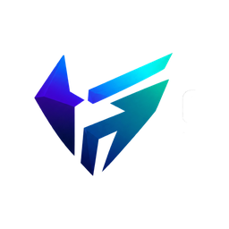
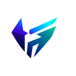

<!--
===============================================================================
                              GAMING HORIZON
                         BEYOND THE HORIZON
===============================================================================

                          OFFICIAL ICON SYSTEM
                   assets/branding/icons/README.md

                         ICON SYSTEM v1.0.0

===============================================================================

DOCUMENT LOCATION
-----------------
assets/branding/icons/README.md

RELATIVE PATH RULE
------------------

Icon files in this directory:
gaming-horizon-icon-128.png

Official logo source:
../logos/gaming-horizon-logo-source.png

Branding documentation:
../README.md

Asset documentation:
../../README.md

Repository root:
../../../

===============================================================================
-->

<div align="center">

<br>


<br><br>

<h1>Gaming Horizon Icon System</h1>

<p>
  <strong>
    Official compact identity assets for browser, application,
    interface, PWA, repository, and platform use.
  </strong>
</p>

<p>
  A scalable icon system designed to preserve Gaming Horizon recognition
  across small-format digital surfaces without compromising clarity,
  consistency, or identity integrity.
</p>

<br>

<!-- ========================================================= -->
<!--                       SYSTEM STATUS                       -->
<!-- ========================================================= -->

<a href="#status">
  
</a>
<a href="#version">
  
</a>
<a href="#icon-system">
  
</a>
<a href="#favicon">
  
</a>
<a href="#license">
  
</a>

<br><br>

<!-- ========================================================= -->
<!--                        ICON SIZES                         -->
<!-- ========================================================= -->

<a href="#16px">
  
</a>
<a href="#32px">
  
</a>
<a href="#48px">
  
</a>
<a href="#64px">
  
</a>
<a href="#128px">
  
</a>

<br>

<a href="#180px">
  
</a>
<a href="#192px">
  
</a>
<a href="#256px">
  
</a>
<a href="#512px">
  
</a>

<br><br>

<!-- ========================================================= -->
<!--                         USE CASES                         -->
<!-- ========================================================= -->

<a href="#browser-use">
  
</a>
<a href="#pwa-use">
  
</a>
<a href="#apple-use">
  
</a>
<a href="#interface-use">
  
</a>
<a href="#standards">
  
</a>

<br><br>

<!-- ========================================================= -->
<!--                       SYSTEM RULES                        -->
<!-- ========================================================= -->

<a href="#integrity">
  
</a>
<a href="#accessibility">
  
</a>
<a href="#performance">
  
</a>
<a href="#workflow">
  
</a>
<a href="#governance">
  
</a>

<br><br>

<!-- ========================================================= -->
<!--                       QUICK LINKS                         -->
<!-- ========================================================= -->

<a href="https://thegaminghorizon.netlify.app/">
  
</a>
<a href="https://github.com/thegaminghorizon/The-Gaming-Horizon">
  
</a>
<a href="https://github.com/thegaminghorizon/The-Gaming-Horizon/issues">
  
</a>

<br><br>

<code>IDENTITY</code>
&nbsp; • &nbsp;
<code>CLARITY</code>
&nbsp; • &nbsp;
<code>SCALABILITY</code>
&nbsp; • &nbsp;
<code>CONSISTENCY</code>
&nbsp; • &nbsp;
<code>PERFORMANCE</code>

<br><br>

</div>

---

<a id="overview"></a>

## ✦ Overview

The Gaming Horizon icon system provides compact identity resources for
environments where the full Gaming Horizon source logo is too large or
impractical.

Icons are intended to preserve brand recognition across small-format surfaces
such as:

- browser tabs;
- bookmarks;
- application interfaces;
- PWA manifests;
- touch icons;
- compact navigation;
- cards;
- repository interfaces;
- device shortcuts;
- future application surfaces.

The icon system exists to solve a specific visual problem:

> **How does Gaming Horizon remain recognizable when only a small amount of
> visual space is available?**

The answer is not simply to shrink the source logo indefinitely.

Small-format identity requires:

```text
CLARITY
SIMPLICITY
RECOGNITION
CONTROLLED DETAIL
CONSISTENT PROPORTION
```

---

<a id="status"></a>

## ✦ Status

Current icon-system status:

```text
ACTIVE DEVELOPMENT
```

Current system coverage:

| Area | Status |
| --- | --- |
| Tiny UI icon | Established |
| Browser icon | Established |
| Desktop icon | Established |
| Interface icon | Established |
| General-purpose icon | Established |
| Apple touch icon | Established |
| PWA icon | Established |
| High-resolution icon | Established |
| Multi-resolution favicon | Established |
| Usage standards | Active |
| Governance | Active |

The current system covers the most common browser, interface, touch, and PWA
requirements.

Additional sizes should only be introduced when a real technical requirement
exists.

---

<a id="version"></a>

## ✦ Version

Current icon-system version:

```text
1.0.0
```

Version structure:

```text
MAJOR.MINOR.PATCH
```

### Major

Used when the core icon architecture or official compact identity changes
significantly.

Example:

```text
1.0.0 → 2.0.0
```

Possible reasons:

```text
New compact identity generation
Replacement of icon geometry
Major source identity change
Complete icon architecture redesign
```

### Minor

Used when meaningful new official icon categories are introduced.

Example:

```text
1.0.0 → 1.1.0
```

Possible reasons:

```text
New application icon family
New monochrome icon system
New platform-specific icon set
New maskable PWA category
```

### Patch

Used for smaller refinements.

Example:

```text
1.0.0 → 1.0.1
```

Possible reasons:

```text
README improvements
Path corrections
Naming refinements
Metadata updates
Minor export fixes
```

---

<a id="icon-system"></a>

## ✦ Icon System

Current architecture:

```text
                   GAMING HORIZON
                         │
                         ▼
                  SOURCE IDENTITY
                         │
                         ▼
                  COMPACT IDENTITY
                         │
       ┌─────────────────┼─────────────────┐
       │                 │                 │
       ▼                 ▼                 ▼
    BROWSER           INTERFACE           PWA
       │                 │                 │
       └─────────────────┼─────────────────┘
                         ▼
                  APPLICATION USE
```

The official icon system is derived from the wider Gaming Horizon identity.

It should not become a separate visual language.

---

## ✦ Current Directory

```text
icons/
├── README.md
├── gaming-horizon-favicon.ico
├── gaming-horizon-icon-16.png
├── gaming-horizon-icon-32.png
├── gaming-horizon-icon-48.png
├── gaming-horizon-icon-64.png
├── gaming-horizon-icon-128.png
├── gaming-horizon-icon-180.png
├── gaming-horizon-icon-192.png
├── gaming-horizon-icon-256.png
└── gaming-horizon-icon-512.png
```

---

## ✦ Icon Register

| Asset | Size | Primary use |
| --- | ---: | --- |
| `gaming-horizon-icon-16.png` | `16×16` | Tiny UI / browser fallback |
| `gaming-horizon-icon-32.png` | `32×32` | Browser / compact UI |
| `gaming-horizon-icon-48.png` | `48×48` | Desktop/browser contexts |
| `gaming-horizon-icon-64.png` | `64×64` | Compact interface branding |
| `gaming-horizon-icon-128.png` | `128×128` | General identity use |
| `gaming-horizon-icon-180.png` | `180×180` | Apple touch icon |
| `gaming-horizon-icon-192.png` | `192×192` | PWA / Android |
| `gaming-horizon-icon-256.png` | `256×256` | High-quality compact branding |
| `gaming-horizon-icon-512.png` | `512×512` | High-resolution application/PWA |
| `gaming-horizon-favicon.ico` | Multi-size | Browser favicon |

---

## ✦ Icon Preview

<div align="center">

<br>


&nbsp;&nbsp;&nbsp;&nbsp;



&nbsp;&nbsp;&nbsp;&nbsp;



<br><br>

<strong>Gaming Horizon Compact Identity</strong>

<br><br>

</div>

---

<a id="16px"></a>

## ✦ 16px Icon

File:

```text
gaming-horizon-icon-16.png
```

Size:

```text
16 × 16
```

Primary use:

```text
TINY UI
FAVICON-SCALE FALLBACK
VERY SMALL INTERFACE CONTEXTS
```

At this size, fine visual detail may naturally be reduced.

The primary requirement is recognizability.

Do not use the `16px` file for larger presentation contexts.

---

<a id="32px"></a>

## ✦ 32px Icon

File:

```text
gaming-horizon-icon-32.png
```

Size:

```text
32 × 32
```

Primary use:

```text
BROWSER TABS
BOOKMARK CONTEXTS
COMPACT INTERFACE ELEMENTS
```

This size offers improved identity clarity compared with very small favicon
contexts.

---

<a id="48px"></a>

## ✦ 48px Icon

File:

```text
gaming-horizon-icon-48.png
```

Size:

```text
48 × 48
```

Primary use:

```text
DESKTOP CONTEXTS
BROWSER APPLICATION SURFACES
COMPACT PLATFORM UI
```

This size is appropriate where slightly more detail can be preserved while
remaining compact.

---

<a id="64px"></a>

## ✦ 64px Icon

File:

```text
gaming-horizon-icon-64.png
```

Size:

```text
64 × 64
```

Primary use:

```text
INTERFACE PRESENTATION
COMPACT BRAND MODULES
NAVIGATION SURFACES
```

---

<a id="128px"></a>

## ✦ 128px Icon

File:

```text
gaming-horizon-icon-128.png
```

Size:

```text
128 × 128
```

Primary use:

```text
GENERAL COMPACT BRANDING
REPOSITORY PRESENTATION
APPLICATION SURFACES
CARDS
PROJECT MODULES
```

This is a useful general-purpose icon where neither very small nor very large
presentation is required.

---

<a id="180px"></a>

## ✦ 180px Icon

File:

```text
gaming-horizon-icon-180.png
```

Size:

```text
180 × 180
```

Primary use:

```text
APPLE TOUCH ICON
MOBILE SHORTCUT PRESENTATION
SUPPORTED APPLE WEB EXPERIENCES
```

---

<a id="192px"></a>

## ✦ 192px Icon

File:

```text
gaming-horizon-icon-192.png
```

Size:

```text
192 × 192
```

Primary use:

```text
PWA
ANDROID
WEB APP MANIFEST
APPLICATION SHORTCUTS
```

This is one of the primary PWA icon sizes.

---

<a id="256px"></a>

## ✦ 256px Icon

File:

```text
gaming-horizon-icon-256.png
```

Size:

```text
256 × 256
```

Primary use:

```text
HIGH-QUALITY COMPACT BRANDING
APPLICATION PRESENTATION
REPOSITORY MEDIA
LARGER INTERFACE MODULES
```

---

<a id="512px"></a>

## ✦ 512px Icon

File:

```text
gaming-horizon-icon-512.png
```

Size:

```text
512 × 512
```

Primary use:

```text
HIGH-RESOLUTION PWA
APPLICATION MANIFEST
LARGE ICON PRESENTATION
FUTURE PLATFORM USE
```

Use this size when a high-resolution compact identity resource is required.

---

<a id="favicon"></a>

## ✦ Browser Favicon

File:

```text
gaming-horizon-favicon.ico
```

The favicon provides browser-compatible multi-resolution identity support.

Primary environments:

```text
BROWSER TAB
BOOKMARK
SHORTCUT
FAVORITES
SUPPORTED DESKTOP CONTEXTS
```

---

<a id="browser-use"></a>

## ✦ Browser Use

Basic HTML example:

```html
<link
  rel="icon"
  href="/assets/branding/icons/gaming-horizon-favicon.ico"
/>
```

PNG favicon example:

```html
<link
  rel="icon"
  type="image/png"
  sizes="32x32"
  href="/assets/branding/icons/gaming-horizon-icon-32.png"
/>
```

Additional fallback:

```html
<link
  rel="icon"
  type="image/png"
  sizes="16x16"
  href="/assets/branding/icons/gaming-horizon-icon-16.png"
/>
```

---

<a id="apple-use"></a>

## ✦ Apple Touch Icon

Example:

```html
<link
  rel="apple-touch-icon"
  sizes="180x180"
  href="/assets/branding/icons/gaming-horizon-icon-180.png"
/>
```

The `180×180` asset is intended for Apple touch-icon-compatible environments.

---

<a id="pwa-use"></a>

## ✦ PWA Use

Recommended manifest assets:

```json
{
  "icons": [
    {
      "src": "/assets/branding/icons/gaming-horizon-icon-192.png",
      "sizes": "192x192",
      "type": "image/png"
    },
    {
      "src": "/assets/branding/icons/gaming-horizon-icon-512.png",
      "sizes": "512x512",
      "type": "image/png"
    }
  ]
}
```

These provide common PWA icon dimensions.

> [!NOTE]
> Actual deployment paths may differ depending on application architecture.
> The examples above represent repository-relative identity guidance, not a
> requirement that production assets must be served directly from `assets/`.

---

<a id="interface-use"></a>

## ✦ Interface Use

Icons may support compact Gaming Horizon interface presentation.

Possible contexts:

```text
NAVIGATION
PROJECT CARDS
ACCOUNT SURFACES
PLATFORM MODULES
DOCUMENTATION
COMPACT BRANDING
APPLICATION TILES
```

Example:

```html

```

---

<a id="standards"></a>

## ✦ Icon Standards

Every official icon should satisfy a baseline standard.

### Recognition

The Gaming Horizon identity should remain recognizable.

### Proportion

The original geometry should remain correctly proportioned.

### Clarity

The asset should remain visually understandable at its intended size.

### Purpose

Each size should have a defined use case.

### Consistency

Different icon sizes should represent the same identity system.

### Technical suitability

The file should be appropriate for its intended environment.

---

<a id="integrity"></a>

## ✦ Identity Integrity

Do not:

```text
STRETCH
SKEW
ROTATE
ARBITRARILY RECOLOR
REDRAW
CHANGE GEOMETRY
OVER-CROP
ADD EXCESSIVE GLOW
ADD UNCONTROLLED SHADOW
DISTORT PROPORTIONS
```

Preserve:

```text
RECOGNIZABLE GEOMETRY
CORRECT PROPORTIONS
CLEAR SPACE
EDGE CLARITY
CONSISTENCY
```

---

## ✦ Official Source Relationship

The compact icon system is derived from the wider Gaming Horizon identity.

Official source:

```text
../logos/gaming-horizon-logo-source.png
```

The source logo remains the authoritative identity reference.

Icons are optimized applications of that identity.

They should not redefine it.

---

## ✦ Clear Space

Small-format identity still needs breathing room.

Avoid placing icons directly against:

```text
TEXT
PAGE EDGES
OTHER LOGOS
BUTTON BORDERS
HEAVY GLOW
VISUALLY DENSE BACKGROUNDS
```

unless the interface composition clearly supports it.

---

## ✦ Small-Size Clarity

At very small dimensions:

```text
16PX
32PX
```

visual details may naturally become less visible.

Judge small-format icons primarily by:

```text
SILHOUETTE
RECOGNITION
EDGE CLARITY
COLOR SEPARATION
```

Do not judge them solely by whether every high-resolution detail remains
visible.

---

## ✦ Background Compatibility

Icons should remain readable against the intended environment.

Check:

```text
CONTRAST
EDGE VISIBILITY
BACKGROUND COMPLEXITY
BRIGHTNESS
COLOR SEPARATION
```

Avoid backgrounds that make the mark visually disappear.

---

<a id="performance"></a>

## ✦ Performance

Icon files are frequently loaded in high-frequency interface environments.

They should remain lightweight and appropriately sized.

Avoid using:

```text
gaming-horizon-icon-512.png
```

when:

```text
gaming-horizon-icon-32.png
```

is sufficient for the actual rendered size.

Using the appropriate file reduces unnecessary resource cost.

---

## ✦ Size Selection

General selection model:

```text
DISPLAY NEED
    │
    ▼
CHOOSE NEAREST APPROPRIATE ICON
    │
    ▼
AVOID UNNECESSARY OVERSIZED FILE
```

Example:

```text
Browser tab        → 16 / 32
Compact UI         → 32 / 48 / 64
General branding   → 128
Apple touch        → 180
PWA                 → 192 / 512
High-quality UI    → 256
Large app identity → 512
```

---

## ✦ File Format

Current standard:

```text
PNG
ICO
```

### PNG

Used for:

```text
TRANSPARENCY
HIGH-QUALITY ICON PRESENTATION
PWA
APPLICATION USE
INTERFACE BRANDING
```

### ICO

Used for:

```text
BROWSER FAVICON SUPPORT
MULTI-RESOLUTION BROWSER IDENTITY
```

---

## ✦ Naming Standard

Current pattern:

```text
gaming-horizon-icon-[size].png
```

Examples:

```text
gaming-horizon-icon-16.png
gaming-horizon-icon-128.png
gaming-horizon-icon-512.png
```

Favicon:

```text
gaming-horizon-favicon.ico
```

Avoid:

```text
icon.png
icon2.png
favicon-new.ico
final-icon.png
final-final-icon.png
logo-small.png
```

---

## ✦ Naming Philosophy

A filename should answer:

```text
WHAT PROJECT?
WHAT TYPE OF ASSET?
WHAT SIZE OR VARIANT?
WHAT FORMAT?
```

For example:

```text
gaming-horizon-icon-192.png
```

immediately communicates:

```text
PROJECT    → Gaming Horizon
TYPE       → Icon
SIZE       → 192
FORMAT     → PNG
```

---

<a id="accessibility"></a>

## ✦ Accessibility

Compact branding should still be accessible.

Embedded icons should use meaningful alternative text where the icon conveys
identity.

Recommended:

```html

```

If an icon is purely decorative and nearby text already communicates the
identity, accessibility implementation may differ depending on the interface.

---

## ✦ Avoid Text Inside Icons

Do not rely on tiny embedded text inside icon assets.

At small sizes:

```text
TEXT BECOMES UNREADABLE
DETAIL IS LOST
ACCESSIBILITY IS REDUCED
```

The icon should work primarily through recognizable visual identity.

---

## ✦ Responsive Use

Icons should be displayed according to context.

Avoid forcing the same rendered size everywhere.

Example:

```html

```

The original source file can be larger than the rendered size when appropriate.

Do not stretch tiny files significantly beyond their intended use.

---

## ✦ Repository Usage

From repository root:

```html

```

---

## ✦ Assets README Usage

From:

```text
assets/README.md
```

use:

```html

```

---

## ✦ Branding README Usage

From:

```text
assets/branding/README.md
```

use:

```html

```

---

## ✦ Local README Usage

From this file:

```text
assets/branding/icons/README.md
```

use:

```html

```

---

## ✦ Documentation Usage

From:

```text
docs/VISION.md
```

use:

```html

```

---

## ✦ Relative Paths

This README lives at:

```text
assets/branding/icons/README.md
```

Therefore local icon assets require no additional directory prefix.

Correct:

```text
gaming-horizon-icon-128.png
```

Official logo:

```text
../logos/gaming-horizon-logo-source.png
```

Branding README:

```text
../README.md
```

Assets README:

```text
../../README.md
```

Repository README:

```text
../../../README.md
```

---

## ✦ Path Matrix

| Document | Correct 128px icon path |
| --- | --- |
| `/README.md` | `assets/branding/icons/gaming-horizon-icon-128.png` |
| `/assets/README.md` | `branding/icons/gaming-horizon-icon-128.png` |
| `/assets/branding/README.md` | `icons/gaming-horizon-icon-128.png` |
| `/assets/branding/icons/README.md` | `gaming-horizon-icon-128.png` |
| `/docs/VISION.md` | `../assets/branding/icons/gaming-horizon-icon-128.png` |

---

<details>

<summary><strong>✦ Icon troubleshooting</strong></summary>

<br>

If an icon fails to render:

1. Confirm the exact filename.
2. Confirm the size number.
3. Confirm lowercase/uppercase characters.
4. Confirm the extension.
5. Confirm the file exists on the current branch.
6. Identify the Markdown file location.
7. Calculate the relative path from that location.
8. Open the icon directly on GitHub.

For this README:

```text
assets/branding/icons/README.md
```

the `128px` icon path is:

```text
gaming-horizon-icon-128.png
```

</details>

---

<a id="workflow"></a>

## ✦ Icon Workflow

New official icon assets should follow:

```text
TECHNICAL NEED
      ↓
SOURCE REVIEW
      ↓
CREATE / EXPORT
      ↓
SMALL-SIZE REVIEW
      ↓
IDENTITY REVIEW
      ↓
QUALITY CHECK
      ↓
APPROVE
      ↓
PUBLISH
```

New sizes should not be introduced without a reason.

---

## ✦ Icon States

| State | Meaning |
| --- | --- |
| `SOURCE` | Original compact identity reference |
| `APPROVED` | Approved for official use |
| `ACTIVE` | Currently used |
| `EXPERIMENTAL` | Under evaluation |
| `REPLACED` | Superseded |
| `ARCHIVED` | Historical reference |
| `DEPRECATED` | Should no longer be used |

---

## ✦ Adding a New Icon Size

Before adding another size:

1. Confirm that the target platform genuinely requires it.
2. Check whether an existing icon size already works.
3. Preserve the same visual identity.
4. Export at the exact required dimensions.
5. Verify clarity at native size.
6. Verify transparency.
7. Verify file naming.
8. Update this README.
9. Update application configuration where relevant.

---

## ✦ Replacing an Icon

When replacing an existing icon:

1. Confirm the new source.
2. Export every affected size consistently.
3. Verify the smallest sizes carefully.
4. Check browser rendering.
5. Check PWA configuration.
6. Check Apple touch usage.
7. Update documentation.
8. Avoid leaving conflicting active variants.

---

## ✦ Quality Gate

Before approving an icon:

- [ ] Official Gaming Horizon identity is preserved
- [ ] Correct dimensions are used
- [ ] Correct aspect ratio is preserved
- [ ] Transparency is correct
- [ ] Small-size recognition is acceptable
- [ ] Edge clarity is acceptable
- [ ] No accidental crop exists
- [ ] No unauthorized redesign is present
- [ ] File naming is correct
- [ ] File format is correct
- [ ] File size is appropriate
- [ ] Intended technical use is understood
- [ ] Accessibility has been considered
- [ ] Source relationship is clear

---

## ✦ Technical Integrity

Icons should never contain:

```text
PRIVATE DATA
CREDENTIALS
PERSONAL INFORMATION
HIDDEN TRACKING CONTENT
UNRELATED THIRD-PARTY BRANDING
```

Official identity assets should remain clean and predictable.

---

## ✦ Truthful Presentation

An icon should communicate identity.

It should not imply:

```text
CERTIFICATION
PARTNERSHIP
ENDORSEMENT
PLATFORM APPROVAL
THIRD-PARTY AFFILIATION
```

unless such a relationship genuinely exists and is documented appropriately.

---

<a id="governance"></a>

## ✦ Icon Governance

Gaming Horizon icon assets form part of the wider visual identity.

The presence of these assets in the repository does **not** automatically
authorize use that falsely implies:

```text
ENDORSEMENT
AUTHORIZATION
SPONSORSHIP
CERTIFICATION
PARTNERSHIP
OWNERSHIP
OFFICIAL AFFILIATION
```

Third-party trademarks, applications, services, platforms, and other
intellectual property remain the property of their respective owners.

---

<a id="license"></a>

## ✦ License & Policies

From:

```text
assets/branding/icons/README.md
```

repository policy files are three levels above.

### License

```text
../../../LICENSE
```

### Copyright

```text
../../../COPYRIGHT.md
```

### Security

```text
../../../SECURITY.md
```

### Privacy

```text
../../../PRIVACY.md
```

### Terms

```text
../../../TERMS.md
```

### Third-party notices

```text
../../../THIRD-PARTY-NOTICES.md
```

### Contributions

```text
../../../CONTRIBUTING.md
```

### Code of Conduct

```text
../../../CODE_OF_CONDUCT.md
```

---

## ✦ Icon Golden Rules

### `01` — Recognition comes first

A compact icon must still feel like Gaming Horizon.

### `02` — Use the correct size

Do not load an unnecessarily large file for a tiny interface.

### `03` — Preserve proportions

Never distort compact identity geometry.

### `04` — Protect small-size clarity

Tiny icons must remain understandable.

### `05` — Preserve transparency

Avoid unwanted backgrounds unless purpose-built.

### `06` — Maintain source continuity

Icons should remain connected to the official identity.

### `07` — Name files clearly

Size and purpose should be immediately understandable.

### `08` — Optimize responsibly

Compact assets should remain technically efficient.

### `09` — Add sizes only when required

Do not create meaningless variants.

### `10` — Evolve intentionally

Future icon systems should strengthen identity rather than fragment it.

---

## ✦ Current Icon Register

```text
icons/
├── README.md
├── gaming-horizon-favicon.ico
├── gaming-horizon-icon-16.png
├── gaming-horizon-icon-32.png
├── gaming-horizon-icon-48.png
├── gaming-horizon-icon-64.png
├── gaming-horizon-icon-128.png
├── gaming-horizon-icon-180.png
├── gaming-horizon-icon-192.png
├── gaming-horizon-icon-256.png
└── gaming-horizon-icon-512.png
```

---

## ✦ Icon Standard

A Gaming Horizon icon should ultimately be:

| # | Standard | Meaning |
|:---:|---|---|
| `01` | **Recognizable** | Clearly belongs to Gaming Horizon |
| `02` | **Compact** | Works within limited visual space |
| `03` | **Clear** | Maintains readable geometry |
| `04` | **Consistent** | Matches the wider identity |
| `05` | **Scalable** | Works across intended sizes |
| `06` | **Efficient** | Uses appropriate resources |
| `07` | **Accessible** | Supports understandable presentation |
| `08` | **Purposeful** | Has a defined technical role |
| `09` | **Protected** | Preserves identity integrity |
| `10` | **Evolving** | Can expand when genuine needs emerge |

---

## ✦ Release Information

```text
SYSTEM          Gaming Horizon Icon System
VERSION         1.0.0
STATUS          Active Development
TYPE            Official Compact Identity Assets
PROJECT         Gaming Horizon
LOCATION        assets/branding/icons/
REPOSITORY      The-Gaming-Horizon
```

---

<div align="center">

<br>


<br><br>

<strong>GAMING HORIZON</strong>

<br>

<sub>Official Icon System · Version 1.0.0</sub>

<br><br>

<a href="#status">
  
</a>
<a href="#version">
  
</a>
<a href="#favicon">
  
</a>
<a href="#pwa-use">
  
</a>
<a href="#standards">
  
</a>

<br><br>

<a href="https://thegaminghorizon.netlify.app/">
  
</a>
<a href="https://github.com/thegaminghorizon/The-Gaming-Horizon">
  
</a>
<a href="https://github.com/thegaminghorizon/The-Gaming-Horizon/issues">
  
</a>

<br><br>

<code>
IDENTITY · CLARITY · SCALABILITY · CONSISTENCY · PERFORMANCE
</code>

<br><br>

<strong>
Stay recognizable at every size. Preserve the identity. Build beyond.
</strong>

<br><br>

<sub>
© 2026 Gaming Horizon · Beyond the Horizon
</sub>

<br><br>

</div>
