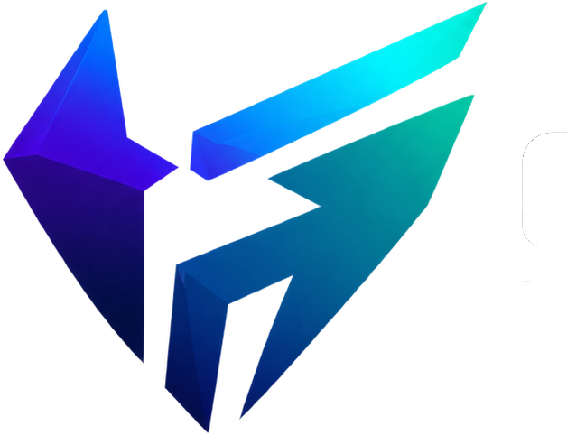
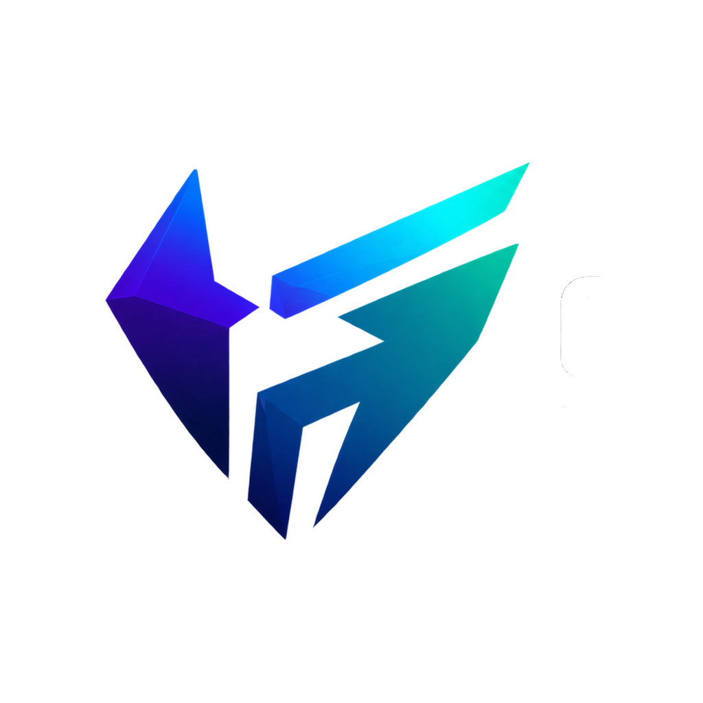
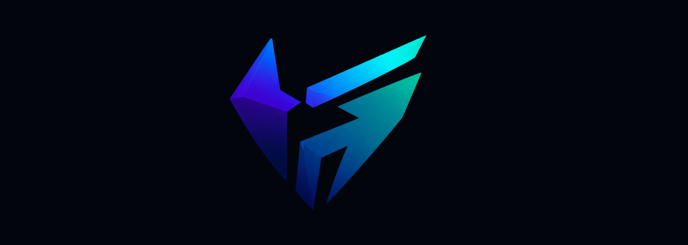

<!--
===============================================================================
                              GAMING HORIZON
                         BEYOND THE HORIZON
===============================================================================

                          OFFICIAL LOGO SYSTEM
                   assets/branding/logos/README.md

                         LOGO SYSTEM v1.0.0

===============================================================================

DOCUMENT LOCATION
-----------------
assets/branding/logos/README.md

RELATIVE PATH RULE
------------------

Logo files in this directory:
gaming-horizon-logo-source.png
gaming-horizon-logo-mark.png
gaming-horizon-logo-mark-square.png
gaming-horizon-logo-readme.png

Branding documentation:
../README.md

Asset documentation:
../../README.md

Repository root:
../../../

===============================================================================
-->

<div align="center">

<br>


<br><br>

<h1>Gaming Horizon Logo System</h1>

<p>
  <strong>
    Official source identity, approved logo variants,
    compact marks, and repository-ready branding for Gaming Horizon.
  </strong>
</p>

<p>
  A controlled identity system designed to preserve recognition,
  consistency, proportion, clarity, and long-term brand integrity
  across every official Gaming Horizon environment.
</p>

<br>

<!-- ========================================================= -->
<!--                       SYSTEM STATUS                       -->
<!-- ========================================================= -->

<a href="#status">
  
</a>
<a href="#version">
  
</a>
<a href="#logo-system">
  
</a>
<a href="#source-logo">
  
</a>
<a href="#license">
  
</a>

<br><br>

<!-- ========================================================= -->
<!--                        LOGO TYPES                         -->
<!-- ========================================================= -->

<a href="#source-logo">
  
</a>
<a href="#logo-mark">
  
</a>
<a href="#square-mark">
  
</a>
<a href="#readme-logo">
  
</a>

<br><br>

<!-- ========================================================= -->
<!--                       SYSTEM RULES                        -->
<!-- ========================================================= -->

<a href="#integrity">
  
</a>
<a href="#clear-space">
  
</a>
<a href="#backgrounds">
  
</a>
<a href="#accessibility">
  
</a>
<a href="#governance">
  
</a>

<br><br>

<!-- ========================================================= -->
<!--                       QUICK LINKS                         -->
<!-- ========================================================= -->

<a href="https://thegaminghorizon.netlify.app/">
  
</a>
<a href="https://github.com/thegaminghorizon/The-Gaming-Horizon">
  
</a>
<a href="https://github.com/thegaminghorizon/The-Gaming-Horizon/issues">
  
</a>

<br><br>

<code>IDENTITY</code>
&nbsp; • &nbsp;
<code>RECOGNITION</code>
&nbsp; • &nbsp;
<code>PROPORTION</code>
&nbsp; • &nbsp;
<code>CONSISTENCY</code>
&nbsp; • &nbsp;
<code>INTEGRITY</code>

<br><br>

</div>

---

<a id="overview"></a>

## ✦ Overview

The Gaming Horizon logo system defines the primary visual signature of the
project.

It contains the approved logo resources used to identify Gaming Horizon across
repository documentation, product interfaces, website presentation, community
environments, project media, and other official surfaces.

The system is intentionally small.

Current identity resources include:

```text
PRIMARY SOURCE LOGO
COMPACT LOGO MARK
SQUARE LOGO MARK
README / DOCUMENTATION LOGO
```

The objective is not to create as many logo variants as possible.

The objective is to maintain a **small, controlled, recognizable identity
system**.

> [!IMPORTANT]
> The fewer official logo variants a project maintains, the easier it is to
> preserve consistency and prevent identity drift.

---

<a id="status"></a>

## ✦ Status

Current logo-system status:

```text
ACTIVE DEVELOPMENT
```

Current logo coverage:

| Area | Status |
| --- | --- |
| Official source logo | Established |
| Compact mark | Established |
| Square mark | Established |
| README presentation | Established |
| Logo integrity guidance | Active |
| Clear-space guidance | Active |
| Background guidance | Active |
| Accessibility guidance | Active |
| Logo governance | Active |
| Future variants | Added only when required |

The existing logo system should be considered the current official identity
set unless an approved replacement or additional variation is introduced.

---

<a id="version"></a>

## ✦ Version

Current logo-system version:

```text
1.0.0
```

Version structure:

```text
MAJOR.MINOR.PATCH
```

### Major

Used when the primary Gaming Horizon identity changes significantly.

Example:

```text
1.0.0 → 2.0.0
```

Possible reasons:

```text
New primary identity generation
Major logo geometry change
Complete visual identity replacement
Major source-logo redesign
```

### Minor

Used when a meaningful new approved identity variant is introduced.

Example:

```text
1.0.0 → 1.1.0
```

Possible reasons:

```text
New monochrome variant
New application-specific identity
New horizontal identity variant
New compact official configuration
```

### Patch

Used for smaller refinements that do not alter the core identity.

Example:

```text
1.0.0 → 1.0.1
```

Possible reasons:

```text
README correction
Relative-path fix
Metadata improvement
Naming clarification
Minor export correction
```

> [!NOTE]
> Version `1.0.0` represents the documented Gaming Horizon logo system.
> It does not mean that every PNG file independently carries its own semantic
> version.

---

<a id="logo-system"></a>

## ✦ Logo System

The current identity hierarchy is:

```text
                     GAMING HORIZON
                           │
                           ▼
                  OFFICIAL SOURCE LOGO
                           │
              ┌────────────┼────────────┐
              │            │            │
              ▼            ▼            ▼
          LOGO MARK    SQUARE MARK   README LOGO
              │            │            │
              └────────────┼────────────┘
                           ▼
                  OFFICIAL APPLICATION
```

The source logo is the authoritative visual reference.

The other assets are approved applications of that identity.

They should not be treated as separate brands.

---

## ✦ Current Directory

```text
logos/
├── README.md
├── gaming-horizon-logo-source.png
├── gaming-horizon-logo-mark.png
├── gaming-horizon-logo-mark-square.png
└── gaming-horizon-logo-readme.png
```

---

## ✦ Logo Register

| Asset | Role | Classification | Priority |
| --- | --- | --- |:---:|
| `gaming-horizon-logo-source.png` | Primary identity reference | Source | **Highest** |
| `gaming-horizon-logo-mark.png` | Compact identity | Approved variant | High |
| `gaming-horizon-logo-mark-square.png` | Square compact identity | Approved variant | High |
| `gaming-horizon-logo-readme.png` | Documentation presentation | Supporting | Standard |

---

<a id="source-logo"></a>

## ✦ Official Source Logo

File:

```text
gaming-horizon-logo-source.png
```

<div align="center">

<br>


<br><br>

<strong>Primary Gaming Horizon Identity Reference</strong>

<br><br>

</div>

The source logo is the highest-priority visual reference in the Gaming Horizon
identity system.

Use it when:

- identity accuracy matters;
- reviewing official branding;
- preparing new approved derivatives;
- presenting the primary Gaming Horizon identity;
- validating other logo exports;
- creating high-quality repository presentation;
- preparing approved project media.

---

## ✦ Source Priority

When multiple identity assets could be used and there is no technical reason
to prefer a derivative, the source logo should remain the primary reference.

```text
SOURCE LOGO
    │
    ▼
IDENTITY TRUTH
    │
    ▼
APPROVED DERIVATIVES
```

The source should remain preserved even if newer optimized variants are
created.

---

## ✦ Source Preservation

Do not overwrite:

```text
gaming-horizon-logo-source.png
```

simply to create another version.

Create a separate descriptive file instead.

For example:

```text
gaming-horizon-logo-mark.png
gaming-horizon-logo-mark-square.png
gaming-horizon-logo-readme.png
```

This protects:

```text
ORIGINAL QUALITY
TRACEABILITY
IDENTITY HISTORY
FUTURE EDITING
CONSISTENCY
```

---

<a id="logo-mark"></a>

## ✦ Logo Mark

File:

```text
gaming-horizon-logo-mark.png
```

<div align="center">

<br>



<br><br>

<strong>Gaming Horizon Compact Logo Mark</strong>

<br><br>

</div>

The logo mark is a compact application of the Gaming Horizon identity.

It is useful where the full source presentation is unnecessary or where space
is limited.

Potential environments include:

```text
NAVIGATION
CARDS
INTERFACE SURFACES
DOCUMENTATION
REPOSITORY COMPONENTS
COMPACT BRAND MODULES
PROJECT PREVIEWS
```

---

## ✦ Logo Mark Usage

Use the mark when:

- compact recognition is more important than full presentation;
- the available visual area is limited;
- the surrounding context already establishes Gaming Horizon;
- an interface requires a smaller identity signature.

Do not use the mark simply because it is smaller.

Choose the variant that best serves the actual environment.

---

<a id="square-mark"></a>

## ✦ Square Logo Mark

File:

```text
gaming-horizon-logo-mark-square.png
```

<div align="center">

<br>



<br><br>

<strong>Gaming Horizon Square Identity Variant</strong>

<br><br>

</div>

The square mark is designed for visual environments where balanced dimensions
are more appropriate.

Potential uses include:

```text
PROFILE-STYLE CONTAINERS
SQUARE PREVIEWS
PROJECT TILES
COMPACT INTERFACE MODULES
APPLICATION SURFACES
REPOSITORY CARDS
```

---

## ✦ Square Mark vs Icon

The square mark and icon system are related but serve different purposes.

### Square logo mark

```text
BRAND PRESENTATION
COMPACT VISUAL IDENTITY
DOCUMENTATION
PROJECT MEDIA
```

### Icon system

```text
BROWSER
PWA
APPLICATION
SMALL UI
TECHNICAL IDENTITY
```

Do not automatically substitute one for the other when a purpose-built asset
already exists.

---

<a id="readme-logo"></a>

## ✦ README Logo

File:

```text
gaming-horizon-logo-readme.png
```

<div align="center">

<br>



<br><br>

<strong>Gaming Horizon Documentation Presentation</strong>

<br><br>

</div>

The README logo is a supporting presentation asset intended for repository and
documentation environments.

Possible uses include:

```text
README INTRODUCTIONS
DOCUMENTATION LANDING PAGES
PROJECT PRESENTATION
REPOSITORY SECTIONS
```

The README variant does not replace:

```text
gaming-horizon-logo-source.png
```

as the authoritative source identity.

---

<a id="integrity"></a>

## ✦ Logo Integrity

The Gaming Horizon logo should remain immediately recognizable.

The surrounding design should adapt to the identity.

The identity should not be distorted simply to fit a composition.

### Do not

```text
STRETCH
COMPRESS
SKEW
ROTATE
ARBITRARILY RECOLOR
REDRAW INACCURATELY
CHANGE GEOMETRY
DISTORT PROPORTIONS
CROP CRITICAL AREAS
ADD EXCESSIVE GLOW
ADD HEAVY OUTLINES
ADD UNCONTROLLED SHADOWS
COVER THE MARK
RECREATE APPROXIMATE VERSIONS
```

### Preserve

```text
PROPORTION
GEOMETRY
RECOGNITION
CLEAR SPACE
CONTRAST
RESOLUTION
VISUAL BALANCE
SOURCE CONTINUITY
```

---

## ✦ Distortion

Never resize a logo by independently changing width and height.

Avoid:

```html

```

unless those dimensions exactly preserve the source aspect ratio.

Prefer:

```html

```

Let the browser calculate the corresponding height.

---

## ✦ Rotation

Do not rotate the logo for decoration.

The orientation of the official asset should remain unchanged unless a future
approved variation explicitly requires otherwise.

---

## ✦ Recoloring

Do not arbitrarily recolor the official identity.

Avoid creating unofficial variations such as:

```text
RED LOGO
GREEN LOGO
RAINBOW LOGO
GOLD LOGO
MONOCHROME LOGO
```

unless an approved asset for that purpose actually exists.

If a monochrome or special-use identity is needed later, it should be added as
an intentional official variant.

---

## ✦ Effects

Effects may be used around branding presentation, but the logo itself should
remain identifiable.

Avoid:

```text
HEAVY BLUR
EXTREME GLOW
OVER-SATURATION
STRONG OUTLINE
DISTORTION EFFECTS
PARTICLE COVERAGE
LIGHT FLARES OVER CRITICAL GEOMETRY
```

Effects should strengthen presentation, not modify identity.

---

<a id="clear-space"></a>

## ✦ Clear Space

The Gaming Horizon logo should have enough surrounding space to remain visually
independent.

Clear space helps prevent:

```text
CROWDING
VISUAL COLLISION
LOSS OF RECOGNITION
POOR HIERARCHY
```

Avoid positioning the logo too close to:

- page edges;
- headings;
- navigation links;
- buttons;
- other logos;
- cards;
- decorative borders;
- characters;
- particles;
- high-detail artwork.

---

## ✦ Practical Clear-Space Rule

Until a formal geometric clear-space measurement is established, use a visual
rule:

> The logo should never appear crowded by surrounding elements.

Provide enough empty space that the mark remains the obvious identity element.

Do not invent exact official spacing measurements unless they have been
formally established.

---

<a id="backgrounds"></a>

## ✦ Background Compatibility

The Gaming Horizon identity must remain clearly visible against its
surroundings.

Before publishing, verify:

```text
EDGE VISIBILITY
COLOR SEPARATION
BACKGROUND COMPLEXITY
BRIGHTNESS
CONTRAST
FOCAL CLARITY
```

---

## ✦ Dark Backgrounds

Dark environments generally align well with the Gaming Horizon visual
direction.

Common foundations include:

```text
MIDNIGHT BLACK
DEEP CHARCOAL
DARK NAVY
COSMIC BLUE
```

However, a dark background should not be so visually dense that the logo loses
clarity.

---

## ✦ Light Backgrounds

When using the logo against lighter environments:

- verify edge separation;
- avoid washed-out presentation;
- preserve color distinction;
- ensure all important identity geometry remains visible.

If the current logo asset is not suitable for a particular background, do not
invent a new version casually.

Use an approved alternative or develop a new official variant deliberately.

---

## ✦ Complex Backgrounds

When placing a logo over artwork or imagery:

Avoid:

```text
HIGH DETAIL DIRECTLY BEHIND THE MARK
BRIGHT LIGHT SOURCES BEHIND THE MARK
CHARACTERS OVERLAPPING THE MARK
TEXTURE THAT DESTROYS EDGE CLARITY
```

Use:

```text
NEGATIVE SPACE
CONTROLLED CONTRAST
SUBTLE BACKGROUND TREATMENT
VISUAL SEPARATION
```

---

## ✦ Minimum Practical Visibility

A formal minimum logo size has not been established in this document.

Instead, use practical visual testing.

At the intended size, ensure:

- major geometry remains recognizable;
- edges remain clear;
- color separation remains understandable;
- the identity does not become visually muddy.

For very small surfaces, use the dedicated icon system instead of endlessly
shrinking a larger logo asset.

Icon system:

```text
../icons/
```

---

## ✦ Logo Selection Guide

Use this basic decision model:

```text
NEED FULL PRIMARY IDENTITY?
          │
          ├── YES → SOURCE LOGO
          │
          └── NO
               │
               ▼
        NEED COMPACT BRAND MARK?
               │
               ├── YES → LOGO MARK
               │
               └── NO
                    │
                    ▼
            NEED SQUARE FORMAT?
                    │
                    ├── YES → SQUARE MARK
                    │
                    └── NO
                         │
                         ▼
             DOCUMENTATION CONTEXT?
                         │
                         └── README LOGO
```

---

## ✦ Usage Matrix

| Environment | Recommended starting asset |
| --- | --- |
| Primary brand presentation | `gaming-horizon-logo-source.png` |
| Repository introduction | Source or README logo |
| Compact card | `gaming-horizon-logo-mark.png` |
| Square identity container | `gaming-horizon-logo-mark-square.png` |
| Documentation presentation | `gaming-horizon-logo-readme.png` |
| Browser favicon | Use `../icons/` |
| PWA icon | Use `../icons/` |
| Small application icon | Use `../icons/` |

This matrix is guidance rather than an absolute rule.

Actual context should determine the most appropriate approved asset.

---

## ✦ GitHub Usage

From the repository root:

```html

```

---

## ✦ Assets README Usage

From:

```text
assets/README.md
```

use:

```html

```

---

## ✦ Branding README Usage

From:

```text
assets/branding/README.md
```

use:

```html

```

---

## ✦ Local README Usage

From this file:

```text
assets/branding/logos/README.md
```

use:

```html

```

---

## ✦ Documentation Usage

From a document such as:

```text
docs/VISION.md
```

use:

```html

```

---

## ✦ Relative Paths

This README lives at:

```text
assets/branding/logos/README.md
```

Therefore local logo files require no directory prefix.

Correct:

```text
gaming-horizon-logo-source.png
```

Branding README:

```text
../README.md
```

Assets README:

```text
../../README.md
```

Repository README:

```text
../../../README.md
```

---

## ✦ Path Matrix

| Document | Correct source-logo path |
| --- | --- |
| `/README.md` | `assets/branding/logos/gaming-horizon-logo-source.png` |
| `/assets/README.md` | `branding/logos/gaming-horizon-logo-source.png` |
| `/assets/branding/README.md` | `logos/gaming-horizon-logo-source.png` |
| `/assets/branding/logos/README.md` | `gaming-horizon-logo-source.png` |
| `/assets/screenshots/README.md` | `../branding/logos/gaming-horizon-logo-source.png` |
| `/assets/showcase/README.md` | `../branding/logos/gaming-horizon-logo-source.png` |
| `/docs/VISION.md` | `../assets/branding/logos/gaming-horizon-logo-source.png` |

---

<details>

<summary><strong>✦ Logo troubleshooting</strong></summary>

<br>

If a logo does not render on GitHub:

1. Confirm the exact filename.
2. Confirm capitalization.
3. Confirm the extension.
4. Confirm the image exists on the same branch.
5. Identify the current Markdown file directory.
6. Calculate the relative path from that location.
7. Open the logo directly on GitHub.
8. Check that an extra `assets/`, `branding/`, or `logos/` directory was not
   accidentally added to the path.

For this README:

```text
assets/branding/logos/README.md
```

the source logo path is simply:

```text
gaming-horizon-logo-source.png
```

</details>

---

## ✦ Naming Standard

Current naming follows:

```text
gaming-horizon-logo-[variant].png
```

Current examples:

```text
gaming-horizon-logo-source.png
gaming-horizon-logo-mark.png
gaming-horizon-logo-mark-square.png
gaming-horizon-logo-readme.png
```

Avoid:

```text
logo.png
new-logo.png
logo2.png
logo-final.png
final-final-logo.png
latest-logo.png
best-logo.png
```

---

## ✦ Naming Philosophy

A logo filename should communicate:

```text
PROJECT
ASSET TYPE
VARIANT
FORMAT
```

Example:

```text
gaming-horizon-logo-mark-square.png
```

means:

```text
PROJECT     Gaming Horizon
TYPE        Logo
VARIANT     Mark Square
FORMAT      PNG
```

---

## ✦ File Format

Current official logo assets use:

```text
PNG
```

PNG is appropriate because it supports:

```text
HIGH-QUALITY RASTER PRESENTATION
TRANSPARENCY
GITHUB RENDERING
DOCUMENTATION USE
GENERAL DIGITAL PRESENTATION
```

---

## ✦ Future Vector Assets

If an approved vector logo is introduced later, it may use:

```text
SVG
```

A vector asset should only be considered official once its geometry is verified
against the primary Gaming Horizon identity.

Do not trace or recreate the logo approximately and present it as an official
vector source.

---

## ✦ Resolution

Use the asset with enough resolution for the target environment.

Avoid:

- significantly enlarging very small raster variants;
- repeatedly resaving compressed copies;
- using a low-quality derivative where the source is available.

For small technical surfaces, use dedicated icon assets.

---

## ✦ Performance

Logo files should balance:

```text
QUALITY
FILE SIZE
TRANSPARENCY
DISPLAY NEED
FUTURE REUSE
```

Do not unnecessarily use a very large source file when a purpose-built compact
asset is more appropriate.

At the same time, do not sacrifice identity clarity simply to reduce a small
amount of file size.

---

<a id="accessibility"></a>

## ✦ Accessibility

Logo usage should support accessible presentation.

Recommended alternative text:

```html

```

For the compact mark:

```html

```

Avoid vague values such as:

```html
alt="image"
```

or:

```html
alt="logo image"
```

when a more meaningful description is available.

---

## ✦ Decorative Use

If the Gaming Horizon name is already clearly present in adjacent text and a
logo is purely decorative, implementation may differ depending on the
interface and accessibility strategy.

The key principle is:

> Do not force screen-reader users to hear redundant identity descriptions
> unnecessarily.

---

## ✦ Text Inside Logo Assets

Important repository information should not exist only inside an image.

Details such as:

```text
VERSION
STATUS
INSTRUCTIONS
LEGAL TERMS
NAVIGATION
SECURITY WARNINGS
```

should remain real accessible text.

The logo communicates identity.

It should not replace documentation.

---

## ✦ Responsive Presentation

When embedding a large logo:

```html

```

the browser will normally preserve its aspect ratio.

For GitHub, avoid unnecessarily oversized presentation that dominates the
entire document.

---

## ✦ Visual Hierarchy

The logo should participate in the page hierarchy.

A typical repository introduction may use:

```text
LOGO
  ↓
PROJECT TITLE
  ↓
SHORT DESCRIPTION
  ↓
STATUS BADGES
  ↓
NAVIGATION
  ↓
DOCUMENTATION
```

Do not repeat the logo between every section.

Recognition is stronger when identity use is deliberate.

---

## ✦ Relationship to Banners

Banners:

```text
../banners/
```

provide wide-format atmospheric presentation.

Logo assets provide identity.

The relationship is:

```text
LOGO
  │
  ▼
IDENTITY
  │
  ▼
BANNER
  │
  ▼
PRESENTATION
```

A banner should never become the authoritative logo source.

---

## ✦ Relationship to Icons

Icons:

```text
../icons/
```

provide small-format technical identity.

The relationship is:

```text
SOURCE LOGO
     │
     ├── LOGO VARIANTS
     │
     └── ICON SYSTEM
```

Both remain connected to the same Gaming Horizon identity.

---

## ✦ Relationship to Showcase Media

Showcase assets live outside the branding directory:

```text
../../showcase/
```

Showcase media communicates ecosystem concepts and visual storytelling.

It should not be treated as an official source for logo geometry.

If a generated showcase image contains a stylized or approximate mark, the
official logo files in this directory remain authoritative.

---

## ✦ Generated Artwork Rule

Generated or conceptual artwork may sometimes contain approximate visual
interpretations of Gaming Horizon branding.

Those interpretations must not replace:

```text
gaming-horizon-logo-source.png
```

or any other approved logo asset.

When exact branding matters, always use the official file.

---

<a id="workflow"></a>

## ✦ Logo Workflow

Official logo assets should follow a controlled lifecycle.

```text
IDENTITY NEED
      ↓
SOURCE REVIEW
      ↓
CREATE / EXPORT
      ↓
GEOMETRY REVIEW
      ↓
QUALITY REVIEW
      ↓
USAGE REVIEW
      ↓
APPROVE
      ↓
PUBLISH
      ↓
MAINTAIN
```

---

## ✦ Logo States

| State | Meaning |
| --- | --- |
| `SOURCE` | Primary identity reference |
| `APPROVED` | Approved official derivative |
| `ACTIVE` | Currently used |
| `EXPERIMENTAL` | Under evaluation |
| `REPLACED` | Superseded by another approved asset |
| `ARCHIVED` | Historical identity reference |
| `DEPRECATED` | Should no longer be used |

---

## ✦ Creating a New Variant

Before adding a new official logo variation:

1. Identify a real use case.
2. Confirm that an existing variant cannot solve it.
3. Begin from the official source.
4. Preserve core geometry.
5. Preserve proportions.
6. Review small and large presentation.
7. Review background compatibility.
8. Use a descriptive filename.
9. Update documentation.
10. Clearly classify the new asset.

---

## ✦ Replacing an Existing Logo

Replacing a primary identity resource is a significant change.

Before replacing:

```text
gaming-horizon-logo-source.png
```

consider:

- every repository reference;
- website usage;
- documentation usage;
- icon derivation;
- banner usage;
- social media;
- cached assets;
- application identity;
- historical documentation.

Primary identity changes should not be treated like ordinary image updates.

---

## ✦ Quality Gate

Before approving a Gaming Horizon logo asset:

- [ ] Identity is recognizable
- [ ] Geometry is accurate
- [ ] Proportions are correct
- [ ] No accidental crop exists
- [ ] No unwanted background exists
- [ ] Transparency behaves correctly
- [ ] Edge quality is acceptable
- [ ] Resolution is appropriate
- [ ] Filename is descriptive
- [ ] Intended role is understood
- [ ] Source relationship is clear
- [ ] Background compatibility is acceptable
- [ ] Accessibility guidance is considered
- [ ] Repository paths are documented
- [ ] Asset is genuinely necessary

---

## ✦ Identity Drift

Identity drift occurs when repeated unofficial changes gradually make a brand
less consistent.

Common causes include:

```text
RANDOM RECOLORING
UNCONTROLLED REDRAWS
MULTIPLE UNOFFICIAL SOURCES
INCONSISTENT PROPORTIONS
LOW-QUALITY COPIES
UNTRACKED VARIANTS
GENERATED APPROXIMATIONS
```

The purpose of this directory is partly to prevent that.

---

## ✦ Single Source of Truth

When exact logo geometry matters:

```text
assets/branding/logos/
```

is the identity source.

Do not use:

```text
SCREENSHOTS
SHOWCASE ART
SOCIAL POSTS
BANNERS
THIRD-PARTY COPIES
GENERATED IMAGES
```

as source references for recreating the logo.

---

## ✦ Truthful Presentation

The Gaming Horizon logo identifies Gaming Horizon.

It should not be used in a way that falsely suggests:

```text
PARTNERSHIP
ENDORSEMENT
CERTIFICATION
SPONSORSHIP
AFFILIATION
THIRD-PARTY APPROVAL
```

unless the relationship genuinely exists and is documented appropriately.

---

<a id="governance"></a>

## ✦ Logo Governance

Gaming Horizon logos and related identity assets form part of the wider Gaming
Horizon brand system.

The presence of these assets in a public repository does **not** automatically
authorize use that falsely implies:

```text
ENDORSEMENT
AUTHORIZATION
SPONSORSHIP
CERTIFICATION
PARTNERSHIP
OWNERSHIP
OFFICIAL AFFILIATION
```

Third-party trademarks, applications, products, games, services, and other
intellectual property remain the property of their respective owners.

---

<a id="license"></a>

## ✦ License & Policies

This repository includes source-code licensing and separate project policy
documents.

Brand assets may have additional identity and usage considerations beyond the
software license itself.

From:

```text
assets/branding/logos/README.md
```

repository-level policy documents are three levels above.

### License

```text
../../../LICENSE
```

### Copyright

```text
../../../COPYRIGHT.md
```

### Security

```text
../../../SECURITY.md
```

### Privacy

```text
../../../PRIVACY.md
```

### Terms

```text
../../../TERMS.md
```

### Third-party notices

```text
../../../THIRD-PARTY-NOTICES.md
```

### Contributions

```text
../../../CONTRIBUTING.md
```

### Code of Conduct

```text
../../../CODE_OF_CONDUCT.md
```

### Future brand policy

When available:

```text
../../../BRAND.md
```

---

## ✦ Logo Golden Rules

### `01` — The source is authoritative

When exact identity matters, use the official source.

### `02` — Preserve proportions

Never distort the identity.

### `03` — Preserve geometry

Do not redraw or reinterpret the mark casually.

### `04` — Choose the right variant

Use the asset designed for the actual environment.

### `05` — Maintain clear space

The logo should never feel crowded.

### `06` — Protect contrast

The mark must remain visually clear.

### `07` — Do not invent colors

Special variants should be formally approved.

### `08` — Keep the source preserved

Derivative creation must not destroy the original.

### `09` — Avoid identity drift

Unofficial copies should not become new sources.

### `10` — Evolve intentionally

A logo-system change should strengthen recognition, not fragment it.

---

## ✦ Current Logo Register

```text
logos/
├── README.md
├── gaming-horizon-logo-source.png
├── gaming-horizon-logo-mark.png
├── gaming-horizon-logo-mark-square.png
└── gaming-horizon-logo-readme.png
```

---

## ✦ Logo Standard

A Gaming Horizon logo asset should ultimately be:

| # | Standard | Meaning |
|:---:|---|---|
| `01` | **Recognizable** | Clearly identifies Gaming Horizon |
| `02` | **Accurate** | Preserves official geometry |
| `03` | **Proportional** | Maintains intended shape |
| `04` | **Clear** | Remains visually understandable |
| `05` | **Consistent** | Aligns with the wider identity |
| `06` | **Purposeful** | Has a defined usage role |
| `07` | **Accessible** | Supports understandable presentation |
| `08` | **Maintainable** | Easy to locate and reference |
| `09` | **Protected** | Preserves identity integrity |
| `10` | **Evolving** | Can expand when genuine needs emerge |

---

## ✦ Release Information

```text
SYSTEM          Gaming Horizon Logo System
VERSION         1.0.0
STATUS          Active Development
TYPE            Official Identity Assets
PROJECT         Gaming Horizon
LOCATION        assets/branding/logos/
PRIMARY SOURCE  gaming-horizon-logo-source.png
REPOSITORY      The-Gaming-Horizon
```

---

<div align="center">

<br>


<br><br>

<strong>GAMING HORIZON</strong>

<br>

<sub>Official Logo System · Version 1.0.0</sub>

<br><br>

<a href="#status">
  
</a>
<a href="#version">
  
</a>
<a href="#source-logo">
  
</a>
<a href="#integrity">
  
</a>
<a href="#governance">
  
</a>

<br><br>

<a href="https://thegaminghorizon.netlify.app/">
  
</a>
<a href="https://github.com/thegaminghorizon/The-Gaming-Horizon">
  
</a>
<a href="https://github.com/thegaminghorizon/The-Gaming-Horizon/issues">
  
</a>

<br><br>

<code>
IDENTITY · RECOGNITION · PROPORTION · CONSISTENCY · INTEGRITY
</code>

<br><br>

<strong>
Preserve the source. Protect the identity. Build beyond.
</strong>

<br><br>

<sub>
© 2026 Gaming Horizon · Beyond the Horizon
</sub>

<br><br>

</div>
