<!--
===============================================================================
                              GAMING HORIZON
                         BEYOND THE HORIZON
===============================================================================

                    OFFICIAL FEATURE SCREENSHOT SYSTEM
                  assets/screenshots/features/README.md

                   FEATURE SCREENSHOTS v1.0.0

===============================================================================

DOCUMENT LOCATION
-----------------
assets/screenshots/features/README.md

RELATIVE PATH RULE
------------------

Feature screenshots in this directory:
gaming-horizon-search-command-palette.png
gaming-horizon-navigation.png
gaming-horizon-game-card.png
gaming-horizon-support-gaming-horizon.png
gaming-horizon-join-waitlist.png
gaming-horizon-currency-language-selector.png
gaming-horizon-music-player.png
gaming-horizon-roadmap-progress.png
gaming-horizon-ai-chat.png
gaming-horizon-ai-suggestions.png
gaming-horizon-developer-api.png
gaming-horizon-webhooks.png
gaming-horizon-api-reference.png
gaming-horizon-developer-keys.png
gaming-horizon-customization-controls.png
gaming-horizon-support-ticket.png
gaming-horizon-sign-in-options.png
gaming-horizon-launch-status.png

Official logo:
../../branding/logos/gaming-horizon-logo-source.png

Screenshot documentation:
../README.md

Asset documentation:
../../README.md

Repository root:
../../../

===============================================================================
-->

<div align="center">

<br>


<br><br>

<h1>Gaming Horizon Feature Screenshots</h1>

<p>
  <strong>
    Official focused interface captures documenting individual Gaming Horizon
    features, controls, interactions, developer surfaces, and product states.
  </strong>
</p>

<p>
  A structured feature-level visual documentation system built around
  clarity, accuracy, maintainability, and truthful product representation.
</p>

<br>

<!-- ========================================================= -->
<!--                       SYSTEM STATUS                       -->
<!-- ========================================================= -->

<a href="#status">
  
</a>
<a href="#version">
  
</a>
<a href="#feature-system">
  
</a>
<a href="#classification">
  
</a>
<a href="#license">
  
</a>

<br><br>

<!-- ========================================================= -->
<!--                    DISCOVERY & PLATFORM                  -->
<!-- ========================================================= -->

<a href="#search-command-palette">
  
</a>
<a href="#navigation">
  
</a>
<a href="#game-card">
  
</a>
<a href="#waitlist">
  
</a>
<a href="#localization">
  
</a>

<br><br>

<!-- ========================================================= -->
<!--                     EXPERIENCE FEATURES                  -->
<!-- ========================================================= -->

<a href="#music-player">
  
</a>
<a href="#roadmap-progress">
  
</a>
<a href="#customization">
  
</a>
<a href="#support-gaming-horizon">
  
</a>
<a href="#support-ticket">
  
</a>

<br><br>

<!-- ========================================================= -->
<!--                       AI FEATURES                         -->
<!-- ========================================================= -->

<a href="#ai-chat">
  
</a>
<a href="#ai-suggestions">
  
</a>

<br><br>

<!-- ========================================================= -->
<!--                    DEVELOPER FEATURES                    -->
<!-- ========================================================= -->

<a href="#developer-api">
  
</a>
<a href="#api-reference">
  
</a>
<a href="#webhooks">
  
</a>
<a href="#developer-keys">
  
</a>

<br><br>

<!-- ========================================================= -->
<!--                    ACCOUNT & RELEASE                     -->
<!-- ========================================================= -->

<a href="#sign-in-options">
  
</a>
<a href="#launch-status">
  
</a>

<br><br>

<!-- ========================================================= -->
<!--                       SYSTEM RULES                        -->
<!-- ========================================================= -->

<a href="#capture-standard">
  
</a>
<a href="#quality">
  
</a>
<a href="#privacy">
  
</a>
<a href="#accessibility">
  
</a>
<a href="#workflow">
  
</a>

<br><br>

<!-- ========================================================= -->
<!--                       QUICK LINKS                         -->
<!-- ========================================================= -->

<a href="https://thegaminghorizon.netlify.app/">
  
</a>
<a href="https://github.com/thegaminghorizon/The-Gaming-Horizon">
  
</a>
<a href="https://github.com/thegaminghorizon/The-Gaming-Horizon/issues">
  
</a>

<br><br>

<code>FEATURES</code>
&nbsp; • &nbsp;
<code>INTERACTIONS</code>
&nbsp; • &nbsp;
<code>AI</code>
&nbsp; • &nbsp;
<code>DEVELOPERS</code>
&nbsp; • &nbsp;
<code>DOCUMENTATION</code>

<br><br>

</div>

---

<a id="overview"></a>

## ✦ Overview

The `features/` screenshot directory contains focused captures of individual
Gaming Horizon product capabilities and interface elements.

Where the website screenshot system documents broad pages and experiences,
feature screenshots document smaller, more specific parts of the platform.

This includes:

- navigation;
- search;
- game presentation;
- AI interactions;
- developer tools;
- webhooks;
- support;
- account access;
- customization;
- localization;
- roadmap presentation;
- launch-state presentation.

The purpose of this directory is to answer:

> **What does this specific Gaming Horizon feature or interaction look like?**

Feature screenshots support:

```text
PRODUCT DOCUMENTATION
TECHNICAL DOCUMENTATION
REPOSITORY EXPLANATION
FEATURE COMMUNICATION
DESIGN REVIEW
DEVELOPMENT PROGRESS
USER GUIDANCE
DEVELOPER GUIDANCE
```

---

<a id="status"></a>

## ✦ Status

Current feature screenshot status:

```text
ACTIVE DEVELOPMENT
```

Current documented coverage:

| Feature group | Status |
| --- | --- |
| Search | Documented |
| Navigation | Documented |
| Game presentation | Documented |
| Waitlist | Documented |
| Localization | Documented |
| Music | Documented |
| Roadmap | Documented |
| AI | Documented |
| Developer experience | Documented |
| Webhooks | Documented |
| API reference | Documented |
| Developer configuration | Documented |
| Customization | Documented |
| Support | Documented |
| Sign-in | Documented |
| Launch status | Documented |
| Future feature captures | Add when required |

---

<a id="version"></a>

## ✦ Version

Current feature screenshot-system version:

```text
1.0.0
```

Version model:

```text
MAJOR.MINOR.PATCH
```

### Major

Used when the feature screenshot architecture changes substantially.

```text
1.0.0 → 2.0.0
```

Possible reasons:

```text
Major documentation restructure
New feature classification system
Large screenshot architecture redesign
Major governance change
```

### Minor

Used when meaningful new feature screenshot categories are introduced.

```text
1.0.0 → 1.1.0
```

Possible reasons:

```text
New multiplayer feature group
New creator feature group
New competition feature group
New accessibility capture category
```

### Patch

Used for smaller improvements.

```text
1.0.0 → 1.0.1
```

Possible reasons:

```text
Path corrections
Filename corrections
README updates
Metadata changes
Classification refinements
```

---

<a id="feature-system"></a>

## ✦ Feature Screenshot System

Current feature organization:

```text
                         FEATURES
                            │
         ┌──────────────────┼──────────────────┐
         │                  │                  │
         ▼                  ▼                  ▼
     DISCOVERY          EXPERIENCE         DEVELOPERS
         │                  │                  │
         │                  │                  │
   SEARCH / GAME       MUSIC / SUPPORT     API / WEBHOOKS
         │                  │                  │
         └──────────────────┼──────────────────┘
                            │
                            ▼
                        PLATFORM
                            │
               ┌────────────┼────────────┐
               │            │            │
               ▼            ▼            ▼
             ACCOUNT       AI          STATUS
```

This structure keeps screenshots organized according to the feature they
document rather than simply their visual appearance.

---

## ✦ Current Directory

```text
features/
├── README.md
├── gaming-horizon-search-command-palette.png
├── gaming-horizon-navigation.png
├── gaming-horizon-game-card.png
├── gaming-horizon-support-gaming-horizon.png
├── gaming-horizon-join-waitlist.png
├── gaming-horizon-currency-language-selector.png
├── gaming-horizon-music-player.png
├── gaming-horizon-roadmap-progress.png
├── gaming-horizon-ai-chat.png
├── gaming-horizon-ai-suggestions.png
├── gaming-horizon-developer-api.png
├── gaming-horizon-webhooks.png
├── gaming-horizon-api-reference.png
├── gaming-horizon-developer-keys.png
├── gaming-horizon-customization-controls.png
├── gaming-horizon-support-ticket.png
├── gaming-horizon-sign-in-options.png
└── gaming-horizon-launch-status.png
```

---

<a id="classification"></a>

## ✦ Screenshot Classification

Feature captures may represent different stages of Gaming Horizon development.

| Classification | Meaning |
| --- | --- |
| `CURRENT` | Current documented feature state |
| `PREVIEW` | Preview-stage feature |
| `DEVELOPMENT` | Feature under active development |
| `EXPERIMENTAL` | Experimental interaction |
| `COMING SOON` | Planned but not currently available |
| `AVAILABLE AT LAUNCH` | Intended for official launch availability |
| `ARCHIVED` | Historical feature state |
| `REPLACED` | Superseded by a newer capture |

Classification should be maintained through surrounding documentation rather
than permanently altering screenshots unless necessary.

---

## ✦ Feature Register

| Screenshot | Feature | Documentation focus |
| --- | --- | --- |
| `gaming-horizon-search-command-palette.png` | Search | Search and command interaction |
| `gaming-horizon-navigation.png` | Navigation | Platform navigation |
| `gaming-horizon-game-card.png` | Discovery | Individual game presentation |
| `gaming-horizon-support-gaming-horizon.png` | Support | Support Gaming Horizon interface |
| `gaming-horizon-join-waitlist.png` | Waitlist | Pre-launch registration experience |
| `gaming-horizon-currency-language-selector.png` | Localization | Currency and language controls |
| `gaming-horizon-music-player.png` | Music | Music-player experience |
| `gaming-horizon-roadmap-progress.png` | Roadmap | Development progress |
| `gaming-horizon-ai-chat.png` | AI | AI Companion conversation |
| `gaming-horizon-ai-suggestions.png` | AI | AI-assisted suggestions |
| `gaming-horizon-developer-api.png` | Developers | Developer API presentation |
| `gaming-horizon-webhooks.png` | Developers | Webhook configuration |
| `gaming-horizon-api-reference.png` | Developers | API reference |
| `gaming-horizon-developer-keys.png` | Developers | Developer app / key configuration |
| `gaming-horizon-customization-controls.png` | Personalization | User customization controls |
| `gaming-horizon-support-ticket.png` | Support | Support-ticket interface |
| `gaming-horizon-sign-in-options.png` | Account | Sign-in options |
| `gaming-horizon-launch-status.png` | Status | Launch-state presentation |

---

<a id="search-command-palette"></a>

## ✦ Search Command Palette

File:

```text
gaming-horizon-search-command-palette.png
```

<div align="center">

<br>

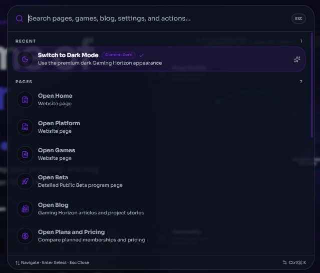

<br>

</div>

The Search Command Palette screenshot documents a focused search and navigation
interaction within Gaming Horizon.

### Documentation focus

```text
SEARCH
DISCOVERY
QUICK NAVIGATION
COMMAND INTERACTION
PLATFORM ACCESS
```

This screenshot is useful when documenting how users can quickly locate or
access supported Gaming Horizon experiences.

---

<a id="navigation"></a>

## ✦ Navigation

File:

```text
gaming-horizon-navigation.png
```

<div align="center">

<br>

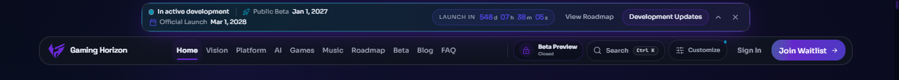

<br>

</div>

The Navigation screenshot documents the primary navigation system used across
Gaming Horizon.

### Documentation focus

```text
GLOBAL NAVIGATION
INFORMATION ARCHITECTURE
PLATFORM MOVEMENT
DISCOVERY
USER ORIENTATION
```

Navigation should remain understandable, predictable, and consistent across
the wider platform.

---

<a id="game-card"></a>

## ✦ Game Card

File:

```text
gaming-horizon-game-card.png
```

<div align="center">

<br>

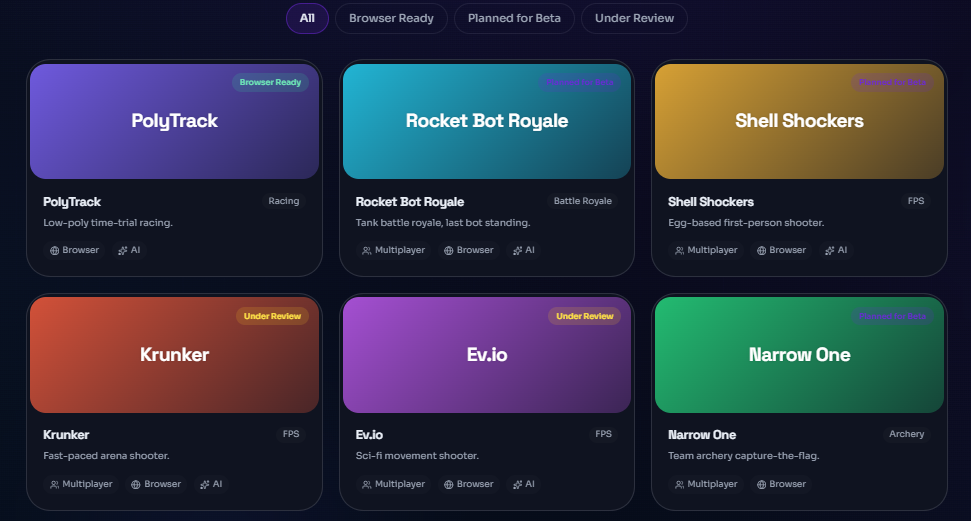

<br>

</div>

The Game Card screenshot documents how an individual game or interactive
experience may be represented within Gaming Horizon discovery surfaces.

### Documentation focus

```text
GAME PRESENTATION
DISCOVERY
VISUAL HIERARCHY
METADATA
INTERACTION
```

This is a focused feature capture.

Broader discovery-page documentation belongs in:

```text
../website/
```

---

<a id="support-gaming-horizon"></a>

## ✦ Support Gaming Horizon

File:

```text
gaming-horizon-support-gaming-horizon.png
```

<div align="center">

<br>

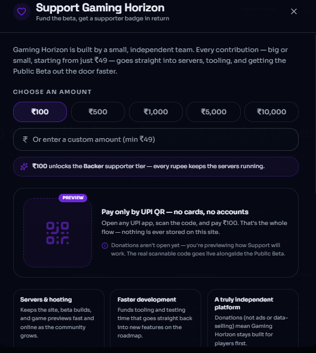

<br>

</div>

This screenshot documents the Support Gaming Horizon interface.

### Documentation focus

```text
PROJECT SUPPORT
USER INTERACTION
SUPPORT EXPERIENCE
PLATFORM COMMUNICATION
```

The screenshot should only document options actually presented by the
interface.

Do not infer additional support mechanisms from the visual alone.

---

<a id="waitlist"></a>

## ✦ Join Waitlist

File:

```text
gaming-horizon-join-waitlist.png
```

<div align="center">

<br>

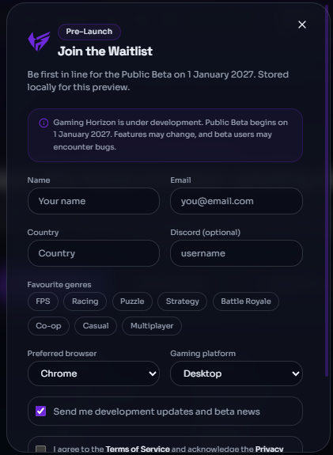

<br>

</div>

The Waitlist screenshot documents the interface used for pre-launch or
preview-stage registration where available.

### Documentation focus

```text
WAITLIST
PRE-LAUNCH ACCESS
USER REGISTRATION
INTEREST
EARLY ACCESS COMMUNICATION
```

> [!NOTE]
> A screenshot documents the interface itself. Current waitlist availability
> should be determined from maintained project information.

---

<a id="localization"></a>

## ✦ Currency & Language Selector

File:

```text
gaming-horizon-currency-language-selector.png
```

<div align="center">

<br>

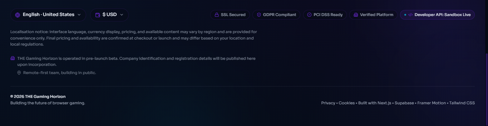

<br>

</div>

This screenshot documents user-facing localization controls.

### Documentation focus

```text
LANGUAGE
CURRENCY
LOCALIZATION
REGIONAL PREFERENCES
ACCESSIBILITY OF EXPERIENCE
```

Localization interfaces should clearly distinguish available options from
future or unsupported configurations.

---

<a id="music-player"></a>

## ✦ Music Player

File:

```text
gaming-horizon-music-player.png
```

<div align="center">

<br>

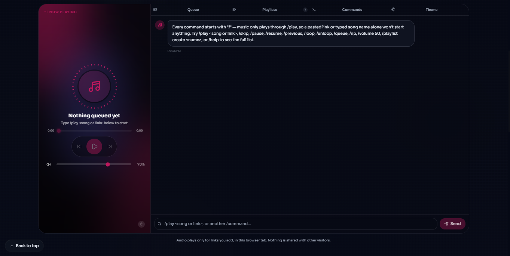

<br>

</div>

The Music Player screenshot documents Gaming Horizon music-related interface
controls where present in the product experience.

### Documentation focus

```text
MUSIC
PLAYBACK
MEDIA CONTROLS
ATMOSPHERE
USER CONTROL
```

Visual documentation should not imply rights to third-party music or media.

Any third-party audio or media remains subject to its respective rights.

---

<a id="roadmap-progress"></a>

## ✦ Roadmap Progress

File:

```text
gaming-horizon-roadmap-progress.png
```

<div align="center">

<br>

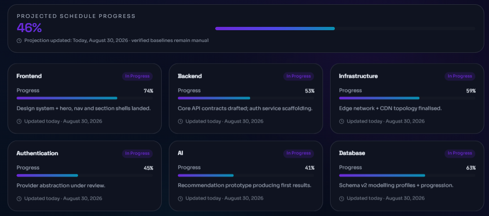

<br>

</div>

The Roadmap Progress screenshot documents focused progress indicators or
development-state presentation.

### Documentation focus

```text
DEVELOPMENT
PROGRESS
MILESTONES
STATUS
ROADMAP PRESENTATION
```

> [!IMPORTANT]
> Roadmap screenshots capture a particular interface state. Maintained written
> roadmap documentation should remain the authoritative source for current
> project direction.

---

<a id="ai-chat"></a>

## ✦ AI Chat

File:

```text
gaming-horizon-ai-chat.png
```

<div align="center">

<br>

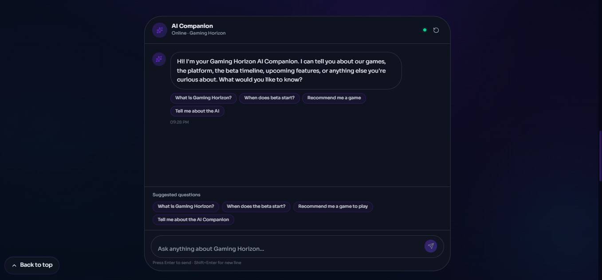

<br>

</div>

The AI Chat screenshot documents the conversational interface associated with
the Gaming Horizon AI Companion experience.

### Documentation focus

```text
AI COMPANION
CONVERSATION
ASSISTANCE
DISCOVERY
INTERACTION
```

This capture documents the interface presentation.

It should not be used to claim capabilities beyond those actually implemented
or documented.

---

<a id="ai-suggestions"></a>

## ✦ AI Suggestions

File:

```text
gaming-horizon-ai-suggestions.png
```

<div align="center">

<br>

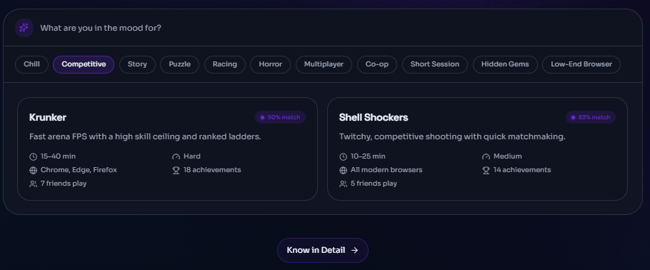

<br>

</div>

The AI Suggestions screenshot documents AI-assisted discovery or recommended
interaction options.

### Documentation focus

```text
AI ASSISTANCE
SUGGESTIONS
DISCOVERY
PERSONALIZED INTERACTION
USER GUIDANCE
```

AI suggestions should be described according to their documented behavior
rather than assumptions based only on visual presentation.

---

<a id="developer-api"></a>

## ✦ Developer API

File:

```text
gaming-horizon-developer-api.png
```

<div align="center">

<br>

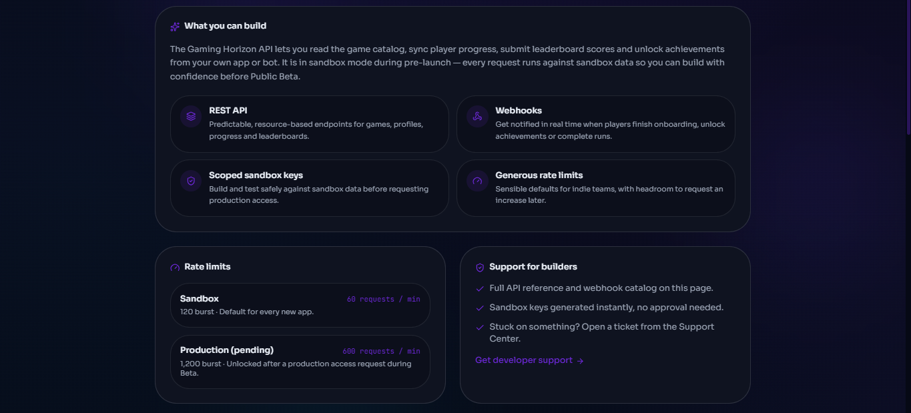

<br>

</div>

The Developer API screenshot documents developer-oriented API presentation
within Gaming Horizon.

### Documentation focus

```text
DEVELOPER EXPERIENCE
API ACCESS
INTEGRATIONS
APPLICATION DEVELOPMENT
PLATFORM EXTENSIBILITY
```

> [!WARNING]
> Developer screenshots must never expose real access tokens, private API keys,
> authentication secrets, or confidential configuration.

---

<a id="api-reference"></a>

## ✦ API Reference

File:

```text
gaming-horizon-api-reference.png
```

<div align="center">

<br>

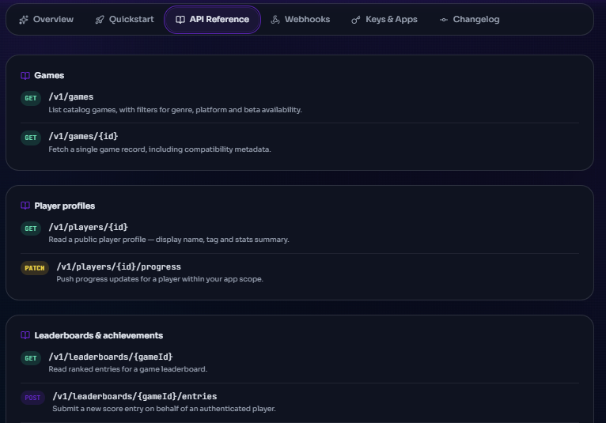

<br>

</div>

The API Reference screenshot documents how developer reference information is
presented within Gaming Horizon.

### Documentation focus

```text
API DOCUMENTATION
ENDPOINT REFERENCE
DEVELOPER GUIDANCE
TECHNICAL NAVIGATION
INTEGRATION SUPPORT
```

The screenshot should support written API documentation rather than replace it.

Technical specifications should remain available as selectable text wherever
practical.

---

<a id="webhooks"></a>

## ✦ Webhooks

File:

```text
gaming-horizon-webhooks.png
```

<div align="center">

<br>

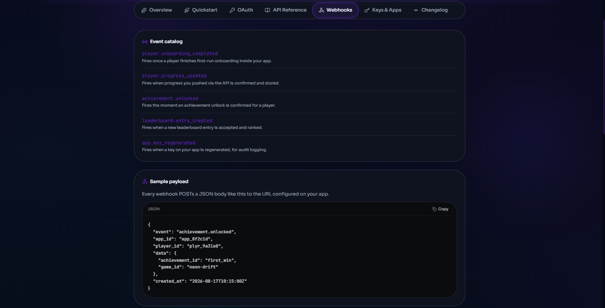

<br>

</div>

The Webhooks screenshot documents webhook configuration and integration
presentation.

### Documentation focus

```text
WEBHOOKS
EVENTS
INTEGRATIONS
DEVELOPER CONFIGURATION
AUTOMATION
```

Before publishing webhook screenshots, verify that no real callback secrets,
signing keys, private URLs, or sensitive configuration are visible.

---

<a id="developer-keys"></a>

## ✦ Developer Keys

File:

```text
gaming-horizon-developer-keys.png
```

<div align="center">

<br>

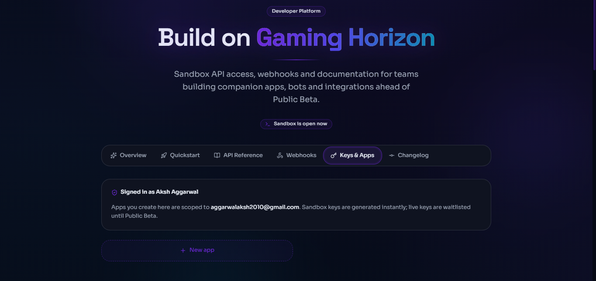

<br>

</div>

The Developer Keys screenshot documents developer app or credential-management
presentation.

### Documentation focus

```text
DEVELOPER APPLICATIONS
KEY MANAGEMENT
INTEGRATION CONFIGURATION
ACCESS CONTROL
DEVELOPER EXPERIENCE
```

### Security requirement

Never expose:

```text
REAL API KEYS
SECRET KEYS
PRIVATE TOKENS
CLIENT SECRETS
SESSION VALUES
SIGNING SECRETS
PRIVATE CREDENTIALS
```

Use:

```text
MASKED
REDACTED
EXAMPLE
PLACEHOLDER
```

values where necessary.

---

<a id="customization"></a>

## ✦ Customization Controls

File:

```text
gaming-horizon-customization-controls.png
```

<div align="center">

<br>

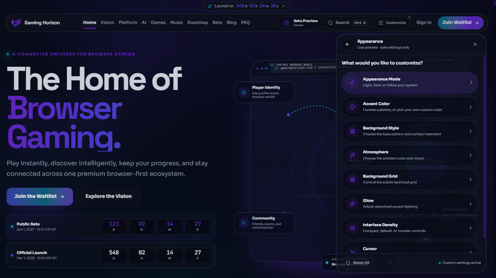

<br>

</div>

This screenshot documents focused personalization and customization controls.

### Documentation focus

```text
PERSONALIZATION
USER PREFERENCES
INTERFACE CONTROL
EXPERIENCE CONFIGURATION
CUSTOMIZATION
```

The broader customization experience may also be documented in:

```text
../website/gaming-horizon-customize-panel.png
```

---

<a id="support-ticket"></a>

## ✦ Support Ticket

File:

```text
gaming-horizon-support-ticket.png
```

<div align="center">

<br>

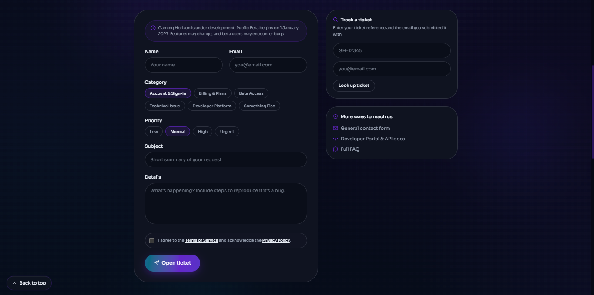

<br>

</div>

The Support Ticket screenshot documents focused help-request or issue-reporting
interaction.

### Documentation focus

```text
SUPPORT
TICKETS
USER ASSISTANCE
ISSUE REPORTING
HELP WORKFLOW
```

Support captures must not expose real private user submissions or personal
information.

---

<a id="sign-in-options"></a>

## ✦ Sign-In Options

File:

```text
gaming-horizon-sign-in-options.png
```

<div align="center">

<br>

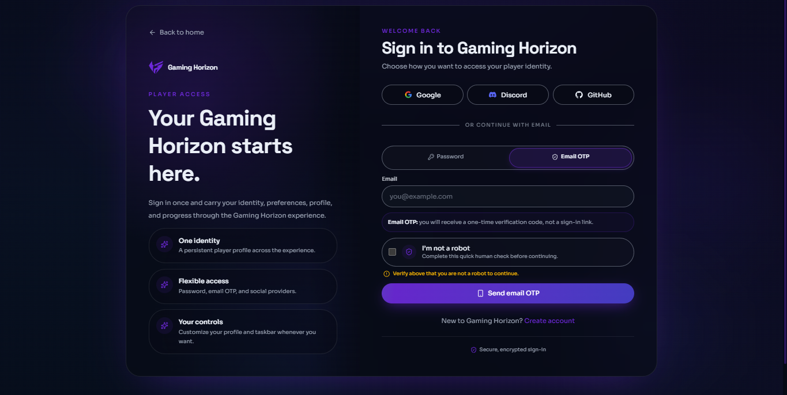

<br>

</div>

This screenshot documents available account-entry options shown by the
Gaming Horizon interface.

### Documentation focus

```text
AUTHENTICATION
SIGN IN
ACCOUNT ACCESS
ENTRY METHODS
USER EXPERIENCE
```

Do not include real passwords, authentication tokens, private account details,
or recovery information.

---

<a id="launch-status"></a>

## ✦ Launch Status

File:

```text
gaming-horizon-launch-status.png
```

<div align="center">

<br>

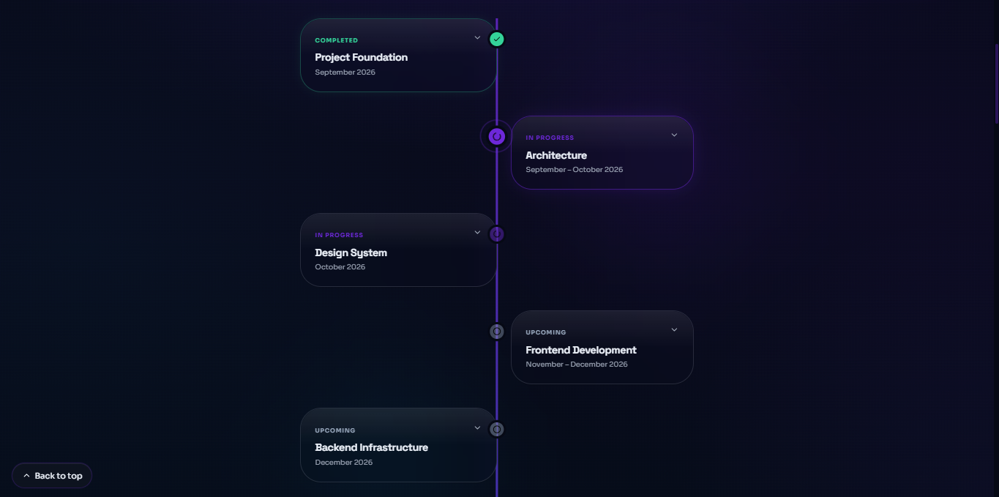

<br>

</div>

The Launch Status screenshot documents how launch-related status information is
presented within Gaming Horizon.

### Documentation focus

```text
LAUNCH
STATUS
DEVELOPMENT
AVAILABILITY
PROJECT PROGRESS
```

> [!IMPORTANT]
> Launch-status screenshots are historical interface captures and may contain
> information that later changes. Current maintained project documentation
> takes precedence over text shown in an older screenshot.

---

## ✦ Feature vs Website Screenshot

Feature screenshots document focused interface components.

Website screenshots document broader experiences.

Use:

```text
features/
```

for:

```text
COMMAND PALETTE
GAME CARD
AI CHAT
BUTTONS
CONTROLS
MODALS
WEBHOOK SETTINGS
API MODULES
ACCOUNT OPTIONS
```

Use:

```text
../website/
```

for:

```text
FULL PAGE
MAJOR EXPERIENCE
LARGE PRODUCT AREA
BROADER USER JOURNEY
```

---

## ✦ Classification Example

```text
AI COMPANION EXPERIENCE
        │
        └── ../website/gaming-horizon-ai-companion.png

AI CHAT FEATURE
        │
        └── gaming-horizon-ai-chat.png

AI SUGGESTION FEATURE
        │
        └── gaming-horizon-ai-suggestions.png
```

Another example:

```text
DEVELOPER EXPERIENCE
        │
        └── ../website/gaming-horizon-developer-experience.png

DEVELOPER API
        │
        └── gaming-horizon-developer-api.png

API REFERENCE
        │
        └── gaming-horizon-api-reference.png

WEBHOOKS
        │
        └── gaming-horizon-webhooks.png

DEVELOPER KEYS
        │
        └── gaming-horizon-developer-keys.png
```

---

<a id="capture-standard"></a>

## ✦ Capture Standard

Before capturing a feature:

### `01` — Define the feature

Know exactly which control, module, or interaction is being documented.

### `02` — Prepare the state

Open the feature in the intended interface state.

### `03` — Remove unrelated elements

Keep the capture focused.

### `04` — Check sensitive information

Review account, developer, support, and authentication surfaces carefully.

### `05` — Capture clearly

Use enough resolution for interface details to remain readable.

### `06` — Review accuracy

Confirm the screenshot represents the intended state.

---

## ✦ Focus

A feature screenshot should emphasize the feature.

Avoid captures where the actual documented element is:

```text
TOO SMALL
OFF-SCREEN
COVERED
CROPPED
SURROUNDED BY UNRELATED UI
```

The viewer should quickly understand what the screenshot is documenting.

---

## ✦ Cropping

Feature screenshots can usually be more tightly cropped than website
screenshots.

However, preserve enough context to understand the feature.

Good:

```text
FEATURE IS PROMINENT
RELEVANT CONTEXT REMAINS
UI IS READABLE
```

Bad:

```text
CONTROL IS PARTIALLY CUT
LABEL IS MISSING
CONTEXT IS LOST
STATE BECOMES MISLEADING
```

---

<a id="quality"></a>

## ✦ Quality

Official feature captures should be:

```text
FOCUSED
CLEAR
READABLE
ACCURATE
UNDISTORTED
SAFE
PURPOSEFUL
```

Avoid:

```text
BLUR
PIXELATION
HEAVY COMPRESSION
DISTORTION
RANDOM CROPPING
UNREADABLE TEXT
UNRELATED OVERLAYS
```

---

## ✦ Aspect Ratio

Never distort feature screenshots.

Recommended:

```html

```

Do not assign arbitrary width and height combinations that change the original
proportions.

---

## ✦ File Format

Current standard:

```text
PNG
```

PNG supports:

```text
UI TEXT
SHARP EDGES
INTERFACE DETAILS
GRADIENTS
TRANSPARENCY WHERE PRESENT
HIGH-QUALITY DOCUMENTATION
```

---

## ✦ Naming Standard

Preferred structure:

```text
gaming-horizon-[feature].png
```

Examples:

```text
gaming-horizon-navigation.png
gaming-horizon-ai-chat.png
gaming-horizon-webhooks.png
gaming-horizon-support-ticket.png
```

Avoid:

```text
feature1.png
Screenshot.png
image.png
new-feature.png
final.png
latest.png
final-final.png
```

---

## ✦ Naming Philosophy

A filename should communicate:

```text
PROJECT
FEATURE
FORMAT
```

Example:

```text
gaming-horizon-search-command-palette.png
```

means:

```text
PROJECT     Gaming Horizon
FEATURE     Search Command Palette
FORMAT      PNG
```

---

## ✦ Duplicate Control

Avoid:

```text
gaming-horizon-ai-chat.png
gaming-horizon-ai-chat-new.png
gaming-horizon-ai-chat-final.png
gaming-horizon-ai-chat-final2.png
```

When an interface evolves, replace the maintained screenshot where appropriate.

Preserve historical variants only when there is a real documentation need.

---

<a id="privacy"></a>

## ✦ Privacy

Feature screenshots can reveal sensitive information very easily.

Never publish screenshots containing:

```text
PASSWORDS
PRIVATE EMAILS
PHONE NUMBERS
PRIVATE MESSAGES
ACCOUNT IDENTIFIERS
ACCESS TOKENS
API KEYS
PRIVATE KEYS
CLIENT SECRETS
RECOVERY CODES
SESSION VALUES
PRIVATE WEBHOOK URLs
ADMIN CREDENTIALS
```

---

## ✦ Developer Safety

Developer screenshots require the strongest review.

Before committing:

```text
gaming-horizon-developer-api.png
gaming-horizon-webhooks.png
gaming-horizon-api-reference.png
gaming-horizon-developer-keys.png
```

verify that all confidential values are:

```text
MASKED
REDACTED
EXAMPLE
PLACEHOLDER
```

Never publish a real secret.

---

## ✦ Support Safety

Before committing:

```text
gaming-horizon-support-ticket.png
```

verify that it does not contain:

```text
REAL USER NAMES
PRIVATE EMAILS
PERSONAL REQUESTS
ACCOUNT DETAILS
INTERNAL MODERATION INFORMATION
```

---

## ✦ Authentication Safety

Before committing:

```text
gaming-horizon-sign-in-options.png
```

verify that it does not expose:

```text
PASSWORDS
TOKENS
RECOVERY CODES
PRIVATE ACCOUNT INFORMATION
SESSION INFORMATION
```

---

<a id="accessibility"></a>

## ✦ Accessibility

Feature screenshots should support accessible documentation.

Use meaningful alternative text.

Recommended:

```html

```

Avoid:

```html

```

or:

```html

```

---

## ✦ Explain Feature Purpose

A screenshot should not be expected to explain an interaction entirely on its
own.

Provide surrounding text explaining:

```text
WHAT IT IS
WHAT IT DOES
WHAT STATE IT REPRESENTS
WHY IT IS DOCUMENTED
```

This makes the documentation more understandable to all readers.

---

## ✦ Essential Information

Do not place important technical or project information only inside screenshots.

Keep:

```text
API DOCUMENTATION
SECURITY WARNINGS
ROADMAP INFORMATION
LAUNCH INFORMATION
ACCOUNT GUIDANCE
SUPPORT INSTRUCTIONS
```

available as real text.

---

<a id="truthful-presentation"></a>

## ✦ Truthful Presentation

Feature screenshots should document real interface states.

Do not use them to falsely imply:

```text
A FEATURE IS AVAILABLE
A FEATURE IS PRODUCTION-READY
AN EXPERIMENT IS FINAL
AN API IS PUBLIC
AN INTEGRATION IS ACTIVE
A PARTNERSHIP EXISTS
A RELEASE HAS OCCURRED
```

unless that statement is actually supported by current project documentation.

Use explicit labels where needed:

```text
PREVIEW
IN DEVELOPMENT
EXPERIMENTAL
COMING SOON
AVAILABLE AT LAUNCH
ARCHIVED
```

---

## ✦ Current Documentation Takes Priority

Screenshots are visual records.

Written maintained documentation defines current project information.

```text
SCREENSHOT
    │
    ▼
CAPTURED VISUAL STATE

CURRENT DOCUMENTATION
    │
    ▼
CURRENT PROJECT INFORMATION
```

If they conflict because the product has changed, update or classify the
screenshot rather than treating old interface text as current truth.

---

## ✦ Screenshot vs Showcase

Feature screenshots:

```text
DOCUMENT PRODUCT UI
```

Showcase media:

```text
COMMUNICATE VISUAL DIRECTION
```

Showcase location:

```text
../../showcase/
```

Do not use conceptual or generated interface-style artwork as official feature
screenshots unless it genuinely corresponds to the real product interface.

---

## ✦ Screenshot vs Branding

Screenshots may contain Gaming Horizon branding, but screenshots are not source
identity resources.

Official branding:

```text
../../branding/
```

Official source logo:

```text
../../branding/logos/gaming-horizon-logo-source.png
```

Do not crop logos out of screenshots and use them as branding assets.

---

## ✦ Relative Paths

This README lives at:

```text
assets/screenshots/features/README.md
```

Local screenshots require no additional directory prefix.

### Search

```text
gaming-horizon-search-command-palette.png
```

### AI Chat

```text
gaming-horizon-ai-chat.png
```

### Developer API

```text
gaming-horizon-developer-api.png
```

### Official logo

```text
../../branding/logos/gaming-horizon-logo-source.png
```

### Parent screenshot README

```text
../README.md
```

### Assets README

```text
../../README.md
```

### Repository README

```text
../../../README.md
```

---

## ✦ Path Matrix

| Document | AI Chat screenshot path |
| --- | --- |
| `/README.md` | `assets/screenshots/features/gaming-horizon-ai-chat.png` |
| `/assets/README.md` | `screenshots/features/gaming-horizon-ai-chat.png` |
| `/assets/screenshots/README.md` | `features/gaming-horizon-ai-chat.png` |
| `/assets/screenshots/features/README.md` | `gaming-horizon-ai-chat.png` |
| `/docs/AI.md` | `../assets/screenshots/features/gaming-horizon-ai-chat.png` |

Developer example:

| Document | Developer API path |
| --- | --- |
| `/README.md` | `assets/screenshots/features/gaming-horizon-developer-api.png` |
| `/assets/README.md` | `screenshots/features/gaming-horizon-developer-api.png` |
| `/assets/screenshots/README.md` | `features/gaming-horizon-developer-api.png` |
| `/assets/screenshots/features/README.md` | `gaming-horizon-developer-api.png` |
| `/docs/DEVELOPERS.md` | `../assets/screenshots/features/gaming-horizon-developer-api.png` |

---

## ✦ Logo Path Matrix

| Document | Official source-logo path |
| --- | --- |
| `/README.md` | `assets/branding/logos/gaming-horizon-logo-source.png` |
| `/assets/README.md` | `branding/logos/gaming-horizon-logo-source.png` |
| `/assets/screenshots/README.md` | `../branding/logos/gaming-horizon-logo-source.png` |
| `/assets/screenshots/features/README.md` | `../../branding/logos/gaming-horizon-logo-source.png` |
| `/docs/AI.md` | `../assets/branding/logos/gaming-horizon-logo-source.png` |

---

<details>

<summary><strong>✦ Feature screenshot troubleshooting</strong></summary>

<br>

If an image fails to display:

1. Confirm the exact filename.
2. Confirm capitalization.
3. Confirm `.png`.
4. Confirm the image exists inside `assets/screenshots/features/`.
5. Confirm the image exists on the current branch.
6. Identify the current Markdown file location.
7. Calculate the relative path from that location.
8. Open the image directly on GitHub.

For this README:

```text
assets/screenshots/features/README.md
```

the AI Chat screenshot path is simply:

```text
gaming-horizon-ai-chat.png
```

The official logo requires:

```text
../../branding/logos/gaming-horizon-logo-source.png
```

</details>

---

<a id="workflow"></a>

## ✦ Feature Screenshot Workflow

Official feature captures should follow:

```text
FEATURE IDENTIFIED
        ↓
SELECT INTERFACE STATE
        ↓
PREPARE FEATURE
        ↓
CAPTURE
        ↓
PRIVACY REVIEW
        ↓
SECURITY REVIEW
        ↓
QUALITY REVIEW
        ↓
ACCURACY REVIEW
        ↓
NAME
        ↓
PUBLISH
        ↓
MAINTAIN
```

---

## ✦ Screenshot States

| State | Meaning |
| --- | --- |
| `CURRENT` | Current documented feature |
| `PREVIEW` | Preview-stage feature |
| `DEVELOPMENT` | Active-development interface |
| `EXPERIMENTAL` | Experimental feature |
| `COMING SOON` | Planned but not currently available |
| `AVAILABLE AT LAUNCH` | Intended for launch availability |
| `REPLACED` | Superseded by a newer capture |
| `ARCHIVED` | Historical reference |

---

## ✦ Adding a Feature Screenshot

Before adding another capture:

1. Identify the feature being documented.
2. Confirm it belongs in `features/`.
3. Check for an existing equivalent screenshot.
4. Prepare a clean feature state.
5. Remove sensitive information.
6. Capture at appropriate resolution.
7. Review accuracy.
8. Use a descriptive filename.
9. Update this README if it joins the official register.
10. Commit with a meaningful message.

---

## ✦ Replacing a Feature Screenshot

When a feature changes:

1. Compare old and new interface states.
2. Confirm the difference is meaningful.
3. Capture the updated feature cleanly.
4. Repeat privacy review.
5. Repeat security review.
6. Preserve the established filename when appropriate.
7. Update connected documentation.
8. Verify GitHub image references.
9. Archive the old capture only when there is historical value.

---

## ✦ Quality Gate

Before treating a feature screenshot as official:

- [ ] Correct feature is visible
- [ ] Screenshot has a clear purpose
- [ ] Feature is readable
- [ ] Relevant context remains visible
- [ ] No accidental crop exists
- [ ] Aspect ratio is preserved
- [ ] No unrelated UI dominates the capture
- [ ] No private information appears
- [ ] No credentials appear
- [ ] No developer secrets appear
- [ ] Filename is descriptive
- [ ] Correct directory is used
- [ ] Product state is understood
- [ ] Presentation is truthful
- [ ] Alternative text can describe the feature
- [ ] Existing duplicates have been checked

---

## ✦ Review Questions

Before publishing, ask:

### What feature does this document?

The answer should be specific.

### Is this a focused interaction?

If it represents a full page or broad experience, it may belong in
`../website/`.

### Is the visible product state still relevant?

If not, update or classify it appropriately.

### Does it expose anything sensitive?

Developer, support, account, and authentication captures deserve extra review.

### Is its filename clear?

A contributor should understand the feature without opening the image.

### Does the screenshot improve documentation?

If not, the repository may not need it.

---

<a id="governance"></a>

## ✦ Governance

Gaming Horizon feature screenshots form part of the wider product
documentation system.

Feature captures may contain:

```text
GAMING HORIZON UI
PROJECT BRANDING
INTERFACE TEXT
GAME REFERENCES
DEVELOPER CONTENT
THIRD-PARTY SERVICES
THIRD-PARTY NAMES
PROJECT ARTWORK
```

Third-party trademarks, games, services, products, artwork, and intellectual
property remain the property of their respective owners.

A screenshot documenting a third-party reference does not transfer ownership
or imply partnership.

---

<a id="license"></a>

## ✦ License & Policies

This repository includes software licensing and separate project policy
documents.

Screenshots, branding, visual media, and third-party materials may involve
additional rights considerations beyond the source-code license.

From:

```text
assets/screenshots/features/README.md
```

repository-level policy files are three levels above.

### License

```text
../../../LICENSE
```

### Copyright

```text
../../../COPYRIGHT.md
```

### Security

```text
../../../SECURITY.md
```

### Privacy

```text
../../../PRIVACY.md
```

### Terms

```text
../../../TERMS.md
```

### Third-party notices

```text
../../../THIRD-PARTY-NOTICES.md
```

### Contributions

```text
../../../CONTRIBUTING.md
```

### Code of Conduct

```text
../../../CODE_OF_CONDUCT.md
```

### Future brand policy

When available:

```text
../../../BRAND.md
```

---

## ✦ Feature Screenshot Golden Rules

### `01` — Focus on the feature

The documented interaction should be immediately understandable.

### `02` — Represent real UI

Concept artwork belongs in the showcase system.

### `03` — Protect sensitive information

Developer and account screenshots require careful review.

### `04` — Preserve context

Do not crop so tightly that the feature becomes confusing.

### `05` — Preserve proportions

Never distort the interface.

### `06` — Name clearly

The filename should identify the feature.

### `07` — Separate feature from page

Use the website screenshot system for broad experiences.

### `08` — Keep current truth outside images

Screenshots capture states; maintained documentation defines current information.

### `09` — Avoid unnecessary duplicates

Maintain a clean and understandable visual record.

### `10` — Update intentionally

Replace screenshots when the underlying feature meaningfully changes.

---

## ✦ Current Feature Register

```text
features/
├── README.md
├── gaming-horizon-search-command-palette.png
├── gaming-horizon-navigation.png
├── gaming-horizon-game-card.png
├── gaming-horizon-support-gaming-horizon.png
├── gaming-horizon-join-waitlist.png
├── gaming-horizon-currency-language-selector.png
├── gaming-horizon-music-player.png
├── gaming-horizon-roadmap-progress.png
├── gaming-horizon-ai-chat.png
├── gaming-horizon-ai-suggestions.png
├── gaming-horizon-developer-api.png
├── gaming-horizon-webhooks.png
├── gaming-horizon-api-reference.png
├── gaming-horizon-developer-keys.png
├── gaming-horizon-customization-controls.png
├── gaming-horizon-support-ticket.png
├── gaming-horizon-sign-in-options.png
└── gaming-horizon-launch-status.png
```

---

## ✦ Feature Screenshot Standard

A Gaming Horizon feature screenshot should ultimately be:

| # | Standard | Meaning |
|:---:|---|---|
| `01` | **Focused** | Clearly documents one feature |
| `02` | **Accurate** | Represents a genuine interface state |
| `03` | **Readable** | Important controls and text remain visible |
| `04` | **Purposeful** | Exists for a clear documentation reason |
| `05` | **Safe** | Contains no sensitive information |
| `06` | **Undistorted** | Preserves interface proportions |
| `07` | **Accessible** | Supported by meaningful text and alt descriptions |
| `08` | **Maintainable** | Easy to locate and replace |
| `09` | **Truthful** | Does not exaggerate feature availability |
| `10` | **Evolving** | Can change as Gaming Horizon develops |

---

## ✦ Release Information

```text
SYSTEM          Gaming Horizon Feature Screenshot System
VERSION         1.0.0
STATUS          Active Development
TYPE            Official Focused Interface Documentation
PROJECT         Gaming Horizon
LOCATION        assets/screenshots/features/
PARENT SYSTEM   assets/screenshots/
REPOSITORY      The-Gaming-Horizon
```

---

<div align="center">

<br>


<br><br>

<strong>GAMING HORIZON</strong>

<br>

<sub>Official Feature Screenshot System · Version 1.0.0</sub>

<br><br>

<a href="#status">
  
</a>
<a href="#version">
  
</a>
<a href="#feature-system">
  
</a>
<a href="#privacy">
  
</a>
<a href="#truthful-presentation">
  
</a>

<br><br>

<a href="https://thegaminghorizon.netlify.app/">
  
</a>
<a href="https://github.com/thegaminghorizon/The-Gaming-Horizon">
  
</a>
<a href="https://github.com/thegaminghorizon/The-Gaming-Horizon/issues">
  
</a>

<br><br>

<code>
FEATURES · INTERACTIONS · AI · DEVELOPERS · DOCUMENTATION
</code>

<br><br>

<strong>
Document the feature. Preserve the truth. Build beyond.
</strong>

<br><br>

<sub>
© 2026 Gaming Horizon · Beyond the Horizon
</sub>

<br><br>

</div>
