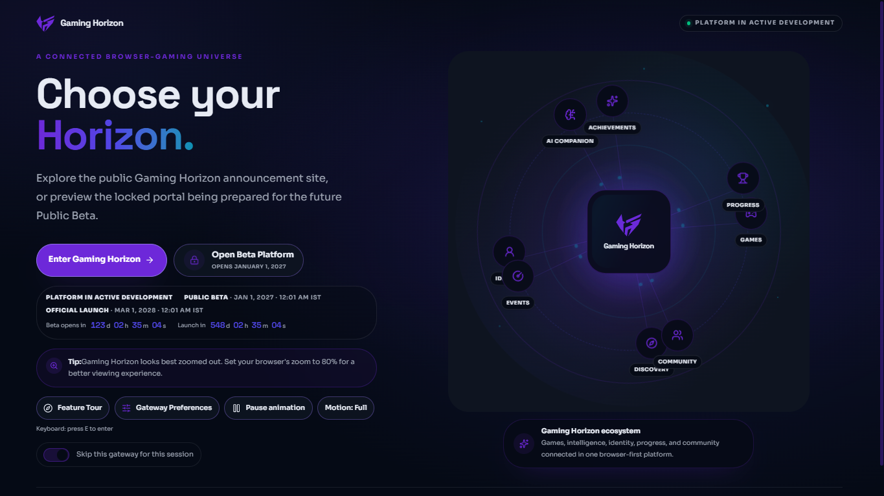
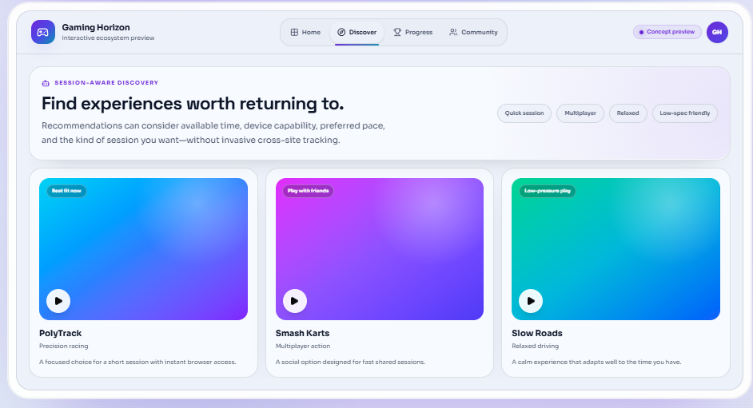
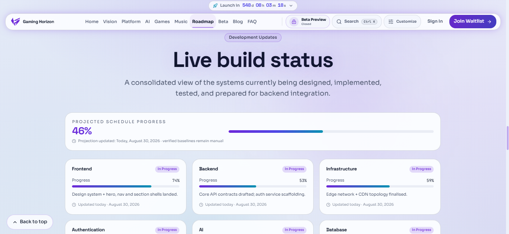
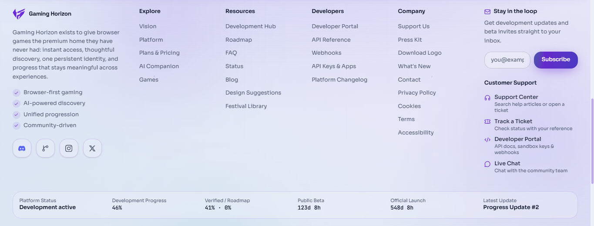
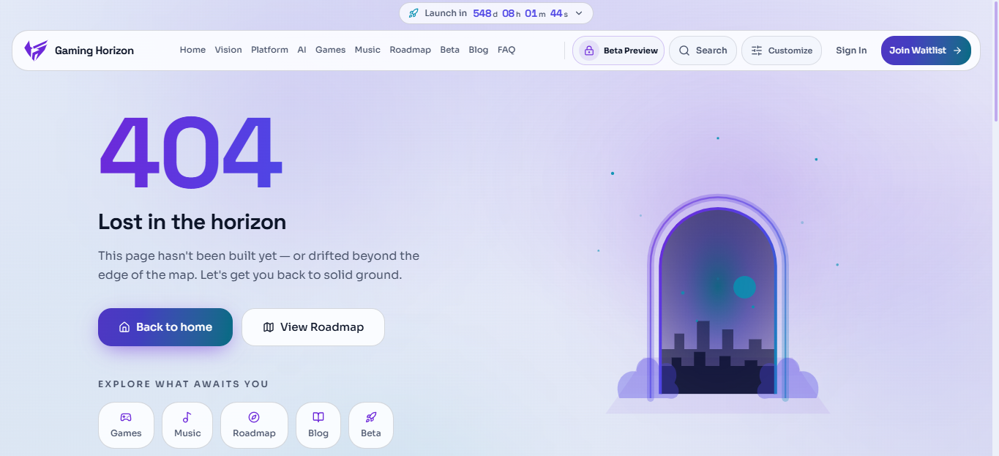
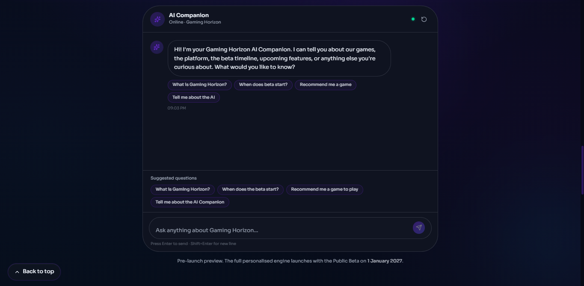
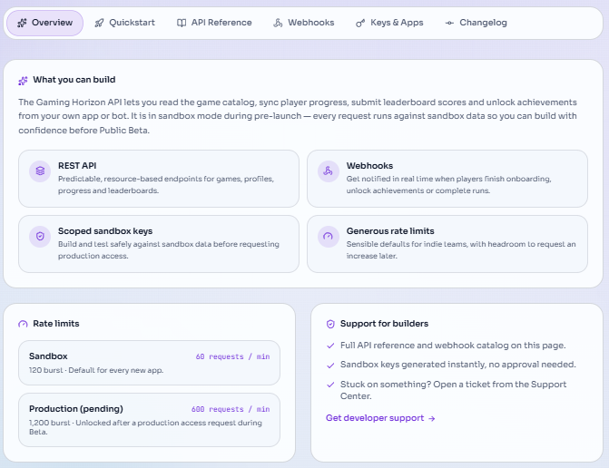
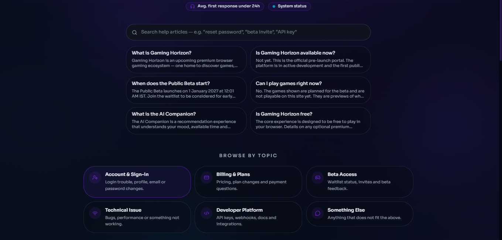
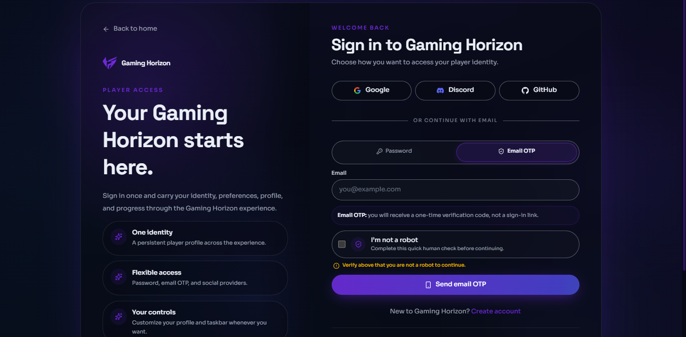
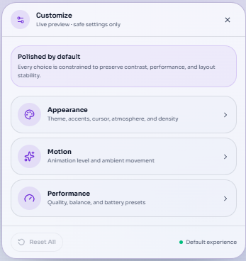

<!--
===============================================================================
                              GAMING HORIZON
                         BEYOND THE HORIZON
===============================================================================

                    OFFICIAL WEBSITE SCREENSHOT SYSTEM
                  assets/screenshots/website/README.md

                   WEBSITE SCREENSHOTS v1.0.0

===============================================================================

DOCUMENT LOCATION
-----------------
assets/screenshots/website/README.md

RELATIVE PATH RULE
------------------

Website screenshots in this directory:
gaming-horizon-gateway.png
gaming-horizon-hero-homepage.png
gaming-horizon-game-discovery.png
gaming-horizon-development-roadmap.png
gaming-horizon-footer.png
gaming-horizon-404-page.png
gaming-horizon-ai-companion.png
gaming-horizon-developer-experience.png
gaming-horizon-support-help.png
gaming-horizon-sign-in.png
gaming-horizon-customize-panel.png

Official logo:
../../branding/logos/gaming-horizon-logo-source.png

Screenshot system:
../README.md

Asset system:
../../README.md

Repository root:
../../../

===============================================================================
-->

<div align="center">

<br>


<br><br>

<h1>Gaming Horizon Website Screenshots</h1>

<p>
  <strong>
    Official captures of major Gaming Horizon website experiences,
    interface surfaces, product areas, and user-facing environments.
  </strong>
</p>

<p>
  A structured visual record designed to document how Gaming Horizon
  appears across its broader browser-first experience.
</p>

<br>

<!-- ========================================================= -->
<!--                       SYSTEM STATUS                       -->
<!-- ========================================================= -->

<a href="#status">
  
</a>
<a href="#version">
  
</a>
<a href="#website-system">
  
</a>
<a href="#classification">
  
</a>
<a href="#license">
  
</a>

<br><br>

<!-- ========================================================= -->
<!--                     WEBSITE EXPERIENCES                  -->
<!-- ========================================================= -->

<a href="#gateway">
  
</a>
<a href="#homepage-hero">
  
</a>
<a href="#game-discovery">
  
</a>
<a href="#development-roadmap">
  
</a>
<a href="#footer">
  
</a>

<br>

<a href="#404-experience">
  
</a>
<a href="#ai-companion">
  
</a>
<a href="#developer-experience">
  
</a>
<a href="#support-help">
  
</a>
<a href="#sign-in">
  
</a>
<a href="#customization">
  
</a>

<br><br>

<!-- ========================================================= -->
<!--                       SYSTEM RULES                        -->
<!-- ========================================================= -->

<a href="#capture-standard">
  
</a>
<a href="#quality">
  
</a>
<a href="#privacy">
  
</a>
<a href="#accessibility">
  
</a>
<a href="#workflow">
  
</a>

<br><br>

<!-- ========================================================= -->
<!--                       QUICK LINKS                         -->
<!-- ========================================================= -->

<a href="https://thegaminghorizon.netlify.app/">
  
</a>
<a href="https://github.com/thegaminghorizon/The-Gaming-Horizon">
  
</a>
<a href="https://github.com/thegaminghorizon/The-Gaming-Horizon/issues">
  
</a>

<br><br>

<code>WEBSITE</code>
&nbsp; • &nbsp;
<code>PRODUCT</code>
&nbsp; • &nbsp;
<code>INTERFACE</code>
&nbsp; • &nbsp;
<code>EXPERIENCE</code>
&nbsp; • &nbsp;
<code>DOCUMENTATION</code>

<br><br>

</div>

---

<a id="overview"></a>

## ✦ Overview

The `website/` screenshot directory documents the broader Gaming Horizon
website experience.

It contains captures of major pages, interfaces, journeys, and product areas
that help explain how Gaming Horizon is presented to users.

The purpose of this directory is to create a reliable visual reference for:

- repository documentation;
- website presentation;
- product explanation;
- feature context;
- development progress;
- design review;
- support documentation;
- developer documentation;
- project history;
- future release communication.

Website screenshots are intended to show the **larger experience**.

More focused individual feature captures belong in:

```text
../features/
```

> [!IMPORTANT]
> Website screenshots document visual interface states. They should not be
> treated as permanent proof of changing information such as availability,
> release state, roadmap status, or future plans.

---

<a id="status"></a>

## ✦ Status

Current website screenshot status:

```text
ACTIVE DEVELOPMENT
```

Current coverage:

| Experience | Status |
| --- | --- |
| Gateway | Documented |
| Homepage Hero | Documented |
| Game Discovery | Documented |
| Development Roadmap | Documented |
| Footer | Documented |
| 404 Experience | Documented |
| AI Companion | Documented |
| Developer Experience | Documented |
| Support & Help | Documented |
| Sign In | Documented |
| Customization | Documented |
| Additional website areas | Add when required |

As the website evolves, screenshots may be replaced or reclassified.

---

<a id="version"></a>

## ✦ Version

Current website screenshot-system version:

```text
1.0.0
```

Version model:

```text
MAJOR.MINOR.PATCH
```

### Major

Used when the overall screenshot architecture or documentation system changes
significantly.

```text
1.0.0 → 2.0.0
```

### Minor

Used when major new website screenshot categories or experience groups are
introduced.

```text
1.0.0 → 1.1.0
```

### Patch

Used for smaller documentation, naming, path, or classification refinements.

```text
1.0.0 → 1.0.1
```

---

<a id="website-system"></a>

## ✦ Website Screenshot System

The website screenshot system is organized around major user-facing
experiences.

```text
                         GAMING HORIZON
                               │
                               ▼
                            WEBSITE
                               │
          ┌────────────────────┼────────────────────┐
          │                    │                    │
          ▼                    ▼                    ▼
        ENTRY               DISCOVERY            ACCOUNT
          │                    │                    │
          ▼                    ▼                    ▼
       GATEWAY              GAMES               SIGN IN
       HOMEPAGE               │                CUSTOMIZE
                              │
              ┌───────────────┼───────────────┐
              │               │               │
              ▼               ▼               ▼
             AI           DEVELOPERS        SUPPORT
```

The screenshot system should reflect this structure without creating
unnecessary duplicate captures.

---

## ✦ Current Directory

```text
website/
├── README.md
├── gaming-horizon-gateway.png
├── gaming-horizon-hero-homepage.png
├── gaming-horizon-game-discovery.png
├── gaming-horizon-development-roadmap.png
├── gaming-horizon-footer.png
├── gaming-horizon-404-page.png
├── gaming-horizon-ai-companion.png
├── gaming-horizon-developer-experience.png
├── gaming-horizon-support-help.png
├── gaming-horizon-sign-in.png
└── gaming-horizon-customize-panel.png
```

---

<a id="classification"></a>

## ✦ Screenshot Classification

Website captures may represent different product states.

Recommended classifications:

| Classification | Meaning |
| --- | --- |
| `CURRENT` | Represents a current documented experience |
| `PREVIEW` | Represents a preview experience |
| `DEVELOPMENT` | Captured during active development |
| `EXPERIMENTAL` | Represents an experiment |
| `ARCHIVED` | Historical reference |
| `REPLACED` | Superseded by a newer capture |

Classification should generally be documented around the screenshot rather than
permanently embedded into the image itself.

---

## ✦ Website Screenshot Register

| Screenshot | Experience | Purpose |
| --- | --- | --- |
| `gaming-horizon-gateway.png` | Gateway | Entry into Gaming Horizon |
| `gaming-horizon-hero-homepage.png` | Homepage | Primary project introduction |
| `gaming-horizon-game-discovery.png` | Discovery | Game and experience exploration |
| `gaming-horizon-development-roadmap.png` | Development | Progress and roadmap presentation |
| `gaming-horizon-footer.png` | Navigation | Global footer and supporting links |
| `gaming-horizon-404-page.png` | Error state | Custom not-found experience |
| `gaming-horizon-ai-companion.png` | AI | AI Companion experience |
| `gaming-horizon-developer-experience.png` | Developers | Developer-facing experience |
| `gaming-horizon-support-help.png` | Support | Help and assistance interface |
| `gaming-horizon-sign-in.png` | Account | Sign-in experience |
| `gaming-horizon-customize-panel.png` | Personalization | Customization controls |

---

<a id="gateway"></a>

## ✦ Gateway

File:

```text
gaming-horizon-gateway.png
```

<div align="center">

<br>



<br>

</div>

The Gateway screenshot documents the entry experience into Gaming Horizon.

It represents the transition between arriving at the project and beginning
exploration.

### Documentation focus

```text
ENTRY
IDENTITY
ATMOSPHERE
FIRST IMPRESSION
NAVIGATION INTO THE EXPERIENCE
```

### Use this screenshot when documenting

- Gaming Horizon entry flow;
- project introduction;
- website experience;
- visual identity in context;
- initial user journey.

---

<a id="homepage-hero"></a>

## ✦ Homepage Hero

File:

```text
gaming-horizon-hero-homepage.png
```

<div align="center">

<br>


<br>

</div>

The homepage hero documents the primary introduction to Gaming Horizon.

It communicates the project's identity, direction, atmosphere, and initial
call to exploration.

### Documentation focus

```text
PROJECT IDENTITY
PRIMARY MESSAGE
VISUAL DIRECTION
ENTRY ACTIONS
HOMEPAGE EXPERIENCE
```

The hero should be used as product documentation rather than as a replacement
for the official source logo.

Official identity resources remain in:

```text
../../branding/
```

---

<a id="game-discovery"></a>

## ✦ Game Discovery

File:

```text
gaming-horizon-game-discovery.png
```

<div align="center">

<br>



<br>

</div>

The Game Discovery screenshot documents how Gaming Horizon presents discovery
of games and interactive experiences.

### Documentation focus

```text
DISCOVERY
EXPLORATION
GAME PRESENTATION
INTERFACE HIERARCHY
BROWSER-FIRST EXPERIENCE
```

This screenshot may support documentation related to:

- discovery;
- platform navigation;
- game cards;
- categories;
- exploration;
- recommendations;
- future discovery systems.

More focused game-card captures belong in:

```text
../features/
```

---

<a id="development-roadmap"></a>

## ✦ Development Roadmap

File:

```text
gaming-horizon-development-roadmap.png
```

<div align="center">

<br>



<br>

</div>

The Development Roadmap screenshot documents how progress, direction, and
development information are visually presented.

### Documentation focus

```text
DEVELOPMENT
PROGRESS
ROADMAP
PROJECT DIRECTION
STATUS PRESENTATION
```

> [!IMPORTANT]
> Roadmap screenshots capture the interface at a particular point in time.
> Current written roadmap documentation should take precedence whenever
> information changes.

---

<a id="footer"></a>

## ✦ Footer

File:

```text
gaming-horizon-footer.png
```

<div align="center">

<br>



<br>

</div>

The Footer screenshot documents the global lower-page experience.

### Documentation focus

```text
NAVIGATION
PROJECT LINKS
SUPPORTING INFORMATION
GLOBAL PAGE STRUCTURE
FOOTER PRESENTATION
```

Footer captures can be useful when documenting:

- site architecture;
- navigation;
- legal/resource placement;
- community links;
- project identity consistency.

---

<a id="404-experience"></a>

## ✦ 404 Experience

File:

```text
gaming-horizon-404-page.png
```

<div align="center">

<br>



<br>

</div>

The 404 screenshot documents the Gaming Horizon not-found experience.

A strong error experience should remain part of the wider product identity
rather than feeling disconnected from the platform.

### Documentation focus

```text
ERROR HANDLING
NAVIGATION RECOVERY
BRAND CONSISTENCY
USER GUIDANCE
NOT-FOUND EXPERIENCE
```

---

<a id="ai-companion"></a>

## ✦ AI Companion

File:

```text
gaming-horizon-ai-companion.png
```

<div align="center">

<br>



<br>

</div>

The AI Companion screenshot documents the broader AI-assisted Gaming Horizon
experience.

### Documentation focus

```text
AI COMPANION
DISCOVERY ASSISTANCE
INTERACTION
PLATFORM INTELLIGENCE
USER EXPERIENCE
```

More focused AI interface screenshots may be stored in:

```text
../features/
```

Examples include:

```text
gaming-horizon-ai-chat.png
gaming-horizon-ai-suggestions.png
```

---

<a id="developer-experience"></a>

## ✦ Developer Experience

File:

```text
gaming-horizon-developer-experience.png
```

<div align="center">

<br>



<br>

</div>

The Developer Experience screenshot documents the broader developer-facing
area of Gaming Horizon.

### Documentation focus

```text
DEVELOPER EXPERIENCE
API PRESENTATION
INTEGRATIONS
DEVELOPER TOOLS
PLATFORM EXTENSIBILITY
```

More focused developer captures may exist in:

```text
../features/
```

including:

```text
gaming-horizon-developer-api.png
gaming-horizon-api-reference.png
gaming-horizon-webhooks.png
gaming-horizon-developer-keys.png
```

> [!WARNING]
> Developer screenshots must never expose real credentials, API secrets,
> access tokens, private keys, or sensitive configuration.

---

<a id="support-help"></a>

## ✦ Support & Help

File:

```text
gaming-horizon-support-help.png
```

<div align="center">

<br>



<br>

</div>

The Support & Help screenshot documents the broader user-assistance
experience.

### Documentation focus

```text
SUPPORT
HELP
GUIDANCE
USER ASSISTANCE
ISSUE RESOLUTION
```

Support screenshots should be captured using clean demonstration states.

Do not expose:

```text
PRIVATE USER MESSAGES
PERSONAL EMAIL ADDRESSES
REAL ACCOUNT INFORMATION
PRIVATE SUPPORT TICKETS
SENSITIVE USER IDENTIFIERS
```

---

<a id="sign-in"></a>

## ✦ Sign In

File:

```text
gaming-horizon-sign-in.png
```

<div align="center">

<br>



<br>

</div>

The Sign In screenshot documents the Gaming Horizon account-entry experience.

### Documentation focus

```text
AUTHENTICATION
ACCOUNT ENTRY
SIGN-IN PRESENTATION
USER JOURNEY
ACCESS
```

Authentication screenshots should never contain:

```text
REAL PASSWORDS
RECOVERY CODES
PRIVATE SESSION INFORMATION
ACCESS TOKENS
PRIVATE ACCOUNT DETAILS
```

---

<a id="customization"></a>

## ✦ Customization

File:

```text
gaming-horizon-customize-panel.png
```

<div align="center">

<br>



<br>

</div>

The Customization screenshot documents personalization controls and user-facing
appearance or experience configuration.

### Documentation focus

```text
PERSONALIZATION
USER CONTROL
INTERFACE PREFERENCES
CUSTOMIZATION
EXPERIENCE CONFIGURATION
```

More focused customization controls may be documented in:

```text
../features/
```

---

## ✦ Major Experience vs Feature Capture

This directory contains major website-level experiences.

Use:

```text
website/
```

when the screenshot represents:

```text
A PAGE
A LARGE EXPERIENCE
A BROADER PRODUCT AREA
A MAJOR USER JOURNEY
```

Use:

```text
../features/
```

when the screenshot represents:

```text
A CONTROL
A CARD
A MODAL
A COMMAND PALETTE
A SINGLE INTERACTION
A FOCUSED FEATURE
```

---

## ✦ Website vs Feature Example

```text
AI Companion Page
        │
        └── website/gaming-horizon-ai-companion.png

AI Conversation UI
        │
        └── ../features/gaming-horizon-ai-chat.png

AI Discovery Suggestions
        │
        └── ../features/gaming-horizon-ai-suggestions.png
```

This prevents the screenshot library from becoming disorganized.

---

<a id="capture-standard"></a>

## ✦ Capture Standard

Before creating a website screenshot:

### `01` — Select the experience

Know exactly what the screenshot should document.

### `02` — Prepare the interface

Open the correct page and interaction state.

### `03` — Remove distractions

Hide unrelated browser or system elements.

### `04` — Review content

Check for outdated, placeholder, or sensitive information.

### `05` — Capture cleanly

Use an appropriate viewport and resolution.

### `06` — Review the result

Inspect the screenshot before committing it.

---

## ✦ Viewport Consistency

Where practical, related website screenshots should use similar viewport
conditions.

Consistency improves comparison across:

```text
PAGES
FEATURES
RELEASES
DESIGN STATES
DOCUMENTATION
```

However, do not force every screenshot into an identical size if that reduces
the usefulness of the capture.

---

## ✦ Browser Chrome

Avoid unnecessary browser UI unless it serves the documentation.

Usually exclude:

```text
UNRELATED TABS
BOOKMARKS
DOWNLOAD BARS
EXTENSIONS
PROFILE MENUS
SYSTEM NOTIFICATIONS
DEVTOOLS
DESKTOP BACKGROUND
```

The product interface should remain the focus.

---

## ✦ Cropping

Crop only when it improves clarity.

Appropriate crop:

```text
REMOVES IRRELEVANT SPACE
MAINTAINS FULL EXPERIENCE
PRESERVES IMPORTANT CONTEXT
```

Inappropriate crop:

```text
CUTS CONTROLS
REMOVES IMPORTANT TEXT
HIDES PRODUCT STATE
MISREPRESENTS THE LAYOUT
```

---

<a id="quality"></a>

## ✦ Quality

Website screenshots should be:

```text
CLEAR
READABLE
UNDISTORTED
PURPOSEFUL
WELL-CROPPED
ACCURATE
SAFE TO PUBLISH
```

Avoid:

```text
PIXELATION
BLUR
EXTREME COMPRESSION
UNNECESSARY UPSCALING
ASPECT-RATIO DISTORTION
ACCIDENTAL CROPPING
```

---

## ✦ Aspect Ratio

Never stretch a screenshot.

Preferred:

```html

```

Avoid arbitrary width and height combinations that distort the image.

---

## ✦ File Format

Current website screenshot standard:

```text
PNG
```

PNG is appropriate for interface captures because it preserves:

```text
TEXT CLARITY
INTERFACE EDGES
GRADIENTS
UI DETAILS
HIGH-QUALITY PRESENTATION
```

---

## ✦ Naming Standard

Preferred format:

```text
gaming-horizon-[experience].png
```

Current examples:

```text
gaming-horizon-gateway.png
gaming-horizon-hero-homepage.png
gaming-horizon-game-discovery.png
gaming-horizon-ai-companion.png
gaming-horizon-sign-in.png
```

Avoid:

```text
Screenshot 1.png
Screenshot 2.png
homepage-new.png
final-page.png
final-final.png
capture.png
image.png
```

---

## ✦ Duplicate Control

Avoid maintaining multiple unclear active versions such as:

```text
gaming-horizon-gateway.png
gaming-horizon-gateway-new.png
gaming-horizon-gateway-final.png
gaming-horizon-gateway-final2.png
```

If the interface has genuinely changed, either:

```text
REPLACE THE MAINTAINED SCREENSHOT
```

or deliberately create a future archive system.

---

## ✦ Historical States

If preserving older website states becomes useful later, an archive may be
introduced.

Possible future structure:

```text
website/
├── README.md
├── current/
└── archive/
```

Do not add archive complexity until the project actually needs it.

---

<a id="privacy"></a>

## ✦ Privacy

Every website screenshot should receive a privacy review.

Never publish captures containing:

```text
PASSWORDS
API KEYS
ACCESS TOKENS
SESSION VALUES
PRIVATE EMAILS
PHONE NUMBERS
PRIVATE MESSAGES
RECOVERY CODES
ADMIN CREDENTIALS
PRIVATE USER DATA
```

---

## ✦ Authentication Safety

Extra care is required for:

```text
SIGN IN
ACCOUNT
DEVELOPER
SUPPORT
ADMINISTRATIVE
```

screens.

Use clean demonstration data wherever possible.

---

## ✦ Developer Safety

Developer screenshots should use:

```text
MASKED
REDACTED
EXAMPLE
PLACEHOLDER
```

values where sensitive configuration could otherwise appear.

Never publish a secret and attempt to fix the problem later.

---

<a id="accessibility"></a>

## ✦ Accessibility

Screenshots should support accessible documentation.

Use meaningful alternative text.

Recommended:

```html

```

Avoid:

```html

```

---

## ✦ Explain the Experience

A screenshot should not be expected to explain an entire feature by itself.

Provide surrounding text that explains:

```text
WHAT THE INTERFACE IS
WHAT IT DOCUMENTS
WHY IT MATTERS
WHAT STATE IT REPRESENTS
```

This improves both accessibility and documentation quality.

---

## ✦ Essential Information

Do not communicate important project facts only through screenshots.

Information such as:

```text
PROJECT STATUS
VERSION
AVAILABILITY
ROADMAP
RELEASE INFORMATION
LEGAL TERMS
SECURITY GUIDANCE
```

should remain accessible as real text.

---

<a id="truthful-presentation"></a>

## ✦ Truthful Presentation

A screenshot should accurately represent the interface state it captured.

Do not use screenshots to falsely suggest:

```text
A FEATURE IS AVAILABLE
A RELEASE HAS OCCURRED
AN EXPERIMENT IS FINAL
A PARTNERSHIP EXISTS
A SERVICE IS CONNECTED
A CAPABILITY IS PRODUCTION-READY
```

when that is not the documented project reality.

Where appropriate, label screenshots as:

```text
CURRENT
PREVIEW
IN DEVELOPMENT
EXPERIMENTAL
ARCHIVED
```

---

## ✦ Changing Information

Interface text can become outdated.

A screenshot is a historical visual record of a particular state.

Therefore:

```text
CURRENT WRITTEN DOCUMENTATION
              │
              ▼
      DEFINES CURRENT TRUTH

SCREENSHOT
              │
              ▼
      DOCUMENTS A VISUAL STATE
```

When the two conflict because the project has evolved, the maintained written
documentation should take precedence.

---

## ✦ Screenshot vs Showcase

Website screenshots:

```text
DOCUMENT REAL INTERFACES
```

Showcase assets:

```text
COMMUNICATE VISUAL DIRECTION
```

Showcase directory:

```text
../../showcase/
```

Do not classify conceptual artwork as a website screenshot merely because it
contains interface-like elements.

---

## ✦ Screenshot vs Branding

Website screenshots may contain Gaming Horizon branding, but they are not
source identity assets.

Official branding:

```text
../../branding/
```

Official source logo:

```text
../../branding/logos/gaming-horizon-logo-source.png
```

When exact branding matters, use the official branding directory rather than
extracting a logo from a screenshot.

---

## ✦ Relative Paths

This README lives at:

```text
assets/screenshots/website/README.md
```

Local website screenshots require no additional directory prefix.

### Gateway

```text
gaming-horizon-gateway.png
```

### Homepage

```text
gaming-horizon-hero-homepage.png
```

### Discovery

```text
gaming-horizon-game-discovery.png
```

### Official logo

```text
../../branding/logos/gaming-horizon-logo-source.png
```

### Parent screenshot README

```text
../README.md
```

### Assets README

```text
../../README.md
```

### Repository README

```text
../../../README.md
```

---

## ✦ Path Matrix

| Document | Gateway screenshot path |
| --- | --- |
| `/README.md` | `assets/screenshots/website/gaming-horizon-gateway.png` |
| `/assets/README.md` | `screenshots/website/gaming-horizon-gateway.png` |
| `/assets/screenshots/README.md` | `website/gaming-horizon-gateway.png` |
| `/assets/screenshots/website/README.md` | `gaming-horizon-gateway.png` |
| `/docs/VISION.md` | `../assets/screenshots/website/gaming-horizon-gateway.png` |

---

## ✦ Logo Path Matrix

| Document | Official source-logo path |
| --- | --- |
| `/README.md` | `assets/branding/logos/gaming-horizon-logo-source.png` |
| `/assets/README.md` | `branding/logos/gaming-horizon-logo-source.png` |
| `/assets/screenshots/README.md` | `../branding/logos/gaming-horizon-logo-source.png` |
| `/assets/screenshots/website/README.md` | `../../branding/logos/gaming-horizon-logo-source.png` |
| `/docs/VISION.md` | `../assets/branding/logos/gaming-horizon-logo-source.png` |

---

<details>

<summary><strong>✦ Website screenshot troubleshooting</strong></summary>

<br>

If an image fails to display:

1. Confirm the exact filename.
2. Confirm capitalization.
3. Confirm the `.png` extension.
4. Confirm that the image exists in `assets/screenshots/website/`.
5. Confirm that the current branch contains the image.
6. Identify where the Markdown file is located.
7. Calculate the relative path from that file.
8. Open the image directly on GitHub.

For this README:

```text
assets/screenshots/website/README.md
```

the Gateway screenshot path is simply:

```text
gaming-horizon-gateway.png
```

The official logo requires:

```text
../../branding/logos/gaming-horizon-logo-source.png
```

</details>

---

<a id="workflow"></a>

## ✦ Website Screenshot Workflow

Official website captures should follow:

```text
DOCUMENTATION NEED
        ↓
SELECT EXPERIENCE
        ↓
PREPARE INTERFACE
        ↓
CAPTURE
        ↓
PRIVACY REVIEW
        ↓
QUALITY REVIEW
        ↓
ACCURACY REVIEW
        ↓
NAME
        ↓
PUBLISH
        ↓
MAINTAIN
```

---

## ✦ Screenshot States

| State | Meaning |
| --- | --- |
| `CURRENT` | Current documented interface |
| `PREVIEW` | Preview-stage experience |
| `DEVELOPMENT` | Active development capture |
| `EXPERIMENTAL` | Experimental experience |
| `REPLACED` | Superseded by a newer screenshot |
| `ARCHIVED` | Historical reference |

---

## ✦ Adding a Website Screenshot

Before adding another screenshot:

1. Identify the major experience being documented.
2. Confirm it belongs in `website/` rather than `features/`.
3. Check that an equivalent screenshot does not already exist.
4. Prepare a clean interface state.
5. Check private and sensitive information.
6. Capture at appropriate resolution.
7. Review accuracy and quality.
8. Use a descriptive Gaming Horizon filename.
9. Update this README if it becomes part of the official register.
10. Commit with a meaningful message.

---

## ✦ Replacing a Website Screenshot

When an experience changes:

1. Compare the current and updated interface.
2. Confirm a replacement is justified.
3. Capture the new state cleanly.
4. Perform privacy review again.
5. Perform quality review again.
6. Preserve the established filename where appropriate.
7. Update related documentation.
8. Verify all GitHub image references.
9. Archive the previous capture only when historical value justifies it.

---

## ✦ Quality Gate

Before treating a website screenshot as official:

- [ ] Correct Gaming Horizon experience is shown
- [ ] Interface is readable
- [ ] Important content is visible
- [ ] Screenshot has a clear purpose
- [ ] No accidental crop exists
- [ ] Aspect ratio is preserved
- [ ] No unrelated browser content appears
- [ ] No personal information appears
- [ ] No credentials appear
- [ ] No developer secrets appear
- [ ] Filename is descriptive
- [ ] Correct directory is used
- [ ] Product state is understood
- [ ] Presentation is truthful
- [ ] Alternative text can describe the screenshot
- [ ] Existing duplicates have been checked

---

## ✦ Review Questions

Before publishing, ask:

### What does this screenshot document?

The answer should be specific.

### Is it a major website experience?

If not, it may belong in `features/`.

### Is the information visible in it still relevant?

If not, update or classify it appropriately.

### Could anything sensitive be visible?

Inspect carefully.

### Is the filename understandable?

A developer should know what the file contains without opening it.

### Does it improve the repository?

If not, it may not need to be committed.

---

<a id="governance"></a>

## ✦ Governance

Gaming Horizon website screenshots form part of the wider project
documentation and visual system.

Screenshots may contain:

```text
GAMING HORIZON INTERFACES
PROJECT BRANDING
UI ELEMENTS
GAME REFERENCES
THIRD-PARTY NAMES
SERVICE REFERENCES
PROJECT ARTWORK
```

Third-party trademarks, games, services, artwork, products, and intellectual
property remain the property of their respective owners.

Screenshots documenting those elements do not transfer ownership.

---

<a id="license"></a>

## ✦ License & Policies

This repository includes source-code licensing and separate project policies.

Screenshots and visual media may involve additional rights considerations
beyond the software license.

From:

```text
assets/screenshots/website/README.md
```

repository policy files are three levels above.

### License

```text
../../../LICENSE
```

### Copyright

```text
../../../COPYRIGHT.md
```

### Security

```text
../../../SECURITY.md
```

### Privacy

```text
../../../PRIVACY.md
```

### Terms

```text
../../../TERMS.md
```

### Third-party notices

```text
../../../THIRD-PARTY-NOTICES.md
```

### Contributions

```text
../../../CONTRIBUTING.md
```

### Code of Conduct

```text
../../../CODE_OF_CONDUCT.md
```

### Future brand policy

When available:

```text
../../../BRAND.md
```

---

## ✦ Website Screenshot Golden Rules

### `01` — Document the real experience

Website screenshots should represent actual interface states.

### `02` — Capture major experiences here

Focused controls belong in the feature screenshot system.

### `03` — Protect privacy

No screenshot is worth exposing sensitive information.

### `04` — Preserve readability

Important interface details should remain visible.

### `05` — Preserve proportions

Never distort screenshots.

### `06` — Name with purpose

The filename should explain the experience.

### `07` — Separate interface from concept

Showcase media and screenshots serve different purposes.

### `08` — Treat changing information carefully

Screenshots capture moments; maintained documentation defines current project information.

### `09` — Avoid unnecessary duplicates

Maintain a clear visual record.

### `10` — Update intentionally

Replace screenshots when the underlying experience meaningfully changes.

---

## ✦ Current Website Register

```text
website/
├── README.md
├── gaming-horizon-gateway.png
├── gaming-horizon-hero-homepage.png
├── gaming-horizon-game-discovery.png
├── gaming-horizon-development-roadmap.png
├── gaming-horizon-footer.png
├── gaming-horizon-404-page.png
├── gaming-horizon-ai-companion.png
├── gaming-horizon-developer-experience.png
├── gaming-horizon-support-help.png
├── gaming-horizon-sign-in.png
└── gaming-horizon-customize-panel.png
```

---

## ✦ Website Screenshot Standard

A Gaming Horizon website screenshot should ultimately be:

| # | Standard | Meaning |
|:---:|---|---|
| `01` | **Accurate** | Represents a genuine website state |
| `02` | **Clear** | Important UI remains readable |
| `03` | **Purposeful** | Documents a meaningful experience |
| `04` | **Organized** | Stored in the correct screenshot category |
| `05` | **Safe** | Contains no sensitive information |
| `06` | **Undistorted** | Preserves original proportions |
| `07` | **Accessible** | Supported by meaningful documentation |
| `08` | **Maintainable** | Easy to identify and replace |
| `09` | **Truthful** | Does not misrepresent the project |
| `10` | **Evolving** | Can change as Gaming Horizon develops |

---

## ✦ Release Information

```text
SYSTEM          Gaming Horizon Website Screenshot System
VERSION         1.0.0
STATUS          Active Development
TYPE            Official Website Interface Documentation
PROJECT         Gaming Horizon
LOCATION        assets/screenshots/website/
PARENT SYSTEM   assets/screenshots/
REPOSITORY      The-Gaming-Horizon
```

---

<div align="center">

<br>


<br><br>

<strong>GAMING HORIZON</strong>

<br>

<sub>Official Website Screenshot System · Version 1.0.0</sub>

<br><br>

<a href="#status">
  
</a>
<a href="#version">
  
</a>
<a href="#website-system">
  
</a>
<a href="#capture-standard">
  
</a>
<a href="#truthful-presentation">
  
</a>

<br><br>

<a href="https://thegaminghorizon.netlify.app/">
  
</a>
<a href="https://github.com/thegaminghorizon/The-Gaming-Horizon">
  
</a>
<a href="https://github.com/thegaminghorizon/The-Gaming-Horizon/issues">
  
</a>

<br><br>

<code>
WEBSITE · EXPERIENCE · INTERFACE · ACCURACY · DOCUMENTATION
</code>

<br><br>

<strong>
Capture the experience. Preserve the context. Build beyond.
</strong>

<br><br>

<sub>
© 2026 Gaming Horizon · Beyond the Horizon
</sub>

<br><br>

</div>
