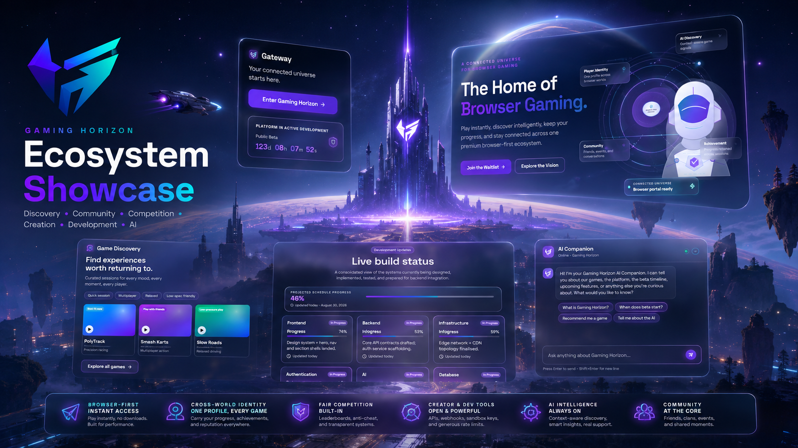
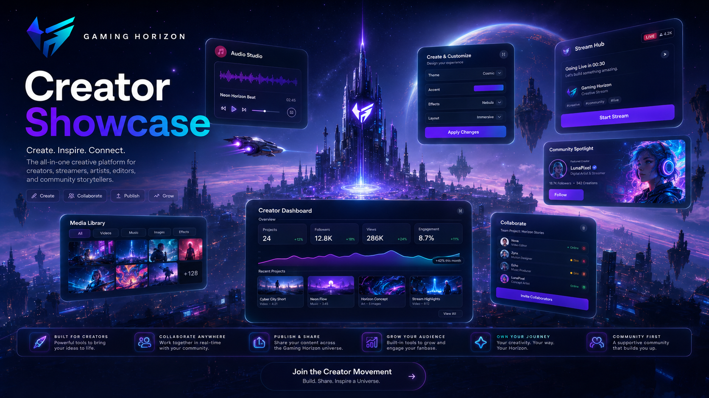
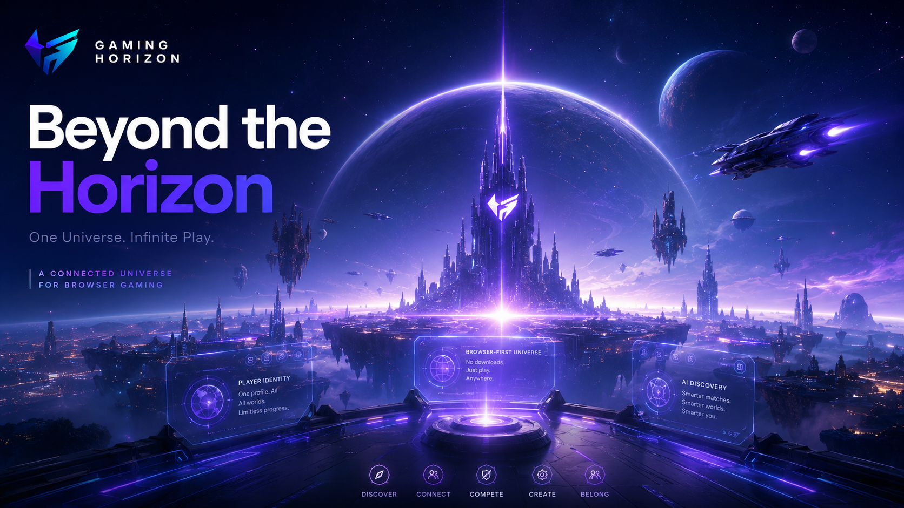
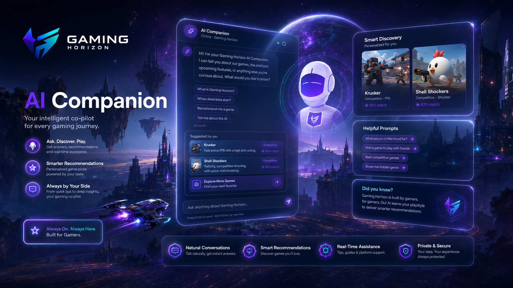
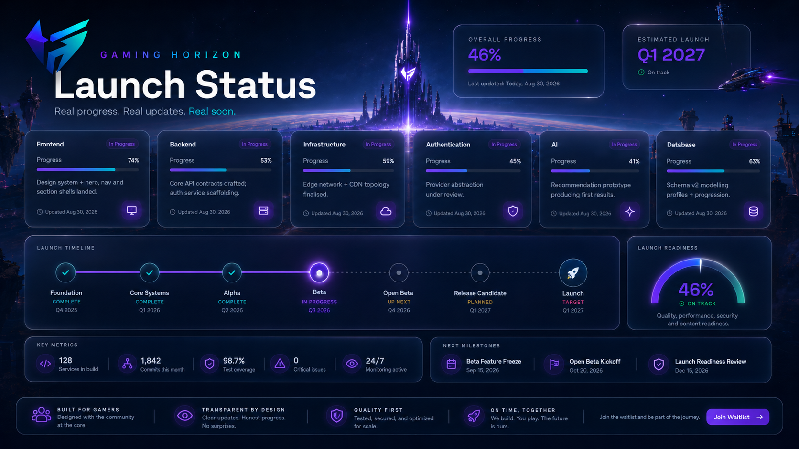
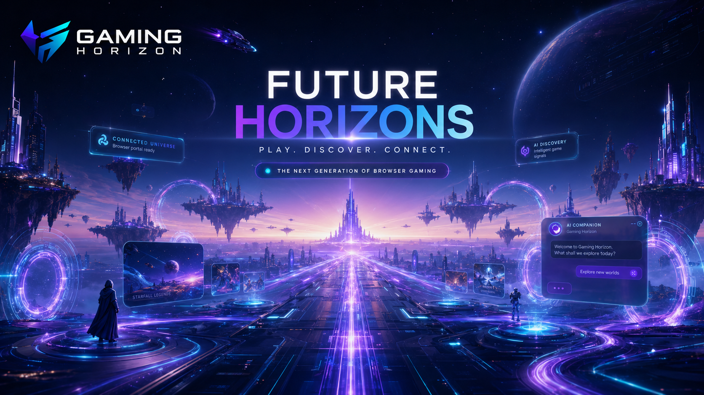
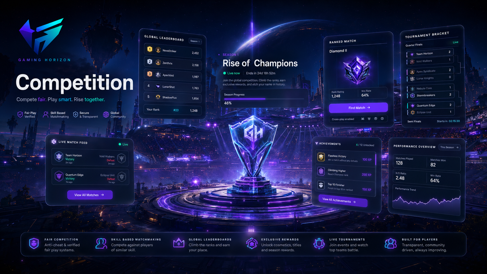
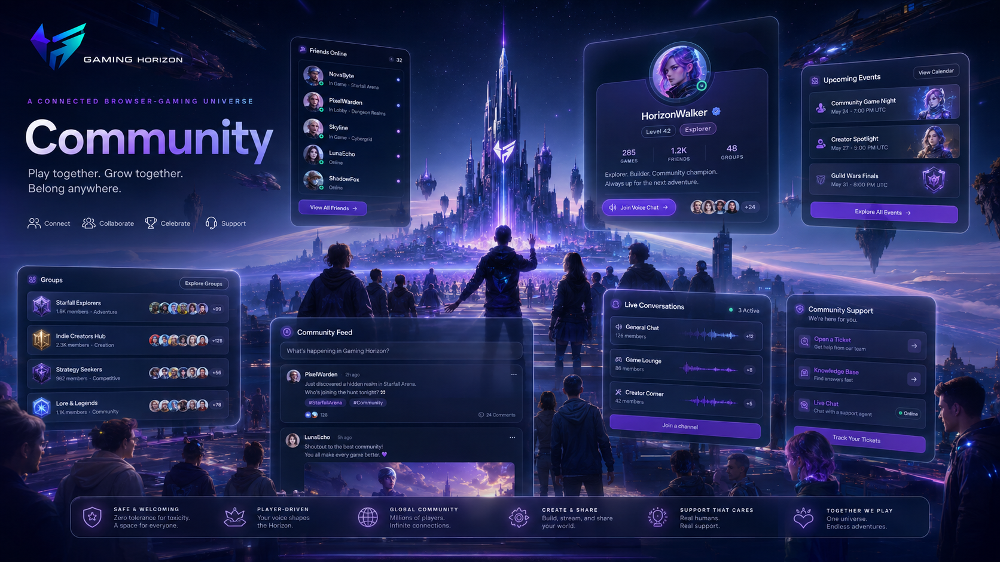
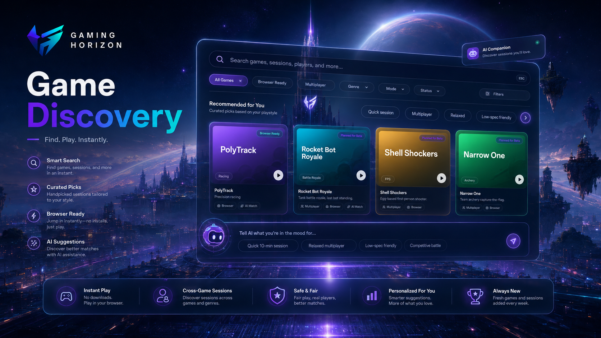

<!--
===============================================================================
                              GAMING HORIZON
                         BEYOND THE HORIZON
===============================================================================

                         OFFICIAL SHOWCASE SYSTEM
                         assets/showcase/README.md

                         SHOWCASE SYSTEM v1.0.0

===============================================================================

DOCUMENT LOCATION
-----------------
assets/showcase/README.md

RELATIVE PATH RULE
------------------

Showcase files in this directory:
gaming-horizon-ecosystem-showcase.png
gaming-horizon-creators-showcase.png
gaming-horizon-beyond-showcase.png
gaming-horizon-ai-showcase.png
gaming-horizon-development-showcase.png
gaming-horizon-future-showcase.png
gaming-horizon-competition-showcase.png
gaming-horizon-community-showcase.png
gaming-horizon-discovery-showcase.png

Official logo:
../branding/logos/gaming-horizon-logo-source.png

Asset documentation:
../README.md

Branding documentation:
../branding/README.md

Screenshot documentation:
../screenshots/README.md

Repository root:
../../

===============================================================================
-->

<div align="center">

<br>


<br><br>

<h1>Gaming Horizon Showcase System</h1>

<p>
  <strong>
    Curated visual storytelling for the Gaming Horizon ecosystem,
    its communities, creators, technology, competition, discovery,
    development, and future direction.
  </strong>
</p>

<p>
  A cinematic presentation system designed to communicate the broader
  Gaming Horizon vision while remaining clearly separated from
  real product screenshots and official source branding.
</p>

<br>

<!-- ========================================================= -->
<!--                       SYSTEM STATUS                       -->
<!-- ========================================================= -->

<a href="#status">
  
</a>
<a href="#version">
  
</a>
<a href="#showcase-system">
  
</a>
<a href="#classification">
  
</a>
<a href="#license">
  
</a>

<br><br>

<!-- ========================================================= -->
<!--                      SHOWCASE AREAS                       -->
<!-- ========================================================= -->

<a href="#ecosystem">
  
</a>
<a href="#creators">
  
</a>
<a href="#beyond">
  
</a>
<a href="#ai">
  
</a>
<a href="#development">
  
</a>

<br>

<a href="#future">
  
</a>
<a href="#competition">
  
</a>
<a href="#community">
  
</a>
<a href="#discovery">
  
</a>

<br><br>

<!-- ========================================================= -->
<!--                       SYSTEM RULES                        -->
<!-- ========================================================= -->

<a href="#visual-direction">
  
</a>
<a href="#showcase-vs-screenshots">
  
</a>
<a href="#truthful-presentation">
  
</a>
<a href="#accessibility">
  
</a>
<a href="#governance">
  
</a>

<br><br>

<!-- ========================================================= -->
<!--                       QUICK LINKS                         -->
<!-- ========================================================= -->

<a href="https://thegaminghorizon.netlify.app/">
  
</a>
<a href="https://github.com/thegaminghorizon/The-Gaming-Horizon">
  
</a>
<a href="https://github.com/thegaminghorizon/The-Gaming-Horizon/issues">
  
</a>

<br><br>

<code>VISION</code>
&nbsp; • &nbsp;
<code>DISCOVERY</code>
&nbsp; • &nbsp;
<code>COMMUNITY</code>
&nbsp; • &nbsp;
<code>CREATION</code>
&nbsp; • &nbsp;
<code>FUTURE</code>

<br><br>

</div>

---

<a id="overview"></a>

## ✦ Overview

The Gaming Horizon showcase system is the curated visual-storytelling layer of
the project.

Unlike product screenshots, showcase assets are designed to communicate:

```text
VISION
ATMOSPHERE
IDENTITY
POSSIBILITY
ECOSYSTEM
DIRECTION
EMOTION
SCALE
```

They help express what Gaming Horizon represents beyond an individual interface.

The showcase system supports:

- repository presentation;
- ecosystem documentation;
- project storytelling;
- creator communication;
- community communication;
- development narratives;
- visual direction;
- conceptual exploration;
- major documentation pages;
- future media presentation.

The central idea remains:

> **There is always another world beyond the horizon.**

Showcase visuals should strengthen that idea without misrepresenting the
actual state of the product.

---

<a id="status"></a>

## ✦ Status

Current showcase-system status:

```text
ACTIVE DEVELOPMENT
```

Current coverage:

| Showcase area | Status |
| --- | --- |
| Ecosystem | Established |
| Creators | Established |
| Beyond | Established |
| AI | Established |
| Development | Established |
| Future | Established |
| Competition | Established |
| Community | Established |
| Discovery | Established |
| Visual standards | Active |
| Classification rules | Active |
| Governance | Active |
| Future showcase categories | Add when required |

The current system provides nine major storytelling directions.

Additional visuals should only be introduced when they add a genuinely new
communication role.

---

<a id="version"></a>

## ✦ Version

Current showcase-system version:

```text
1.0.0
```

Version structure:

```text
MAJOR.MINOR.PATCH
```

### Major

Used when the showcase architecture or overall visual storytelling system
changes significantly.

```text
1.0.0 → 2.0.0
```

Possible reasons:

```text
Complete showcase-system redesign
Major new brand generation
Visual storytelling architecture replacement
Major classification change
```

### Minor

Used when meaningful new official showcase areas are introduced.

```text
1.0.0 → 1.1.0
```

Possible examples:

```text
New platform showcase
New developer showcase category
New event showcase system
New creator-media family
```

### Patch

Used for smaller documentation refinements.

```text
1.0.0 → 1.0.1
```

Possible reasons:

```text
README improvements
Path corrections
Filename corrections
Description refinement
Metadata changes
```

---

<a id="showcase-system"></a>

## ✦ Showcase System

The showcase system is organized around major Gaming Horizon ideas.

```text
                         GAMING HORIZON
                               │
                               ▼
                            SHOWCASE
                               │
          ┌────────────────────┼────────────────────┐
          │                    │                    │
          ▼                    ▼                    ▼
       EXPERIENCE           PEOPLE              FUTURE
          │                    │                    │
          │                    │                    │
   DISCOVERY / AI      COMMUNITY / CREATORS   BEYOND / FUTURE
          │                    │                    │
          └────────────────────┼────────────────────┘
                               │
                               ▼
                         ECOSYSTEM STORY
                               │
                  ┌────────────┴────────────┐
                  ▼                         ▼
            DEVELOPMENT                COMPETITION
```

Each image should have a distinct responsibility.

Avoid creating multiple visuals that communicate exactly the same idea.

---

## ✦ Current Directory

```text
showcase/
├── README.md
├── gaming-horizon-ecosystem-showcase.png
├── gaming-horizon-creators-showcase.png
├── gaming-horizon-beyond-showcase.png
├── gaming-horizon-ai-showcase.png
├── gaming-horizon-development-showcase.png
├── gaming-horizon-future-showcase.png
├── gaming-horizon-competition-showcase.png
├── gaming-horizon-community-showcase.png
└── gaming-horizon-discovery-showcase.png
```

---

<a id="classification"></a>

## ✦ Showcase Classification

Showcase assets should be clearly understood as visual storytelling.

Recommended classifications:

| Classification | Meaning |
| --- | --- |
| `OFFICIAL SHOWCASE` | Approved Gaming Horizon presentation visual |
| `CONCEPTUAL` | Communicates an idea or direction |
| `ECOSYSTEM` | Represents the broader Gaming Horizon universe |
| `DEVELOPMENT` | Represents building and technical progress |
| `FUTURE` | Represents possible future direction |
| `ARCHIVED` | Historical showcase visual |
| `REPLACED` | Superseded by a newer presentation asset |

A showcase image can be official presentation media while still being
conceptual.

Those ideas are not contradictory.

---

## ✦ Showcase Register

| Asset | Area | Storytelling focus |
| --- | --- | --- |
| `gaming-horizon-ecosystem-showcase.png` | Ecosystem | Connected Gaming Horizon universe |
| `gaming-horizon-creators-showcase.png` | Creators | Creation and collaboration |
| `gaming-horizon-beyond-showcase.png` | Beyond | Beyond the Horizon vision |
| `gaming-horizon-ai-showcase.png` | AI | Intelligent assistance and discovery |
| `gaming-horizon-development-showcase.png` | Development | Building and technical progress |
| `gaming-horizon-future-showcase.png` | Future | Future possibilities |
| `gaming-horizon-competition-showcase.png` | Competition | Competitive gaming experiences |
| `gaming-horizon-community-showcase.png` | Community | Connection between players and communities |
| `gaming-horizon-discovery-showcase.png` | Discovery | Exploration of games and experiences |

---

<a id="ecosystem"></a>

## ✦ Ecosystem Showcase

File:

```text
gaming-horizon-ecosystem-showcase.png
```

<div align="center">

<br>



<br>

</div>

The Ecosystem Showcase represents Gaming Horizon as a connected gaming universe
rather than a collection of isolated features.

### Direction

```text
DISCOVERY
COMMUNITY
CREATION
COMPETITION
DEVELOPMENT
AI
BROWSER-FIRST EXPERIENCES
```

### Purpose

Use this visual when communicating the relationship between major Gaming
Horizon pillars.

It is especially suited to:

```text
ECOSYSTEM DOCUMENTATION
PROJECT OVERVIEW
PLATFORM DIRECTION
REPOSITORY PRESENTATION
VISION COMMUNICATION
```

---

<a id="creators"></a>

## ✦ Creators Showcase

File:

```text
gaming-horizon-creators-showcase.png
```

<div align="center">

<br>



<br>

</div>

The Creators Showcase represents the creative side of the Gaming Horizon
ecosystem.

### Direction

```text
CREATION
COLLABORATION
EXPERIMENTATION
INTERACTIVE EXPERIENCES
CREATOR TOOLS
COMMUNITY CONTRIBUTION
```

The visual should communicate opportunity and creativity without claiming
specific tools or capabilities that are not documented elsewhere.

---

<a id="beyond"></a>

## ✦ Beyond Showcase

File:

```text
gaming-horizon-beyond-showcase.png
```

<div align="center">

<br>



<br>

</div>

The Beyond Showcase communicates the emotional and conceptual core of Gaming
Horizon.

### Core idea

> **There is always another world beyond the horizon.**

### Direction

```text
POSSIBILITY
EXPLORATION
ADVENTURE
UNKNOWN WORLDS
PROGRESSION
NEXT EXPERIENCE
```

This image is best used where Gaming Horizon's broader vision matters more than
specific product functionality.

---

<a id="ai"></a>

## ✦ AI Showcase

File:

```text
gaming-horizon-ai-showcase.png
```

<div align="center">

<br>



<br>

</div>

The AI Showcase communicates intelligent discovery and assistance within the
Gaming Horizon vision.

### Direction

```text
AI COMPANION
DISCOVERY
GUIDANCE
PERSONALIZATION
INTELLIGENT INTERACTION
FUTURE TECHNOLOGY
```

> [!IMPORTANT]
> This image is showcase media. It should not be interpreted as evidence that
> every depicted AI interaction or capability is currently implemented.

For actual product interface documentation, use:

```text
../screenshots/
```

---

<a id="development"></a>

## ✦ Development Showcase

File:

```text
gaming-horizon-development-showcase.png
```

<div align="center">

<br>



<br>

</div>

The Development Showcase represents the process of building Gaming Horizon.

### Direction

```text
ENGINEERING
PLATFORM DEVELOPMENT
SYSTEM DESIGN
TECHNOLOGY
ITERATION
PROGRESS
CREATION
```

The visual may support:

```text
DEVELOPMENT DOCUMENTATION
TECHNICAL DIRECTION
ROADMAP PRESENTATION
CONTRIBUTOR COMMUNICATION
PROJECT PROGRESS
```

Development showcase media should communicate the act of building without
implying unsupported technical capabilities.

---

<a id="future"></a>

## ✦ Future Showcase

File:

```text
gaming-horizon-future-showcase.png
```

<div align="center">

<br>



<br>

</div>

The Future Showcase communicates long-term possibility.

### Direction

```text
NEXT-GENERATION EXPERIENCES
EMERGING TECHNOLOGY
NEW INTERACTIONS
EXPANSION
POSSIBILITY
EXPLORATION
```

Future-facing visuals should remain intentionally broad.

They should inspire without becoming accidental product commitments.

---

<a id="competition"></a>

## ✦ Competition Showcase

File:

```text
gaming-horizon-competition-showcase.png
```

<div align="center">

<br>



<br>

</div>

The Competition Showcase represents competitive gaming experiences within the
wider Gaming Horizon ecosystem.

### Direction

```text
COMPETITION
SKILL
CHALLENGE
PROGRESSION
COMMUNITY EVENTS
ACHIEVEMENT
```

The visual should communicate competitive energy without implying a specific
competition format, tournament structure, prize system, or event that has not
been formally documented.

---

<a id="community"></a>

## ✦ Community Showcase

File:

```text
gaming-horizon-community-showcase.png
```

<div align="center">

<br>



<br>

</div>

The Community Showcase represents connection between players, creators,
developers, and Gaming Horizon communities.

### Direction

```text
CONNECTION
COMMUNITY
COLLABORATION
SHARED EXPERIENCES
PARTICIPATION
GLOBAL GAMING CULTURE
```

The community should feel active and connected without relying on invented
community statistics or unsupported claims.

---

<a id="discovery"></a>

## ✦ Discovery Showcase

File:

```text
gaming-horizon-discovery-showcase.png
```

<div align="center">

<br>



<br>

</div>

The Discovery Showcase represents exploration across games, experiences, and
new possibilities.

### Direction

```text
GAME DISCOVERY
EXPLORATION
RECOMMENDATION
NEW WORLDS
CURIOSITY
ADVENTURE
```

Discovery is one of the central Gaming Horizon concepts.

The visual should communicate movement toward something new.

---

<a id="visual-direction"></a>

## ✦ Visual Direction

Gaming Horizon showcase media should generally feel:

```text
PREMIUM
FUTURISTIC
CINEMATIC
ATMOSPHERIC
GAMING-FOCUSED
CONFIDENT
EXPANSIVE
IMMERSIVE
ELEGANT
```

The objective is not to create generic science-fiction artwork.

The objective is to create visual storytelling that feels recognizably
Gaming Horizon.

---

## ✦ Atmospheric Foundation

Typical foundation directions include:

```text
MIDNIGHT BLACK
DEEP CHARCOAL
DARK NAVY
ATMOSPHERIC BLUE
COSMIC DEPTH
```

These darker environments create room for controlled energy accents.

---

## ✦ Energy Accents

Typical accent directions include:

```text
PURPLE
ELECTRIC BLUE
CYAN
VIOLET
SUBTLE MAGENTA
```

Accent color should function as energy and hierarchy.

It should not make every visual element equally bright.

---

## ✦ Lighting

Appropriate lighting may include:

```text
HORIZON GLOW
AURORA LIGHTING
EDGE LIGHTING
SOFT BLOOM
ATMOSPHERIC FOG
DIMENSIONAL SHADOW
SUBTLE REFLECTION
CINEMATIC BACKLIGHT
```

Lighting should create depth rather than visual noise.

---

## ✦ Geometry

Showcase composition may use:

```text
HORIZON LINES
FUTURISTIC GEOMETRY
SPATIAL PANELS
SUBTLE GRIDS
DIRECTIONAL FORMS
LIGHT TRAILS
LAYERED DEPTH
PORTAL-LIKE STRUCTURES
```

Geometry should reinforce the theme of discovery and progression.

---

## ✦ Glass & Interface Language

Where appropriate, showcase visuals may use:

```text
GLASSMORPHISM
TRANSLUCENT PANELS
HOLOGRAPHIC SURFACES
SUBTLE UI ELEMENTS
FUTURISTIC INTERFACE LANGUAGE
```

These should remain supporting visual devices.

A showcase image containing interface-like elements is still not automatically
a product screenshot.

---

## ✦ Visual Restraint

Avoid turning every showcase asset into:

```text
MAXIMUM NEON
MAXIMUM PARTICLES
MAXIMUM GLOW
MAXIMUM TEXT
MAXIMUM UI
MAXIMUM EFFECTS
```

Premium presentation depends on hierarchy.

> [!NOTE]
> More visual effects do not automatically create a more futuristic result.

---

## ✦ What to Avoid

Gaming Horizon showcase visuals should avoid becoming:

```text
CHEAP
CHILDISH
GENERIC
OVERLOADED
EXCESSIVELY NEON
UNCONTROLLED CYBERPUNK
CORPORATE-SAAS GENERIC
VISUALLY CLUTTERED
ARTIFICIALLY FUTURISTIC
UNRELATED TO GAMING
```

---

<a id="showcase-vs-screenshots"></a>

## ✦ Showcase vs Screenshots

The difference between showcase media and screenshots is fundamental.

| Showcase | Screenshot |
| --- | --- |
| Visual storytelling | Product documentation |
| May be conceptual | Represents real interface state |
| Communicates direction | Communicates actual UI |
| Vision-focused | Product-focused |
| Cinematic presentation | Interface evidence |
| May contain imagined scenes | Should document what exists |
| Supports emotion and identity | Supports factual interface reference |

Screenshot system:

```text
../screenshots/
```

> [!IMPORTANT]
> Never move a showcase visual into `screenshots/` simply because it contains
> interface-like graphics.

---

## ✦ Showcase vs Branding

Showcase visuals may contain Gaming Horizon branding.

They are not the authoritative source for that branding.

Official identity:

```text
../branding/
```

Official source logo:

```text
../branding/logos/gaming-horizon-logo-source.png
```

If a showcase image contains a stylized, simplified, generated, or approximate
mark, the official logo file remains authoritative.

---

## ✦ Showcase vs Documentation

Showcase media supports documentation.

It should not replace it.

A visual can communicate:

```text
ATMOSPHERE
DIRECTION
VISION
CONCEPT
```

Written documentation should communicate:

```text
SPECIFICATIONS
STATUS
POLICY
CAPABILITIES
ROADMAP
TECHNICAL INFORMATION
```

Use both where appropriate.

---

<a id="truthful-presentation"></a>

## ✦ Truthful Presentation

Showcase visuals may explore possibilities, but they should never be used to
intentionally mislead.

Do not present showcase artwork as proof that:

```text
A FEATURE IS LIVE
A FEATURE IS PRODUCTION-READY
AN API IS PUBLIC
A TOURNAMENT EXISTS
A PARTNERSHIP EXISTS
A SPONSOR EXISTS
A CERTAIN USER COUNT EXISTS
A REVENUE FIGURE EXISTS
A PRODUCT HAS LAUNCHED
A SPECIFIC FUTURE FEATURE IS GUARANTEED
```

unless those claims are independently supported by maintained project
documentation.

---

## ✦ Concept Labels

Where clarification is needed, use surrounding labels such as:

```text
SHOWCASE
CONCEPT
VISION
FUTURE DIRECTION
IN DEVELOPMENT
EXPERIMENTAL
```

Do not permanently add labels inside every image unless the visual itself
requires them.

Documentation around the image is often more flexible.

---

## ✦ Generated Visuals

Showcase artwork may use generative or concept-driven production methods.

That is acceptable when the result serves a legitimate presentation role.

However:

```text
GENERATED UI ≠ PRODUCT SCREENSHOT
GENERATED LOGO ≠ OFFICIAL SOURCE LOGO
GENERATED FEATURE ≠ IMPLEMENTED FEATURE
GENERATED SCENE ≠ PRODUCT COMMITMENT
```

This distinction should remain clear throughout the repository.

---

## ✦ Identity Accuracy

If exact Gaming Horizon branding is required in future showcase production,
use the official branding resources as the identity reference.

Do not extract identity geometry from:

```text
OLD SHOWCASE ART
SCREENSHOTS
SOCIAL GRAPHICS
THIRD-PARTY COPIES
GENERATED APPROXIMATIONS
```

Use:

```text
../branding/logos/
```

instead.

---

<a id="accessibility"></a>

## ✦ Accessibility

Showcase visuals should support accessible documentation.

Use meaningful alternative text.

Recommended:

```html

```

Avoid:

```html

```

---

## ✦ Describe Meaning Outside the Image

A cinematic showcase can contain complex visual ideas.

Provide surrounding documentation explaining:

```text
WHAT THE IMAGE REPRESENTS
WHAT AREA OF GAMING HORIZON IT SUPPORTS
WHETHER IT IS CONCEPTUAL
WHY IT IS INCLUDED
```

This improves accessibility and prevents interpretation errors.

---

## ✦ Essential Information

Do not communicate critical information only through showcase artwork.

Keep important details such as:

```text
PROJECT STATUS
VERSION
ROADMAP
AVAILABILITY
TECHNICAL REQUIREMENTS
SECURITY INFORMATION
LEGAL TERMS
```

available as real text.

---

## ✦ Responsive Presentation

For README presentation:

```html

```

This allows the image to scale naturally with GitHub's content area.

Avoid arbitrary width and height combinations that distort the artwork.

---

## ✦ Aspect Ratio

Preserve source proportions.

Recommended:

```html

```

Avoid:

```html

```

unless those dimensions match the real aspect ratio.

---

## ✦ Cropping

Avoid destructive cropping.

If a future destination requires a substantially different composition, create
a purpose-built derivative rather than damaging the original showcase.

---

## ✦ Resolution

Showcase media should remain high enough quality for public presentation.

Avoid:

```text
PIXELATION
EXTREME UPSCALING
HEAVY COMPRESSION
VISIBLE ARTIFACTS
UNINTENTIONAL BLUR
```

At the same time, consider repository and website performance.

---

## ✦ File Format

Current showcase standard:

```text
PNG
```

PNG supports:

```text
HIGH-QUALITY PRESENTATION
GRADIENTS
SHARP ELEMENTS
CINEMATIC VISUALS
GITHUB DISPLAY
```

Future optimized website derivatives may use:

```text
WebP
```

when technically appropriate.

---

## ✦ Naming Standard

Preferred structure:

```text
gaming-horizon-[subject]-showcase.png
```

Current examples:

```text
gaming-horizon-ecosystem-showcase.png
gaming-horizon-community-showcase.png
gaming-horizon-discovery-showcase.png
gaming-horizon-ai-showcase.png
```

Avoid:

```text
showcase1.png
image.png
final.png
final2.png
new-art.png
latest-showcase.png
cool-image.png
```

---

## ✦ Naming Philosophy

A showcase filename should answer:

```text
WHAT PROJECT?
WHAT SUBJECT?
WHAT TYPE?
WHAT FORMAT?
```

Example:

```text
gaming-horizon-community-showcase.png
```

means:

```text
PROJECT     Gaming Horizon
SUBJECT     Community
TYPE        Showcase
FORMAT      PNG
```

---

## ✦ Duplicate Control

Avoid:

```text
gaming-horizon-community-showcase.png
gaming-horizon-community-showcase-new.png
gaming-horizon-community-showcase-final.png
gaming-horizon-community-showcase-final2.png
```

When replacing a visual, either update the maintained asset or introduce a
clearly documented historical/archive system.

---

## ✦ Relative Paths

This README lives at:

```text
assets/showcase/README.md
```

Therefore showcase images can be referenced directly.

### Ecosystem

```text
gaming-horizon-ecosystem-showcase.png
```

### Community

```text
gaming-horizon-community-showcase.png
```

### Discovery

```text
gaming-horizon-discovery-showcase.png
```

### Official logo

```text
../branding/logos/gaming-horizon-logo-source.png
```

### Assets README

```text
../README.md
```

### Repository README

```text
../../README.md
```

---

## ✦ Path Matrix

| Document | Ecosystem showcase path |
| --- | --- |
| `/README.md` | `assets/showcase/gaming-horizon-ecosystem-showcase.png` |
| `/assets/README.md` | `showcase/gaming-horizon-ecosystem-showcase.png` |
| `/assets/showcase/README.md` | `gaming-horizon-ecosystem-showcase.png` |
| `/docs/ECOSYSTEM.md` | `../assets/showcase/gaming-horizon-ecosystem-showcase.png` |

Community example:

| Document | Community showcase path |
| --- | --- |
| `/README.md` | `assets/showcase/gaming-horizon-community-showcase.png` |
| `/assets/README.md` | `showcase/gaming-horizon-community-showcase.png` |
| `/assets/showcase/README.md` | `gaming-horizon-community-showcase.png` |
| `/docs/COMMUNITY.md` | `../assets/showcase/gaming-horizon-community-showcase.png` |

---

## ✦ Recommended Documentation Mapping

| Showcase | Recommended documentation |
| --- | --- |
| Ecosystem | `docs/ECOSYSTEM.md` |
| Creators | `docs/CREATORS.md` |
| Beyond | `docs/BEYOND.md` |
| AI | `docs/AI.md` |
| Development | `docs/DEVELOPMENT.md` |
| Future | Future-direction documentation |
| Competition | `docs/COMPETE.md` |
| Community | `docs/COMMUNITY.md` |
| Discovery | `docs/DISCOVERY.md` |

These mappings allow each showcase visual to support a meaningful project
document rather than existing without context.

---

## ✦ Logo Path Matrix

| Document | Official source-logo path |
| --- | --- |
| `/README.md` | `assets/branding/logos/gaming-horizon-logo-source.png` |
| `/assets/README.md` | `branding/logos/gaming-horizon-logo-source.png` |
| `/assets/showcase/README.md` | `../branding/logos/gaming-horizon-logo-source.png` |
| `/docs/ECOSYSTEM.md` | `../assets/branding/logos/gaming-horizon-logo-source.png` |

---

<details>

<summary><strong>✦ Showcase troubleshooting</strong></summary>

<br>

If a showcase image fails to display:

1. Confirm the exact filename.
2. Confirm capitalization.
3. Confirm the `.png` extension.
4. Confirm the image exists inside `assets/showcase/`.
5. Confirm the current branch contains the file.
6. Identify the Markdown file location.
7. Calculate the relative path from that location.
8. Open the image directly on GitHub.

For this README:

```text
assets/showcase/README.md
```

the Ecosystem Showcase path is simply:

```text
gaming-horizon-ecosystem-showcase.png
```

The official logo requires:

```text
../branding/logos/gaming-horizon-logo-source.png
```

</details>

---

<a id="workflow"></a>

## ✦ Showcase Workflow

Official showcase visuals should follow:

```text
STORYTELLING NEED
        ↓
DEFINE SUBJECT
        ↓
DEFINE DIRECTION
        ↓
CREATE
        ↓
IDENTITY REVIEW
        ↓
QUALITY REVIEW
        ↓
TRUTHFULNESS REVIEW
        ↓
CLASSIFY
        ↓
NAME
        ↓
PUBLISH
        ↓
MAINTAIN
```

A visually impressive image should not automatically become part of the
official showcase system.

It should have a defined communication purpose.

---

## ✦ Showcase States

| State | Meaning |
| --- | --- |
| `APPROVED` | Approved for official showcase use |
| `ACTIVE` | Currently used |
| `CONCEPTUAL` | Communicates a concept or direction |
| `EXPERIMENTAL` | Under visual evaluation |
| `REPLACED` | Superseded by another visual |
| `ARCHIVED` | Historical presentation asset |
| `DEPRECATED` | Should no longer be used |

---

## ✦ Adding a Showcase

Before adding another showcase visual:

1. Define what area of Gaming Horizon it represents.
2. Check whether an existing showcase already serves that role.
3. Establish the intended visual direction.
4. Preserve Gaming Horizon identity.
5. Avoid unsupported product claims.
6. Review quality.
7. Review accessibility context.
8. Use a descriptive filename.
9. Update this README if it becomes part of the official register.
10. Use a meaningful commit.

---

## ✦ Replacing a Showcase

When replacing a showcase visual:

1. Confirm the new visual communicates the same role better.
2. Review brand consistency.
3. Review conceptual accuracy.
4. Verify relative paths.
5. Update connected documentation.
6. Preserve historical material only when useful.
7. Avoid leaving two competing active showcase files for the same purpose.

---

## ✦ Quality Gate

Before treating a showcase visual as official:

- [ ] Gaming Horizon identity is recognizable
- [ ] Visual purpose is clearly defined
- [ ] Subject matches the intended documentation
- [ ] Composition is balanced
- [ ] Visual effects are controlled
- [ ] Resolution is appropriate
- [ ] Aspect ratio is preserved
- [ ] Filename is descriptive
- [ ] Correct directory is used
- [ ] No unnecessary duplicate exists
- [ ] No sensitive information appears
- [ ] Concept is not presented as product evidence
- [ ] Unsupported claims are avoided
- [ ] Accessibility context is considered
- [ ] Third-party rights are considered

---

## ✦ Review Questions

Before publishing, ask:

### What does this visual represent?

There should be a precise answer.

### Is this a screenshot?

If yes, it belongs in `../screenshots/`.

### Is this an identity source?

If yes, it belongs in `../branding/`.

### Does it communicate something new?

If not, another showcase may already serve the same purpose.

### Could someone mistake it for a real product feature?

If yes, provide clearer surrounding context.

### Does it feel recognizably Gaming Horizon?

If not, reconsider the visual direction.

---

<a id="governance"></a>

## ✦ Governance

Gaming Horizon showcase media forms part of the wider project visual system.

Showcase visuals may include:

```text
GAMING HORIZON BRANDING
GENERATED OR CONCEPTUAL ELEMENTS
GAMING REFERENCES
INTERFACE-LIKE VISUALS
CHARACTERS
ENVIRONMENTS
THIRD-PARTY REFERENCES
```

Third-party trademarks, games, services, products, artwork, and other
intellectual property remain the property of their respective owners.

The inclusion of third-party references does not imply partnership,
sponsorship, endorsement, or ownership.

---

<a id="license"></a>

## ✦ License & Policies

This repository includes software licensing and separate project policies.

Showcase artwork, branding, generated media, and third-party material may have
rights considerations beyond the source-code license.

From:

```text
assets/showcase/README.md
```

repository-level policy documents are two levels above.

### License

```text
../../LICENSE
```

### Copyright

```text
../../COPYRIGHT.md
```

### Security

```text
../../SECURITY.md
```

### Privacy

```text
../../PRIVACY.md
```

### Terms

```text
../../TERMS.md
```

### Third-party notices

```text
../../THIRD-PARTY-NOTICES.md
```

### Contributions

```text
../../CONTRIBUTING.md
```

### Code of Conduct

```text
../../CODE_OF_CONDUCT.md
```

### Future brand policy

When available:

```text
../../BRAND.md
```

---

## ✦ Showcase Golden Rules

### `01` — Tell a story

Every showcase visual should communicate a clear Gaming Horizon idea.

### `02` — Preserve identity

The visual should remain recognizably Gaming Horizon.

### `03` — Separate concept from product

Showcase artwork is not product evidence.

### `04` — Use atmosphere with control

Cinematic presentation should not become visual noise.

### `05` — Avoid unsupported claims

Future-facing visuals are not product commitments.

### `06` — Keep screenshots separate

Actual interfaces belong in the screenshot system.

### `07` — Keep branding authoritative

Official logo files remain the source of identity truth.

### `08` — Name with purpose

The subject of the visual should be obvious from the filename.

### `09` — Avoid unnecessary duplicates

Each showcase should have a distinct storytelling responsibility.

### `10` — Build beyond

Every visual should strengthen the wider Gaming Horizon universe.

---

## ✦ Current Showcase Register

```text
showcase/
├── README.md
├── gaming-horizon-ecosystem-showcase.png
├── gaming-horizon-creators-showcase.png
├── gaming-horizon-beyond-showcase.png
├── gaming-horizon-ai-showcase.png
├── gaming-horizon-development-showcase.png
├── gaming-horizon-future-showcase.png
├── gaming-horizon-competition-showcase.png
├── gaming-horizon-community-showcase.png
└── gaming-horizon-discovery-showcase.png
```

---

## ✦ Showcase Standard

A Gaming Horizon showcase visual should ultimately be:

| # | Standard | Meaning |
|:---:|---|---|
| `01` | **Recognizable** | Clearly connected to Gaming Horizon |
| `02` | **Cinematic** | Communicates atmosphere and scale |
| `03` | **Purposeful** | Represents a defined project idea |
| `04` | **Premium** | Suitable for official presentation |
| `05` | **Consistent** | Aligns with the wider visual identity |
| `06` | **Accessible** | Supported by meaningful documentation |
| `07` | **Truthful** | Clearly separated from unsupported product claims |
| `08` | **Maintainable** | Easy to identify and replace |
| `09` | **Distinct** | Has a unique storytelling responsibility |
| `10` | **Forward-Looking** | Supports the idea of what lies beyond the horizon |

---

## ✦ Showcase Responsibility Map

```text
ECOSYSTEM
   │
   ├── DISCOVERY
   │
   ├── COMMUNITY
   │
   ├── CREATORS
   │
   ├── COMPETITION
   │
   ├── AI
   │
   └── DEVELOPMENT
   │
   ▼
FUTURE
   │
   ▼
BEYOND
```

This structure represents the relationship between the current showcase
categories.

---

## ✦ Release Information

```text
SYSTEM          Gaming Horizon Showcase System
VERSION         1.0.0
STATUS          Active Development
TYPE            Official Visual Storytelling System
PROJECT         Gaming Horizon
LOCATION        assets/showcase/
SHOWCASES       9
REPOSITORY      The-Gaming-Horizon
```

---

<div align="center">

<br>


<br><br>

<strong>GAMING HORIZON</strong>

<br>

<sub>Official Showcase System · Version 1.0.0</sub>

<br><br>

<a href="#status">
  
</a>
<a href="#version">
  
</a>
<a href="#ecosystem">
  
</a>
<a href="#discovery">
  
</a>
<a href="#beyond">
  
</a>

<br><br>

<a href="https://thegaminghorizon.netlify.app/">
  
</a>
<a href="https://github.com/thegaminghorizon/The-Gaming-Horizon">
  
</a>
<a href="https://github.com/thegaminghorizon/The-Gaming-Horizon/issues">
  
</a>

<br><br>

<code>
VISION · DISCOVERY · COMMUNITY · CREATION · FUTURE
</code>

<br><br>

<strong>
Explore what exists. Imagine what comes next. Go beyond the horizon.
</strong>

<br><br>

<sub>
© 2026 Gaming Horizon · Beyond the Horizon
</sub>

<br><br>

</div>
